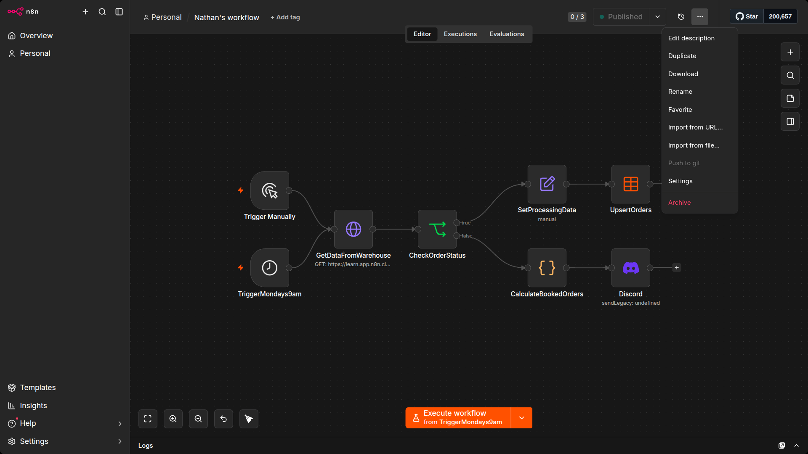

# Download or import

In this unit, you will learn how to export and import workflows.

You can save n8n workflows locally as JSON files. This is useful if you want to share your workflow with someone else or import a workflow from someone else.

You can export and import workflows in three ways:

## 1. From the Editor UI menu

- **Export**: From the top navigation bar, select the three dots in the upper right, then select Download. This will download your current workflow as a JSON file on your computer.
- **Import**: From the top navigation bar, select the three dots in the upper right, then select Import from URL (to import a published workflow) or Import from File (to import a workflow as a JSON file).

## 2. From the Editor UI canvas

- **Export**: Select all the nodes on the canvas and use CMD/Ctrl+C to copy the workflow JSON. You can paste this into a file or share it directly with other people.
- **Import**: You can paste a copied workflow JSON directly into the canvas with CMD/Ctrl+V.

## 3. From the command line

- **Export**: See the full list of commands for exporting workflows or credentials in the [n8n documentation](https://docs.n8n.io/deploy/host-n8n/configure-n8n/use-the-command-line).
- **Import**: See the full list of commands for importing workflows or credentials in the [n8n documentation](https://docs.n8n.io/deploy/host-n8n/configure-n8n/use-the-command-line).