# Meet your client

Meet Nathan.  🙋 Nathan works as an Analytics Manager at ABCorp. His job is to support the ABCorp team with reporting and analytics. Being a true jack of all trades, he also handles several miscellaneous initiatives.

Some things that Nathan does are repetitive and mind-numbing. He wants to automate some of these tasks so that he doesn't burn out. As an Automation Expert, you are meeting with Nathan today to help him understand how he can offload some of his responsibilities to n8n.

```text
You 👩‍🔧: Nice to meet you, Nathan. Glad to be doing this. What's a repetitive task that's error-prone and that you'd like to get off your plate first?
```

```text
Nathan 🙋: Thanks for coming in. The most annoying one's gotta be the weekly sales reporting.

I have to collect sales data from our legacy data warehouse, which manages data from the main business processes of an organization, such as sales or production. Now, each sales order can have the status Processing or Booked. I have to calculate the sum of all the Booked orders and announce them in the company Discord every Monday. Then I have to create a table of all the Processing sales so that the Sales Managers can review them and check if they need to follow up with customers.

This manual work is tough and requires high attention to detail to make sure that all the numbers are right. Inevitably, I lose my focus and mistype a number or I don't get it done on time. I've been criticized once by my manager for miscalculating the data.
```

```text
You 👩‍🔧: Oh no. Doesn't the data warehouse have a way to export the data?
```

```text
Nathan 🙋: The data warehouse was written in-house ages ago. It doesn't have a CSV export but they recently added a couple of API endpoints that expose this data, if that helps.
```

```text
You 👩‍🔧: Perfect. That's a good start. If you have a generic API, we can add some custom code and a couple of services to make an automated workflow. This gig has n8n written all over it. Let's get started.
```

# Designing the workflow

Now that we know what Nathan wants to automate, let's consider the steps he needs to take to achieve his goals:

1. Get the relevant data (order id, order status, order value, employee name) from the data warehouse
2. Filter the orders by their status (Processing or Booked)
3. Calculate the total value of all the Booked orders
4. Notify the team members about the Booked orders in the company's Discord channel
5. Insert the details about the Processing orders in a Data Table for follow-up
6. Schedule this workflow to run every Monday morning

Nathan's workflow involves sending data from the company's data warehouse to one external service and one built-in n8n feature:

1. Discord (external)
2. n8n Data Tables (built-in)

Before that, the data has to be wrangled with general functions (conditional filtering, calculation, scheduling).

n8n provides integrations for all these steps, so Nathan's workflow in n8n would look like this eight-node workflow.


You will build this workflow in eight steps:

1. Getting data from the data warehouse
2. Inserting data into a Data Table
3. Filtering orders
4. Setting values for processing orders
5. Calculating booked orders
6. Notifying the team
7. Scheduling the workflow
8. Publishing and examining the workflow

# 1. Getting data from the data warehouse

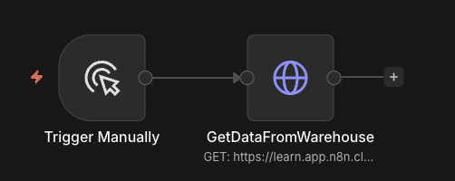

In this unit, you will learn how to get data by making HTTP requests with the HTTP Request node.

## 1.1 Create new workflow

Open your Editor UI and create a new workflow with one of the two possible commands:

- Select Ctrl+Alt+N or Cmd+Option+N on your keyboard.
- Open the left menu, navigate to Workflows, and select Add workflow.

Name this new workflow "Nathan's workflow."

The first thing you need to do is get data from ABCorp's old data warehouse.

Earlier in this section, you used an action node designed for a specific service (Hacker News). But not all apps or services have dedicated nodes, like the legacy data warehouse from Nathan's company.

Though we can't directly export the data, Nathan told us that the data warehouse has a couple of API endpoints. That's all we need to access the data using the HTTP Request node in n8n.

The HTTP Request node is one of the most versatile nodes, allowing you to make HTTP requests to query data from apps and services. You can use it to access data from apps or services that don't have a dedicated node in n8n.

## 1.2 Add a Manual Trigger node

Start by adding a Manual Trigger node to your canvas, just like you did in the previous sub-section. This will let you run the workflow on demand while you build it. Rename it to Trigger Manually. 

## 1.3 Add an HTTP Request node

Now add an HTTP Request node connected to the Manual Trigger node. The node window will open, where you need to configure some parameters. Rename it GetDataFromWarehouse. This node will use credentials.

Credentials are unique pieces of information that identify a user or a service and allow them to access apps or services (in our case, represented as n8n nodes). A common form of credentials is a username and a password, but they can take other forms depending on the service.

In the Parameters of the HTTP Request node, make the following adjustments:

- `Method`: This should default to GET. Make sure it's set to GET.
- `URL`: https://learn.app.n8n.cloud/webhook/courses/n8n-quickstart/company-warehouse
- `Send Headers`: Toggle this control to true. In Specify Headers, ensure Using Fields Below is selected.
    - `Header Parameters > Name`: Enter x-assessment-id.
    - `Header Parameters > Value`: Your assessment ID, which you can find at the top of this page under your name or in your profile.
- `Authentication`: Select Generic Credential Type. This option requires credentials before allowing you to access the data.
    - `Generic Auth Type`: Select Header Auth. (This field will appear after you select the Generic Credential Type for the Authentication.)
    - `Credential for Header Auth`: To add your credentials, select + Create new credential. This will open the Credentials window.
    - In the Credentials window, set `Name` to `X-API-KEY`.
    - In the Credentials window, set `Value` to `j[vKYdY68H(:WFb`
    - Select the Save button in the Credentials window to save your credentials.

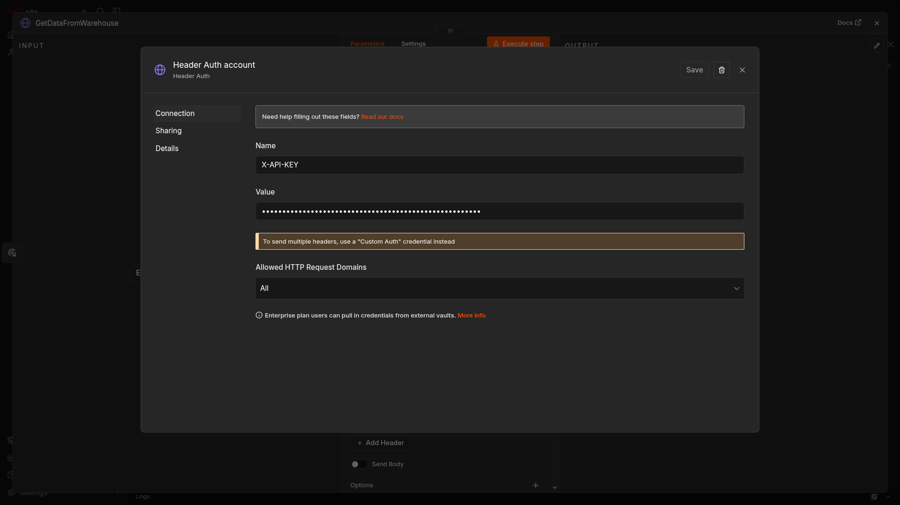

New credential names follow the " account" format by default. You can rename the credentials by clicking on the name, similarly to renaming nodes. It's good practice to give them names that identify the app/service, type, and purpose of the credential. A naming convention makes it easier to keep track of and identify your credentials. Rename the credential by clicking on the name in the top right to n8n Quickstart Header Auth account

Once you save, exit out of the Credentials window to return to the HTTP Request node.

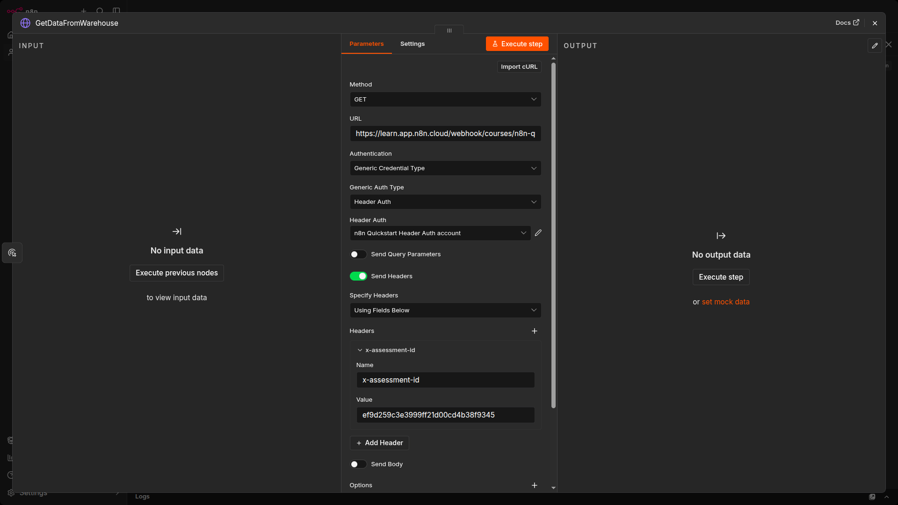

## 1.4 Get the data

Select the Execute step button in the HTTP Request node window. The table view of the HTTP request results should look like this:

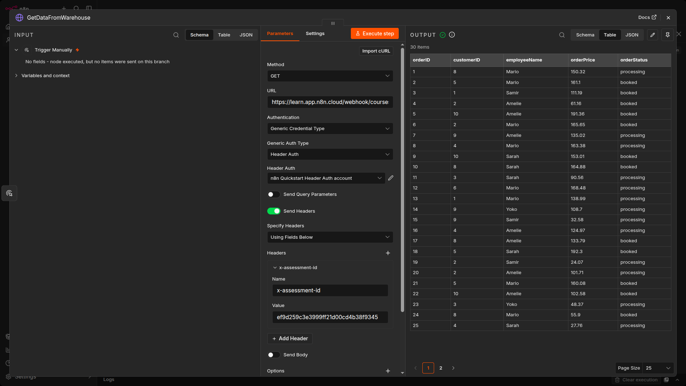

This is the data from ABCorp's data warehouse that Nathan needs to work with. This data set includes sales information from 30 customers with five columns:

- `orderID`: The unique id of each order.
- `customerID`: The unique id of each customer.
- `employeeName`: The name of Nathan's colleague responsible for the customer.
- `orderPrice`: The total price of the customer's order.
- `orderStatus`: Whether the customer's order status is booked or still in processing.

### What's next?

```text
Nathan: This is great. You already automated an important part of my job with only one node. Now instead of manually accessing the data every time I need it, I can use the HTTP Request Node to automatically get the information.
```

```text
You: Exactly. In the next step, I'll help you one step further and insert the data you retrieved into an n8n Data Table.
```

## 2. Inserting data into a Data Table

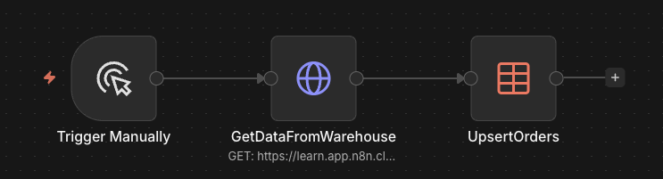

In this unit, you will learn how to insert the data received from the HTTP Request node into an n8n Data Table using the Data Table node. 

Data Tables are a built-in feature of n8n that lets you store, manage, and interact with data directly inside your n8n environment. No external services or credentials required. Think of them as lightweight, spreadsheet-like databases that live right inside n8n.

## 2.1 Create your Data Table

Before we can insert data, we need to create a Data Table to store it. Since Data Tables are built into n8n, there's no need to sign up for an external service or configure API credentials. Data tables are found in your personal or project workspace. Your workflow must be in the same workspace as your data table to be able to access it. 

- In the left-side panel of the Editor UI, select your personal workspace. 
- Then click on Data Tables 

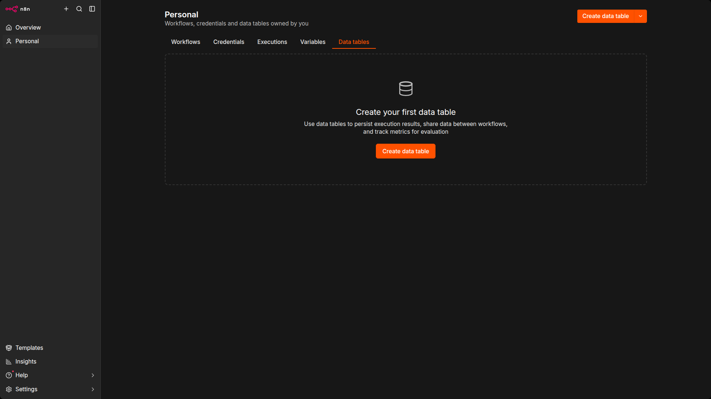

- Click the button in the top right corner Create data table.
- In the popup name the table orders. Then select From scratch

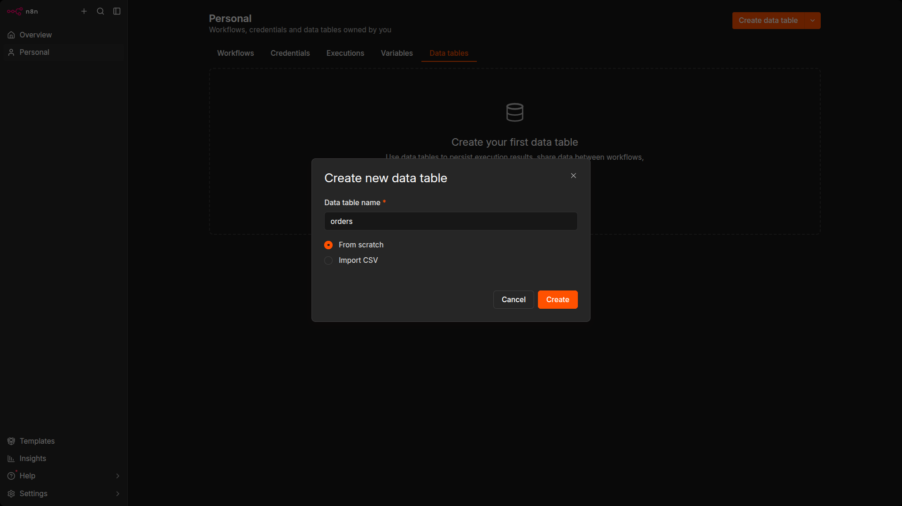

- In the table view that appears, add the following columns by clicking on the Add Column button in the top right, with their corresponding types:

    | Column name | Column type |
    |---|---|
    | orderID | Number |
    | customerID | Number |
    | employeeName | String |
    | orderPrice | Number |
    | orderStatus | String |

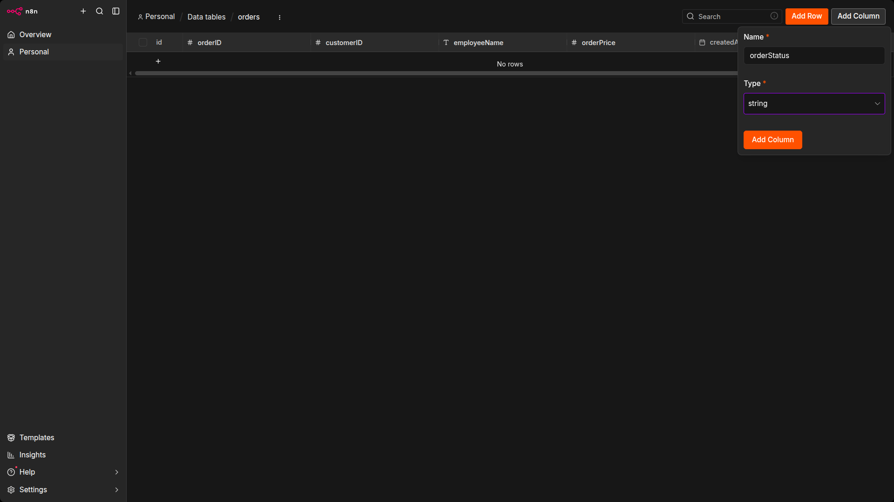

Unlike external services such as Airtable or Google Sheets, Data Tables don't require you to create an account, generate API tokens, or configure credentials. Everything stays inside n8n, making setup faster and keeping your data secure. 

Now that the table is ready, let's return to the workflow in the n8n Editor UI.

## 2.2 Add a Data Table node to the HTTP Request node

You can add a node connected to an existing node by selecting the + icon next to the existing node.

In the node panel:

- Search for Data Table.
- Select it then choose row action Upsert row(s)

This will add the Data Table node to your canvas and open the node details window.

In the Data Table node window, configure the following parameters: 

- Rename the node: UpsertOrders
- Operation: Select Upsert. This operation will insert or update new rows into the table.
- Data Table: Select the orders table you just created from the dropdown list.
- Must Match: Any condition
- Conditions:
    - Column orderId
    - Condition: equals
    - Value: swich to expression {{ $json.orderID }}
- Mapping Column Mode:  Select Map Automatically

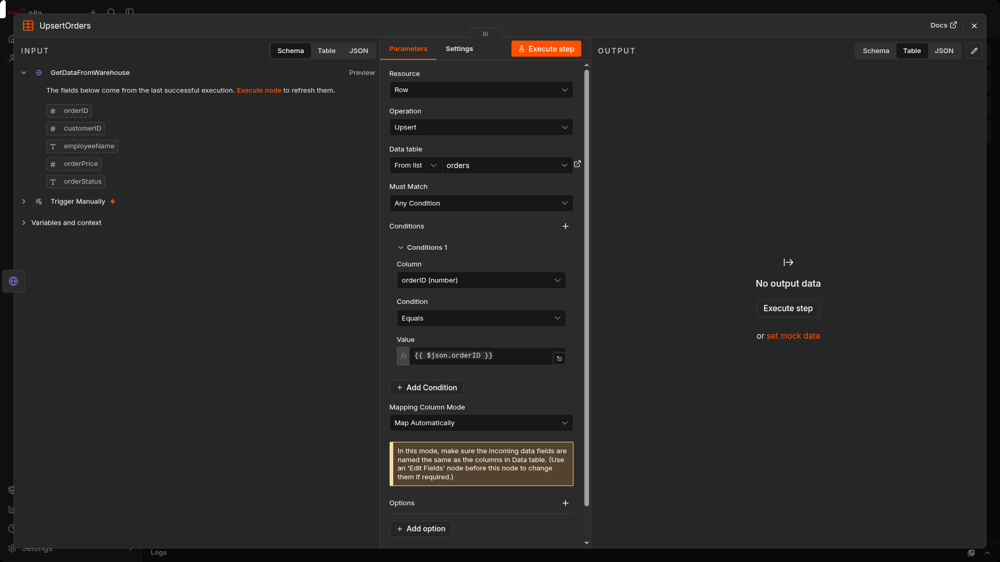

The Data Table node will automatically map incoming data fields to matching column names in your table. This means the field names from the HTTP Request node output (like orderID, customerID, etc.) need to match the column names you set up in the Data Table.

> [NOTE] 
> The incoming data field names must match the column names in your Data Table for automatic mapping to work. If they don't match, you can use map manually from the Mapping Column mode. 

## 2.3 Why Upsert? 

We use the Upsert operation instead of Insert so that if you re-run your workflow during testing, existing records get updated rather than duplicated. This keeps your Data Table clean while you're learning and experimenting.

## 2.4 Test the Data Table node

Once you've finished configuring the Data Table node, execute it by selecting Execute step.

All 30 data records will now appear in the orders Data Table. You can verify this by navigating to the Data Tables tab in the left-side panel and opening the orders table. You will notice that there is also three other columns. These are built into data tables. They are id, createdAt and updatedAt. 

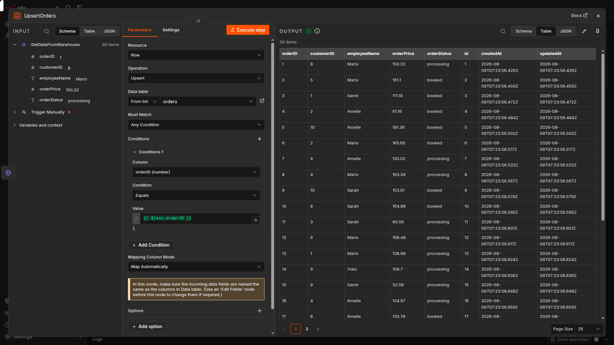

### What's next?

```text
Nathan: Wow, this automation is already so useful. And I didn't even need to set up an external account. It's all right here in n8n. But this inserts all collected data from the HTTP Request node into the Data Table. Remember that I actually need to insert only processing orders in the table and calculate the price of booked orders?
```

```text
You: Sure, no problem. As a next step, I'll use a new node to filter the orders based on their status.
```

# 3. Filtering orders

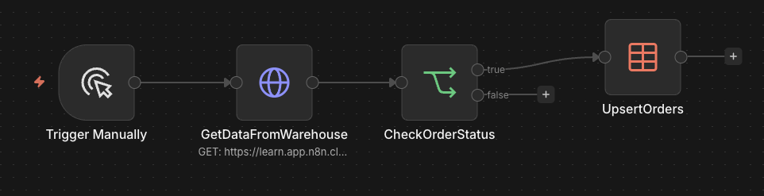

In this unit, you will learn how to filter data using conditional logic and how to use expressions in nodes using the If node.

To insert only processing orders into the Data Table we need to filter our data by orderStatus. We want to tell the program that if the orderStatus is processing, then insert all records with this status into the Data Table; else, for example, if the orderStatus isn't processing, calculate the sum of all orders with the other orderStatus (booked).

This if-then-else command is conditional logic. In n8n workflows, you can add conditional logic with the If node, which splits a workflow conditionally based on comparison operations.

If you need to filter data on more than boolean values (true and false), use the Switch node. The Switch node is similar to the If node, but supports multiple output connectors.

## 3.1 Add If node before the Data Table node

First, add an If node between the connection from the HTTP Request node to the Data Table node:

- Hover over the arrow connecting the HTTP Request node and the Data Table node.
- Select the + sign between the HTTP Request node and the Data Table node.

## 3.2 Configure the If node

Selecting the plus removes the connection to the Data Table node from the HTTP Request. Now, add an If node connected to the HTTP Request node:

- Search for the If node.
- Select it when it appears in the search.
- Rename the node CheckOrderStatus

For the If node, we'll use an expression.

An expression is a string of characters and symbols in a programming language that can be evaluated to get a value, often according to its input. In n8n workflows, you can use expressions in a node to refer to another node for input data. In our example, the If node references the data output by the HTTP Request node.

In the If node window, configure the parameters:

- Set the value1 placeholder to {{ $json.orderStatus }} with the following steps:
    - Hover over the value1 field.
    - Select the Expression tab on the right side of the value1 field.
    - Open the expression editor by selecting the link icon.
- Use the left-side panel to select HTTP Request > orderStatus and drag it into the Expression field in the center of the window.
- Once you add the expression, close the Edit Expression dialog.
- Operation: Select String > is equal to
- Set the value2 placeholder to processing.

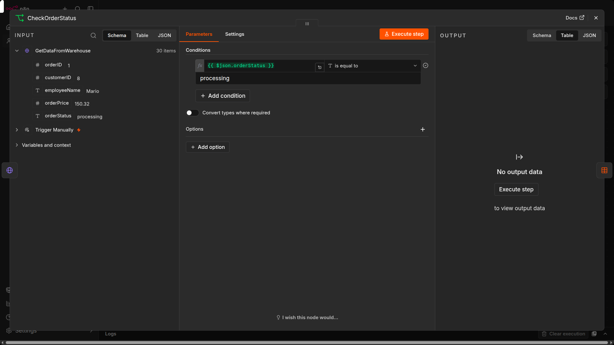

Make sure to select the correct data type (boolean, date & time, number, or string) when you select the Operation. In this case, it is String. 

Select Execute step to test the If node.

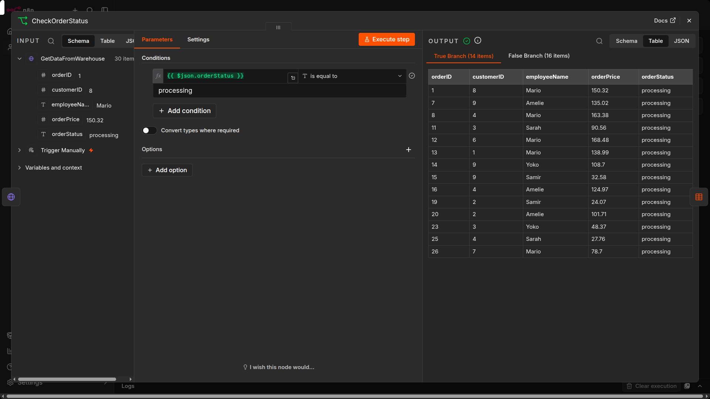

The orders with a processing order status should show for the True Branch output, while the orders with a booked order status should show in the False Branch output.

Close the If node detail view when you're finished.

## 3.3 Insert data into the Data Table

Next, we want to insert the filtered data into our Data Table. Remember what Nathan said at the end of the Inserting data into a Data Table unit?

*"I actually need to insert only processing orders in the table..."*

Since Nathan only needs the processing orders in the table, we'll connect the Data Table node to the If node's true connector.

In this case, since the Data Table node is already connected to our try branch. If it isn't, select the If node true connector and drag it to the Data Table node.

It's a good idea at this point to retest the Data Table node. Before you do, navigate to the Data Tables tab in the left-side panel, open your orders table, and delete all existing rows. Then return to the workflow, open the Data Table node window in n8n, and select Execute step.

Review the data in your Data Table to be sure your workflow only added the correct orders (those with orderStatus of processing). There should be 14 records now instead of 30.

### What's next?

```text
Nathan: This If node is so useful for filtering data! Now I have all the information about processing orders. I actually only need the employeeName and orderID, but I guess I can keep all the other fields just in case.
```

```text
You: Actually, I wouldn't recommend doing that. Inserting more data requires more computational power, the data transfer is slower and takes longer, and takes up more storage resources in your table. In this particular case, 14 records with 5 fields might not seem like it'd make a significant difference, but if your business grows to thousands of records and dozens of fields, things add up and even one extra column can affect performance.
```

```text
Nathan: Oh, that's good to know. Can you select only two fields from the processing orders?
```

```text
You: Sure, I'll do that in the next unit.
```

# 4. Setting values for processing orders

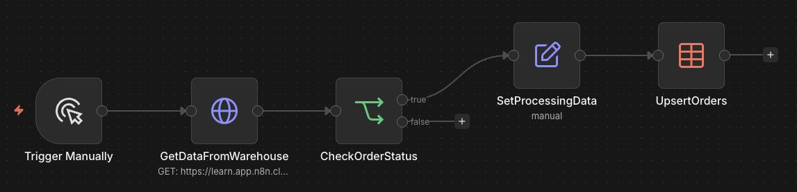

In this unit, you will learn how to select and set data before transferring it to a Data Table using the Edit Fields (Set) node.

The next step in Nathan's workflow is to filter the data to only insert the employeeName and orderID of all processing orders into a Data Table.

For this, you need to use the Edit Fields (Set) node, which allows you to select and set the data you want to transfer from one node to another.

The Edit Fields node can set completely new data as well as overwrite data that already exists. This node is crucial in workflows which expect incoming data from previous nodes, such as when inserting values into spreadsheets or databases

## 4.1 Add another node before the Data Table node

In your workflow, add another node before the Data Table node from the If node on the If node's true connector. Feel free to drag the Data Table node further away if your canvas feels crowded.

## 4.2 Configure the Edit Fields node

Search for the Edit Fields (Set) node after you've selected the + sign coming off the If node's true connector.

With the Edit Fields node window open, configure these parameters:

- Rename the node SetProcessingData
- Ensure Mode is set to Manual Mapping.
- While you can use the expression editor we used in the Filtering orders unit, this time, drag the fields from the Input into the Fields to Set:
    - Drag If > orderID as the first field.
    - Drag If > employeeName as the second field.
- Ensure that Include Other Input Fields is set to false

Select Execute step. You should see the following results:

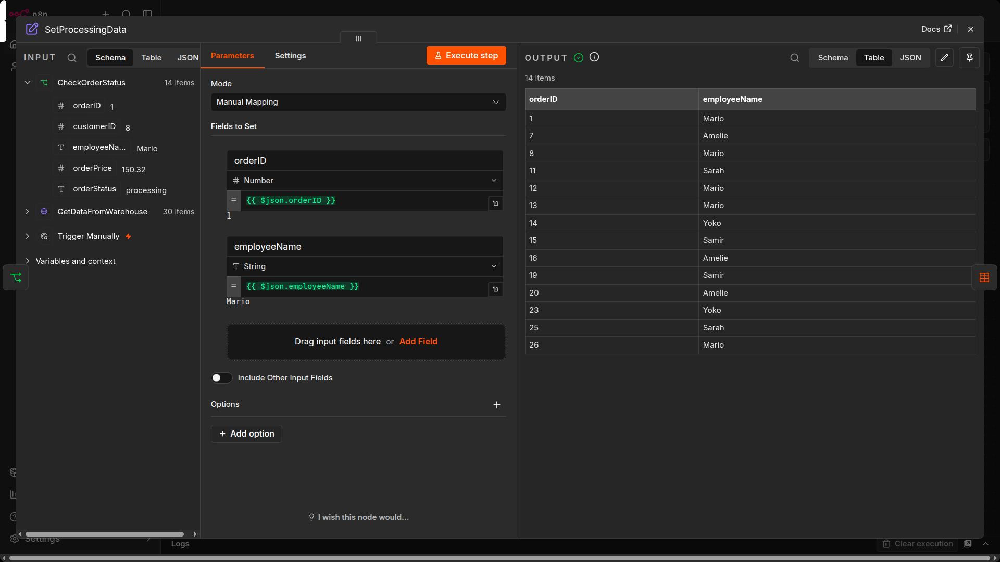

## 4.3 Add data to the Data Table

Next, insert these filtered values into a new Data Table:

- Navigate to the Data Tables tab in the left-side panel of the Editor UI.
- Create a new Data Table called processingOrders.
- Add the following columns:

    | Column name | Column type |
    |---|---|
    | orderID | Number |
    | employeeName | String |

> [!NOTE] If you get stuck, refer to the Inserting data into a Data Table unit earlier in this section.

- Return to your workflow in the Editor UI.
- Connect the Edit Fields node connector to the Data Table node.
- Update the Data Table node configuration to point to the new processingOrders table instead of the orders table.
- Test your Data Table node to be sure it inserts records into the new processingOrders table. You can verify by checking the table in the Data Tables tab.

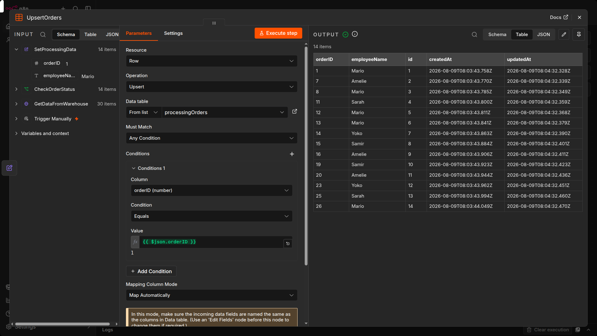

### What's next?

```text
Nathan: You've already automated half of my work! Now I still need to calculate the booked orders for my colleagues. Can we automate that as well?
```

```text
You: Yes! In the next unit, I'll use some JavaScript code in a node to calculate the booked orders.
```

# 5. Calculating booked orders

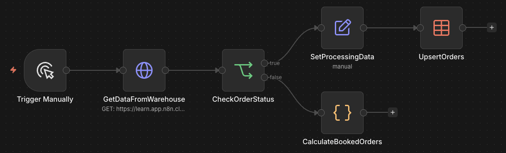

In this unit, you will learn how n8n structures data and how to add custom JavaScript code to perform calculations using the Code node. 

The next step in Nathan's workflow is to calculate two values from the booked orders:

- The total number of booked orders
- The total value of all booked orders

To calculate data and add more functionality to your workflows you can use the Code node, which lets you write custom JavaScript code.

## 5.1 About the Code node

> [!NOTE] The Code node has two operational modes, depending on how you want to process items:

- Run Once for All Items allows you to write code to process all input items at once, as a group.
- Run Once for Each Item executes your code once for each input item.

In n8n, the data that's passed between nodes is an array of objects with the following JSON structure:

```json
[
  {
    "json": {
      "apple": "beets",
      "carrot": {
        "dill": 1
      }
    },
    "binary": {
      "apple-picture": {
        "data": "....",
        "mimeType": "image/png",
        "fileExtension": "png",
        "fileName": "example.png"
      }
    }
  }
]
```

Key notes on the data structure:

- json (required): n8n stores the actual data within a nested json key. This property is required, but can be set to anything from an empty object (like {}) to arrays and deeply nested data. The Code node automatically wraps the data in a json object and parent array ([]) if it's missing.
- binary (optional): Binary data of item. Most items in n8n don't contain binary data.

## 5.2 Configure the Code node

In your workflow, add a Code node connected to the false branch of the If node.

When you search for the Code node, you will see two options: Code in JavaScript and Code in Python. Select Code in JavaScript. Don't forget to rename your node! Rename it to CalculateBookedOrders

> [!NOTE] Both JavaScript and Python are supported in the Code node. We use JavaScript throughout this course, but you can use whichever language you're more comfortable with.

With the Code node window open, set Mode to Run Once for All Items.

Copy the code below and paste it into the Code box to replace the existing code:

```javascript
let items = $input.all();
let totalBooked = items.length;
let bookedSum = 0;

for (let i=0; i < items.length; i++) {
  bookedSum = bookedSum + items[i].json.orderPrice;
}

return [{ json: {totalBooked, bookedSum} }];
```

Notice the format in which we return the results of the calculation:

```javascript
return [{ json: {totalBooked, bookedSum} }]
```

> [!NOTE] If you don't use the correct data structure, you will get an error message: 

> Error: Always an Array of items has to be returned!

Now select Execute step and you should see the following results:

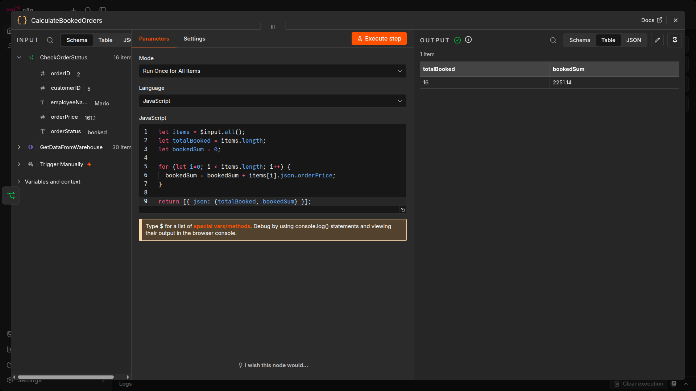

### What's next?

```text
Nathan: Wow, the Code node is powerful! This means that if I have some basic JavaScript skills I can power up my workflows.
```

```text
You: Yes! You can progress from no-code to low-code!
```

```text
Nathan: Now, how do I send the calculations for the booked orders to my team's Discord channel?
```

```text
You: There's an n8n node for that. I'll set it up in the next unit.
```

# 6. Notifying the team

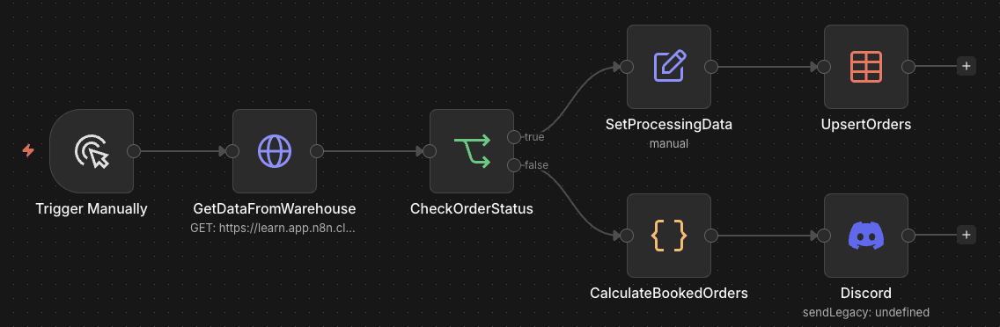

In this unit, you will learn how to send messages to a Discord channel using the Discord node.

Now that you have a calculated summary of the booked orders, you need to notify Nathan's team in their Discord channel. For this workflow, you will send messages to the n8n server on Discord.

Before you begin the steps below, use this [link](https://discord.gg/G98WXzsjky) to connect to the n8n server on Discord. Be sure you can access the #n8n-quickstart channel.

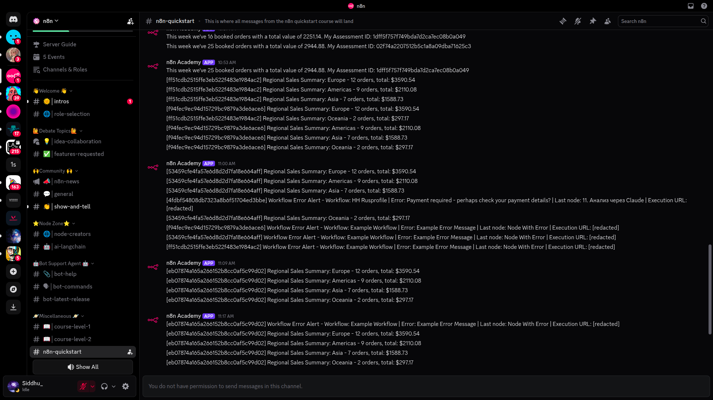

## 6.1 Add the Discord node

In your workflow, add a Discord node connected to the Code node.

When you search for the Discord node, look for Message Actions and select Send a message to add the node.

## 6.2 Configure the Discord node

In the Discord node window, configure these parameters:

- Connection Type: Select Webhook.
- Credential for Discord Webhook: Select - Create New Credential
- In the Webhook URL field, enter: https://learn.app.n8n.cloud/webhook/courses/n8n-quickstart/notify-team
- Rename the credential n8n Quickstart S1 Discord Webhook account by clicking on the name in the top left. 
- Click Save and then close the credentials dialog.

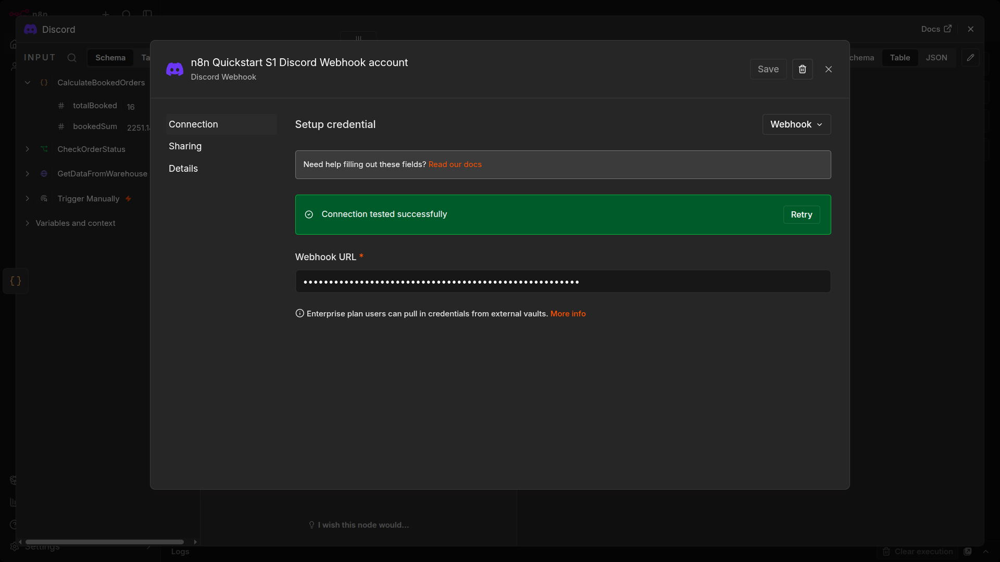

- Operation: Select Send a Message.
- Message:
    - Select the Expression tab on the right side of the Message field.
    - Copy the text below and paste it into the Expression window, or construct it manually using the expression editor.

```text
This week we've {{$json.totalBooked}} booked orders with a total value of {{$json.bookedSum.round(2)}}. My Assessment ID: {{ $('GetDataFromWarehouse').params.headerParameters.parameters[0].value }}
```

> [!NOTE] The expression above automatically pulls your Assessment ID from the GetDataFromWarehouse HTTP Request node's header parameters that you configured earlier. This is the same Assessment ID found at the top of your LMS page under your login name.

Now select Execute step in the Discord node. If all works well, you should see the output in n8n.

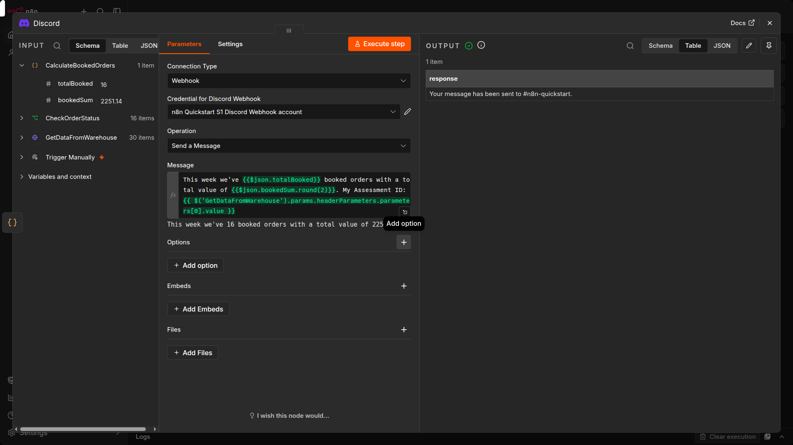

Your message should also appear in the #n8n-quickstart channel on the n8n Discord. 

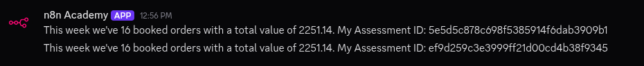

### What's next?

```text
Nathan: Incredible, you've saved me hours of tedious work already! Now I can execute this workflow when I need it. I just need to remember to run it every Monday morning at 9 AM.
```

```text
You: Don't worry about that, you can actually schedule the workflow to run on a specific day, time, or interval. I'll set this up in the next unit.
```

# 7. Scheduling the workflow

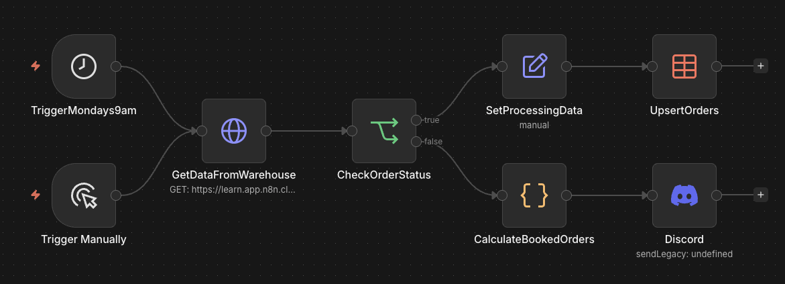

In this unit, you will learn how to schedule your workflow so that it runs automatically at a set time or interval using the Schedule Trigger node.

The workflow you've built so far executes only when you select Execute Workflow via the Manual Trigger. But Nathan needs it to also run automatically every Monday morning. You can do this with the Schedule Trigger, which allows you to schedule workflows to run periodically at fixed dates, times, or intervals.

The great thing is that a workflow can have multiple triggers. We'll keep the Manual Trigger so you can still run the workflow on demand for testing, and add a Schedule Trigger alongside it.

## 7.1 Add the Schedule Trigger node

- Open the nodes panel and search for Schedule Trigger.
- Select it when it appears in the search results.

In the Schedule Trigger node window, configure these parameters:

- Trigger Interval: Select Weeks.
- Weeks Between Triggers: Enter 1.
- Trigger on weekdays: Select Monday (and remove Sunday if added by default).
- Trigger at Hour: Select 9am.
- Trigger at Minute: Enter 0.

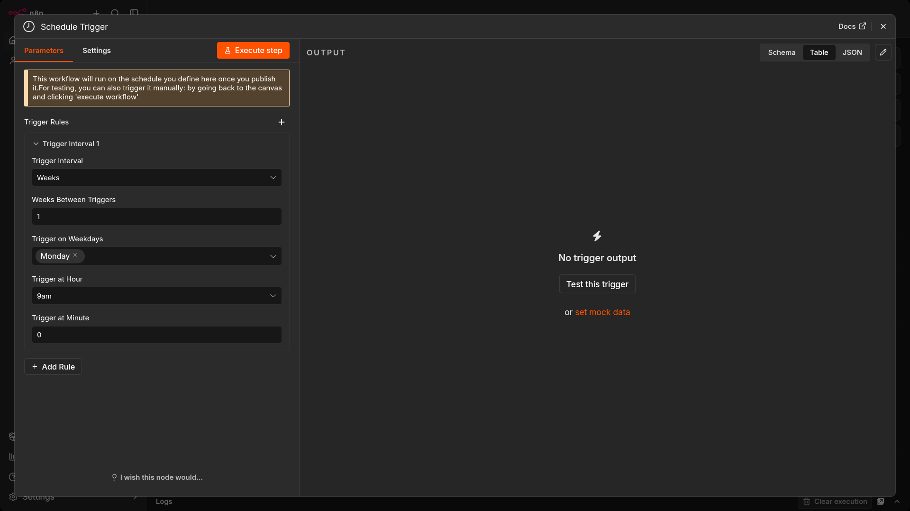


> [!NOTE]
> To ensure accurate scheduling with the Schedule Trigger node, be sure to set the correct timezone for your n8n instance or the workflow's settings. The Schedule Trigger node will use the workflow's timezone if it's set, and will fall back to the n8n instance's timezone if it's not.

## 7.2 Rename and connect the node

Before connecting the node, let's give it a descriptive name. Double-click the node title and rename it to TriggerMondays9am. Clear naming helps you and others understand what each node does at a glance, especially as your workflows grow.

Now connect the Schedule Trigger node to the GetOrdersFromWarehouse HTTP Request node by dragging the arrow from it to the HTTP Request node. Your workflow now has two triggers -- the Manual Trigger for on-demand testing, and TriggerMondays9am for the automated Monday schedule.

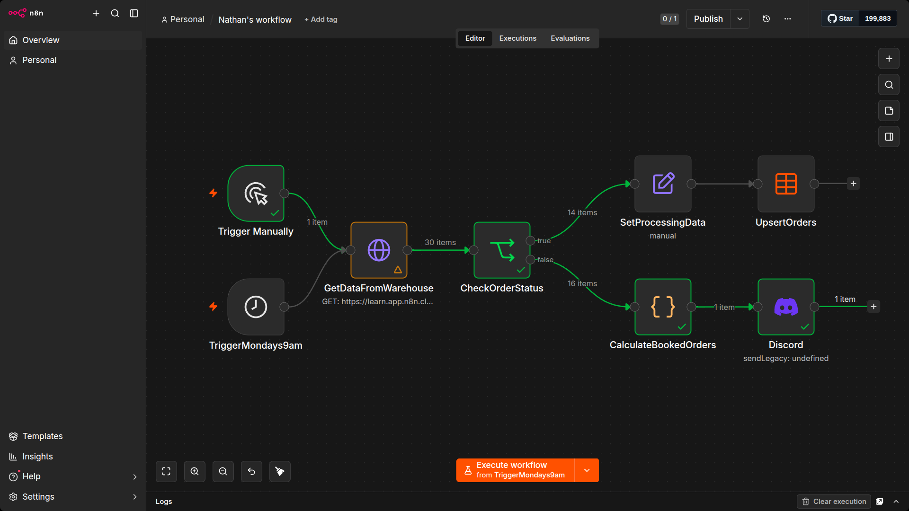

### What's next?

```text
You: That was it for the workflow! I've added and configured all necessary nodes. Now you can test anytime using the Manual Trigger, and every Monday morning at 9 AM the Schedule Trigger will kick things off automatically -- getting, filtering, calculating, and transferring the sales data.
```

```text
Nathan: This is just what I needed! So it will run automatically every Monday morning, correct?
```

```text
You: Not so fast. To do that, you need to publish your workflow. I'll do this in the next unit and show you how to interpret the execution log.
```

# 8. Publishing and examining the workflow

In this unit, you will learn how to publish your workflow and change the default workflow settings.

Publishing a workflow means that it will run automatically every time a trigger node receives input or meets a condition. By default, newly created workflows are not published.

To publish your workflow, select Publish in the top navigation of the Editor UI. Nathan's workflow will now be executed automatically every Monday at 9 AM.


## 8.1 Workflow executions

An execution represents a completed run of a workflow, from the first to the last node. n8n logs workflow executions, allowing you to see if the workflow succeeded or not. The execution log is useful for debugging your workflow and seeing at what stage it runs into issues.

To view the executions for a specific workflow, you can switch to the Executions tab when the workflow is open on the canvas. Use the Editor tab to swap back to the node editor.

To see the execution log for the entire n8n instance, in your Editor UI, select Overview and then select the Executions tab in the main panel.

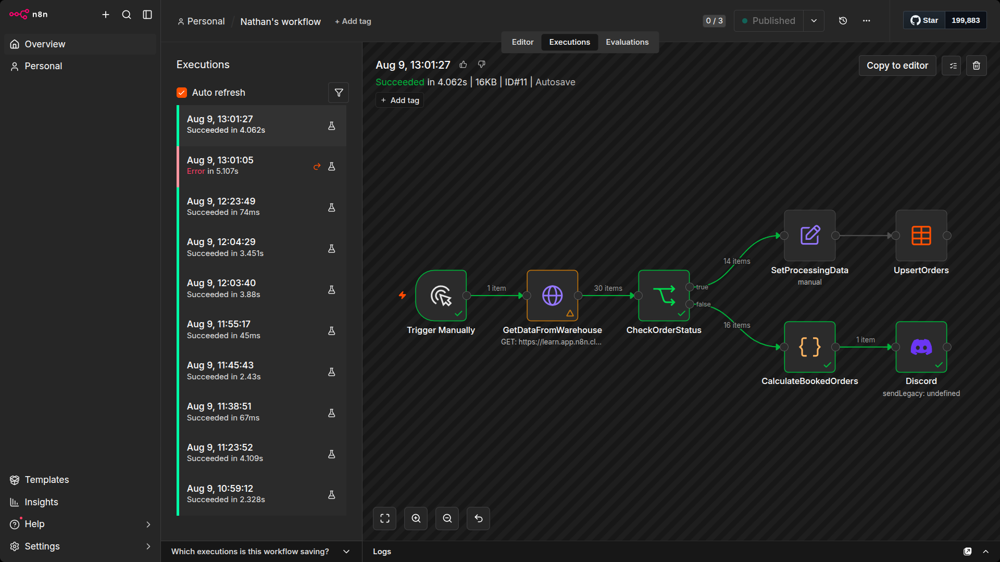

The Executions window displays a table with the following information:

- Name: The name of the workflow
- Started At: The date and time when the workflow started
- Status: The status of the workflow (Waiting, Running, Succeeded, Cancelled, or Failed) and the amount of time it took the workflow to execute
- Execution ID: The ID of this workflow execution

> [!NOTE] You can filter the displayed Executions by workflow and by status (Any Status, Failed, Cancelled, Running, Success, or Waiting). The information displayed here depends on which executions you configure to save in the Workflow Settings.

## 8.2 Workflow settings

You can customize your workflows and executions, or overwrite some global default settings in Workflow Settings.

Access these settings by selecting the three dots in the upper right corner of the Editor UI when the workflow is open on the canvas, then select Settings.

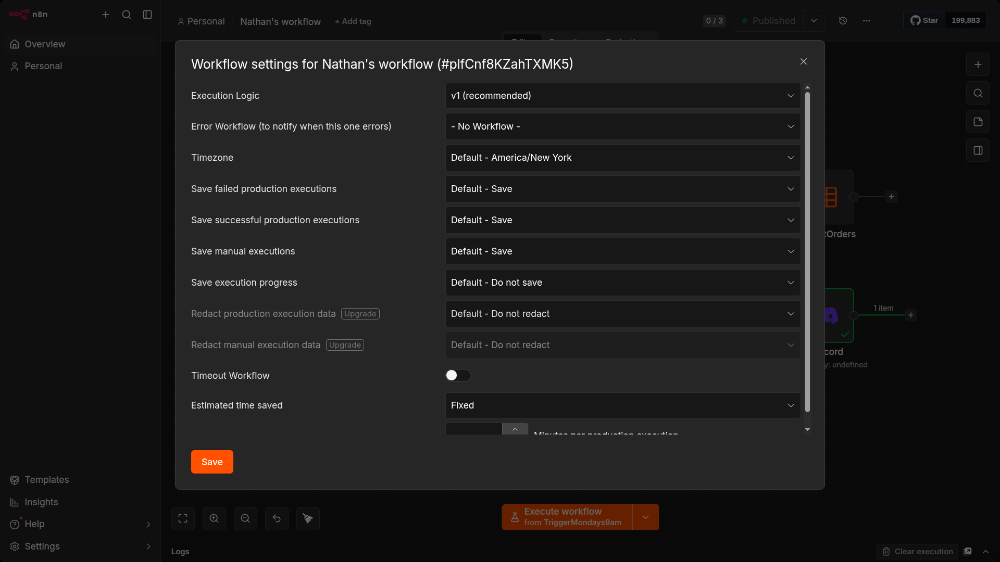

In the Workflow Settings window you can configure the following settings:

- **Execution Logic:** Choose the execution logic for multi-branch workflows. You should leave this set to v1 (recommended) if you don't have workflows that rely on the legacy execution ordering.
- **Error Workflow** (to notify when this one errors): A workflow to run if the execution of the current workflow fails.
- **This workflow can be called by**: Workflows allowed to call this workflow using the Execute Sub-workflow node.
- **Timezone**: The timezone to use in the current workflow. If not set, the global timezone is used. This setting is important for the Schedule Trigger node, as you want to make sure that the workflow gets executed at the right time.
- **Save failed production executions**: If n8n should save the execution data of the workflow when it fails. Default is to save.
- **Save successful production executions**: If n8n should save the execution data of the workflow when it succeeds. Default is to save.
- **Save manual executions**: If n8n should save executions started from the Editor UI. Default is to save.
- **Save execution progress**: If n8n should save the execution data of each node. If set to Save, you can resume the workflow from where it stopped in case of an error, though keep in mind that this might make the execution slower. Default is to not save.
- **Redact production execution data**: Whether to redact data from production execution logs. Default is to not redact.
- **Redact manual execution data**: Whether to redact data from manual execution logs. Default is to not redact.
- **Timeout Workflow**: Whether to cancel a workflow execution after a specific period of time. Default is off.
- **Estimated time saved**: Set to Fixed or Custom to estimate how many minutes each production execution saves. Useful for tracking the ROI of your automations.

### What's next?

```text
You: That was it! Now you have a 8-node workflow that will run automatically every Monday morning. You don't have to worry about remembering to wrangle the data. Instead, you can start your week with more meaningful or exciting work.
```

```text
Nathan: This workflow is incredibly helpful, thank you! Now, what's next for you?
```

```text
You: I'd like to build more workflows, share them with others, and use some workflows built by other people.
```