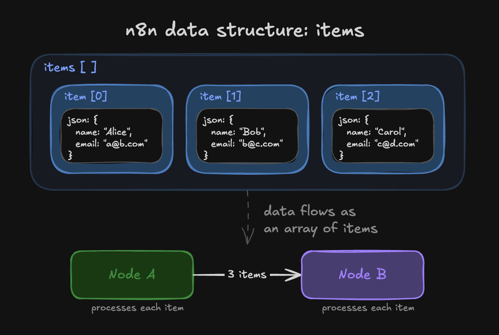
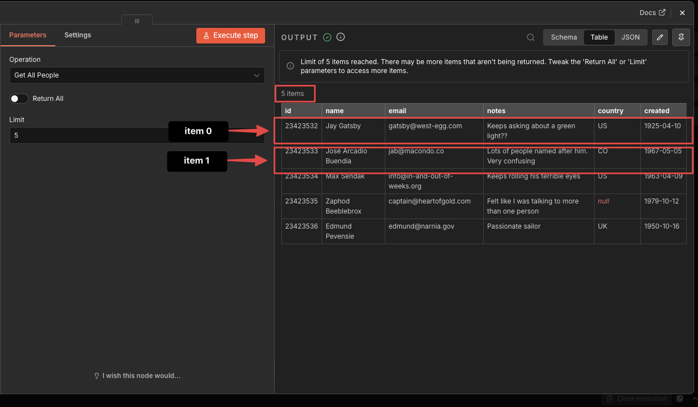
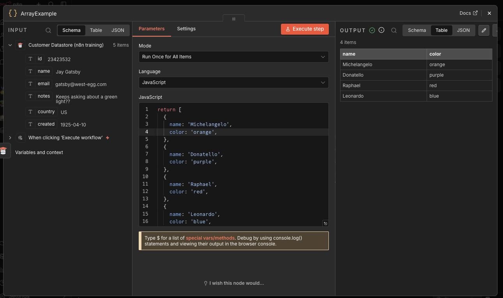
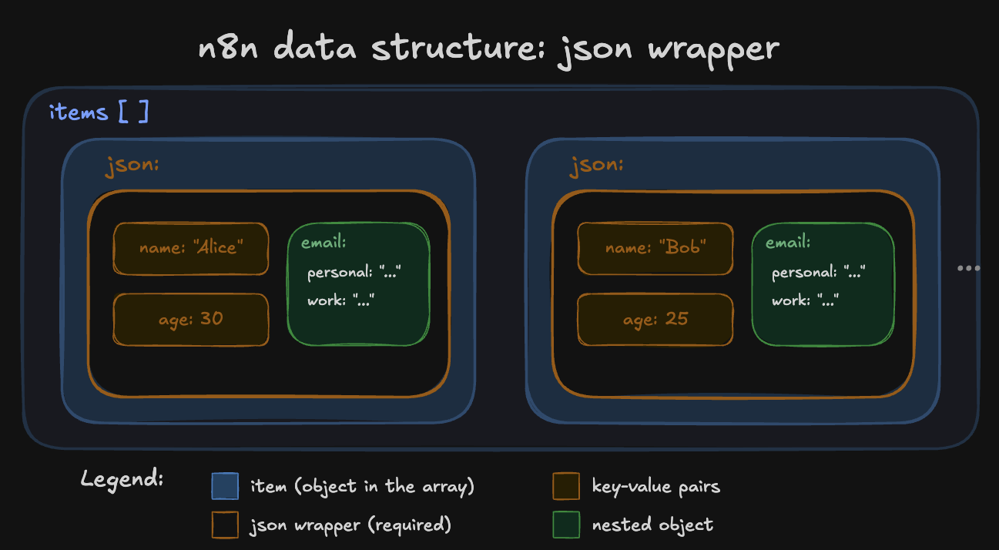
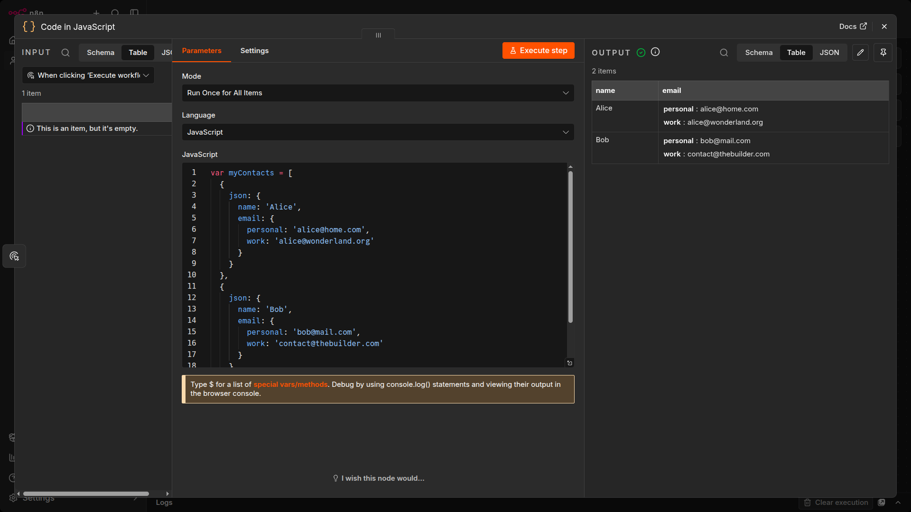
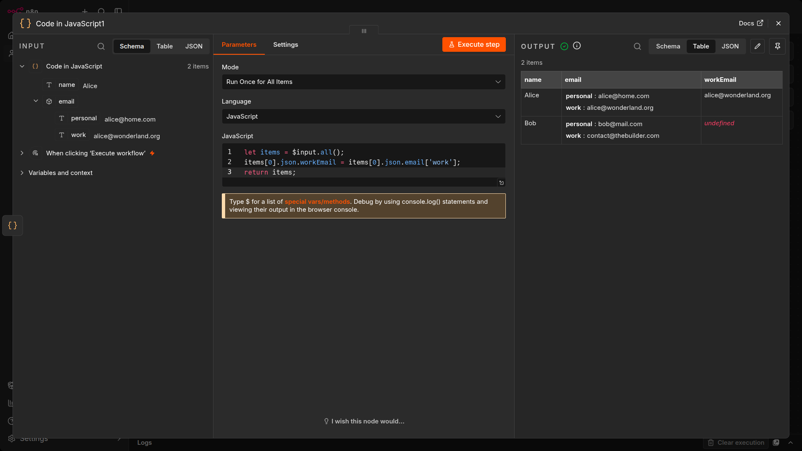
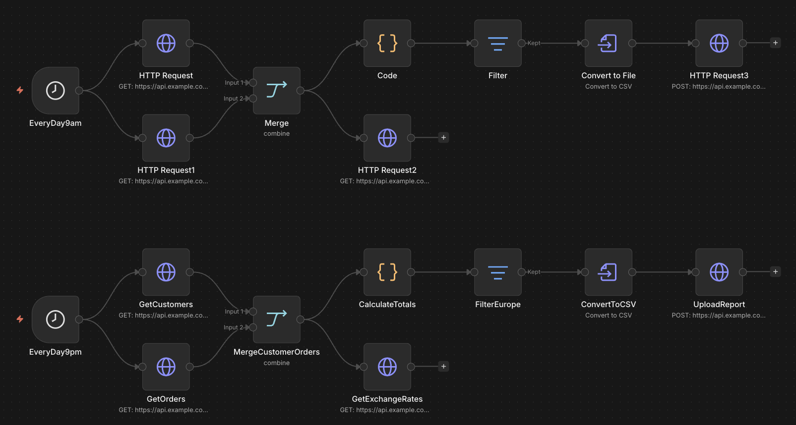
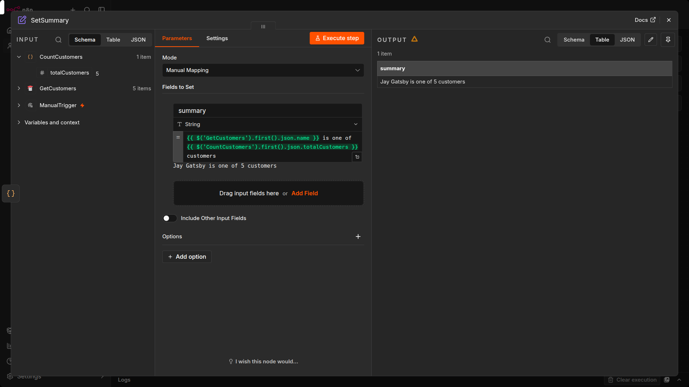
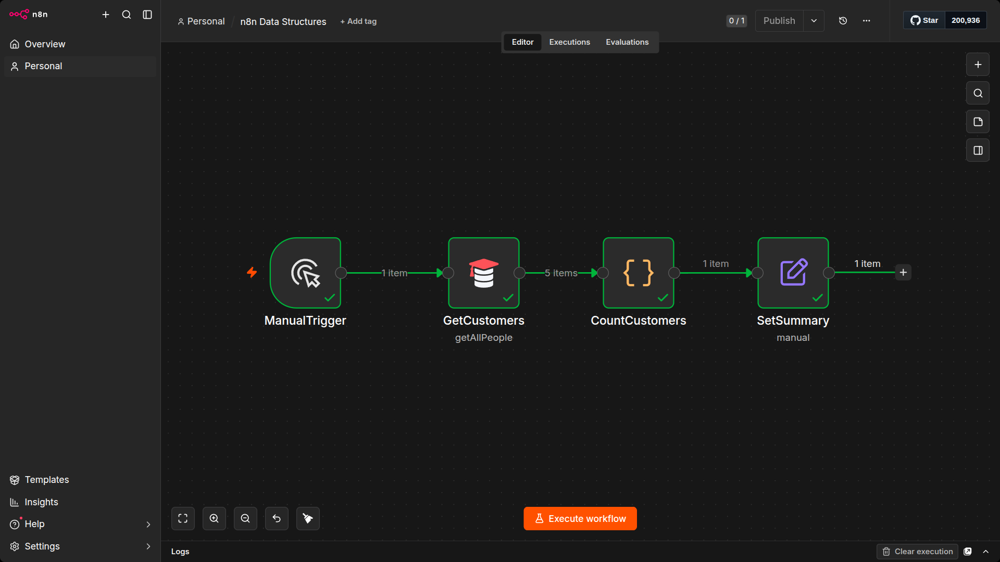

# Data structure of n8n

This section focuses on working with data in n8n. You will learn how to use the data structure of n8n correctly, process different data types (for example, XML, HTML, date, time, and binary data), merge data from different sources (for example, a database, spreadsheet, or CRM), and use functions and JavaScript code in the Code node.

You will learn all this by completing short practical exercises after the theoretical explanations and building a business workflow following step-by-step instructions.

n8n works like an ETL (Extract, Transform, Load) tool. The data that moves along from node to node in your workflow must be in a format (structure) that can be recognized and interpreted by each node. In n8n, this required structure is an array of objects.

Let's break down what this means:

## Arrays

An array is a list of values. The array can be empty or contain several elements. Each element is stored at a position (index) in the list, starting at 0, and can be referenced by the index number. For example, in the array:

```python
["Leonardo", "Michelangelo", "Donatello", "Raphael"]
```

The element `Donatello` is stored at index 2.

## Objects

An object stores key-value pairs, instead of values at numbered indexes as in arrays. The order of the pairs isn't important, as the values can be accessed by referencing the key name. For example, the object below contains two properties (name and color):

```json
{
  "name": "Michelangelo",
  "color": "blue"
}
```

## Arrays of objects

An array of objects is an array that contains one or more objects. For example, the array turtles below contains four objects:

```python
turtles = [
  {
    name: 'Michelangelo',
    color: 'orange',
  },
  {
    name: 'Donatello',
    color: 'purple',
  },
  {
    name: 'Raphael',
    color: 'red',
  },
  {
    name: 'Leonardo',
    color: 'blue',
  }
];
```

You can access the properties of an object using dot notation with the `syntax object.property`. For example, `turtles[1].color` gets the color of the second turtle.

Data sent from one node to another is sent as an array of JSON objects. The elements in this collection are called items.



An n8n node performs its action on each item of incoming data.



# Creating and referencing data with the Code node

Now that you are familiar with the n8n data structure, you can use it to create your own data sets or simulate node outputs. To do this, use the Code node to write JavaScript code defining your array of objects.

When creating data in the Code node, you need to wrap each object with a json key. This is the n8n data structure that the platform expects:

```javascript
return [
  {
    json: {
      apple: 'beets',
    }
  }
];
```

For example, the array of objects representing the Ninja turtles would look like this in the Code node:



Notice that the array of objects contains an extra key: json. n8n expects you to wrap each object in an array in another object, with the key json.



It's good practice to pass the data in the right structure used by n8n. But don't worry if you forget to add the json key to an item, n8n adds it automatically.

You can also have nested pairs, for example if you want to define a primary and a secondary color. In this case, you need to further wrap the key-value pairs in curly braces {}.

## Exercise: Creating a data set

In a Code node, create an array of objects named myContacts that contains the properties name and email, and the email property is further split into personal and work.

When you search for the Code node, select Code in JavaScript. Set Mode to Run Once for All Items.

In the JavaScript Code field you have to write the following code:

```javascript
var myContacts = [
  {
    json: {
      name: 'Alice',
      email: {
        personal: 'alice@home.com',
        work: 'alice@wonderland.org'
      }
    }
  },
  {
    json: {
      name: 'Bob',
      email: {
        personal: 'bob@mail.com',
        work: 'contact@thebuilder.com'
      }
    }
  }
];
return myContacts;
```

When you execute the Code node, the result should look like this:



## Referencing node data with the Code node

Just like you can use expressions to reference data from other nodes, you can also use some methods and variables in the Code node.

Please make sure you read these pages before continuing to the next exercise.

## Exercise: Referencing data

Let's build on the previous exercise, in which you used the Code node to create a data set of two contacts with their names and emails. Now, connect a second Code node to the first one. In the new node, write code to create a new column named workEmail that references the work email of the first contact.

In the Code node, in the JavaScript Code field you have to write the following code:

```javascript
let items = $input.all();
items[0].json.workEmail = items[0].json.email['work'];
return items;
```

When you execute the Code node, the result should look like this:



## Referencing data from other nodes

So far you've used $json.fieldName to access data from the node directly connected to the current one. That works when data flows in a straight line, but sometimes you need to reach back and grab something from a node further up the workflow.

n8n has a $() function for exactly this. Pass in the name of the node you want to reference:

```javascript
{{ $('GetCustomers').first().json.customerName }}
```

This grabs the first item from the GetCustomers node's output and reads the customerName field.

You have a few options for which item to grab:

| Method | Returns | Example |
|---|---|---|
| `.first()` | The first item | `$('NodeName').first().json.field` |
| `.last()` | The last item | `$('NodeName').last().json.field` |
| `.all()` | All items as an array | `$('NodeName').all()` |
| `.item` | The item at the same index as the current one | `$('NodeName').item.json.field` |

Use .first() when the node outputs a single item or you only care about one result. Use .item when both nodes process the same number of items and you want to match them up by position.

## Name your nodes

Before you go any further, take a look at your node names. By default, n8n names nodes after their type: "HTTP Request", "Code", "Edit Fields". When you add duplicates, n8n appends a number: "HTTP Request1", "HTTP Request2". That works, but it does not tell you what each node actually does.

Rename your nodes to describe what they do. Double-click the node title in the canvas and give it a clear name like "GetCountries" or "CalculateTotal". When you see `$('GetCountries').first().json.region` in an expression, you know exactly what data you are pulling. `$('HTTP Request 2').first().json.region` tells you nothing. 

Naming your nodes is self-documenting. You can clearly see what the workflow does when you have proper naming. Get into the habit of naming your workflows, your nodes and using a sticky note to explain what the workflow does. The naming convention should make sense to you and your team. We recommend using CamelCase or pascalCase as the no space makes it much easier to reference the node. 



## Exercise: referencing other nodes

Build a workflow that pulls data from two different upstream nodes into a single expression.

1. Add a Manual Trigger node.
2. Add a Customer Datastore node (action: Get All People). Rename it to GetCustomers.
3. Add a Code in JavaScript node after it. Rename it to CountCustomers. Paste this code:

  ```javascript
  return [{ json: { totalCustomers: $input.all().length } }]
  ```

4. Add an Edit Fields (Set) node after the Code node. Rename it SetSummary. 
5. In the Edit Fields node, add a new string field called summary. Switch the field value to expression mode and enter:

  ```text
  {{ $('GetCustomers').first().json.name }} is one of {{ $('CountCustomers').first().json.totalCustomers }} customers
  ```

6. Run the workflow and check the Edit Fields output. You should see a summary like "Jay Gatsby is one of 5 customers".



The Edit Fields node is not directly connected to GetCustomers, but it can still read from it using the $() syntax. Notice how the expression reads almost like a sentence because the nodes have descriptive names. If they were still called "Customer Datastore" and "Code", the same expression would work, but it would be harder to tell what data you are pulling and from where.

