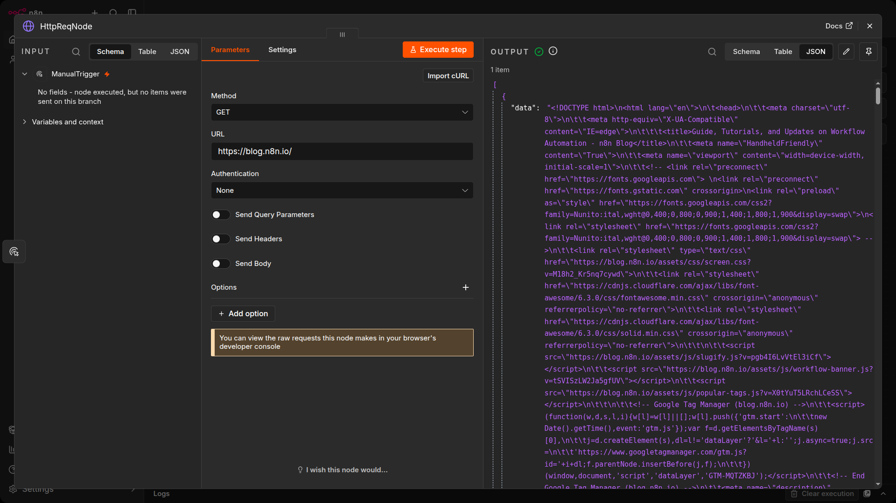
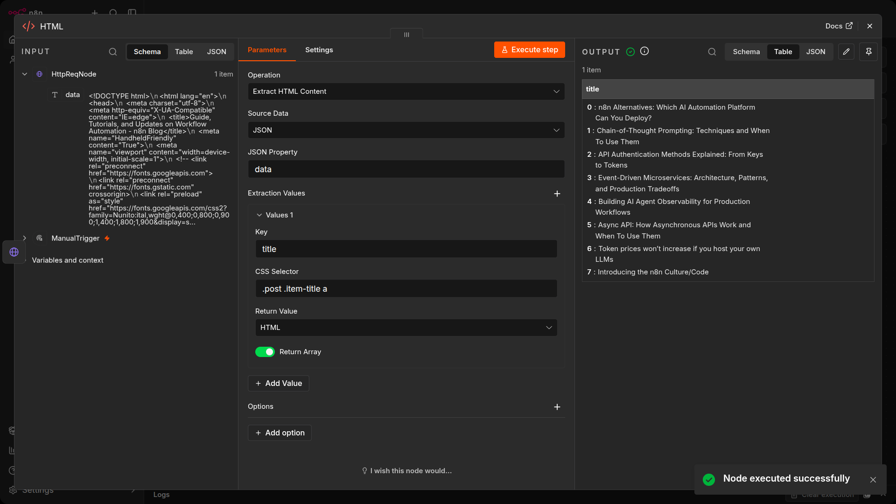
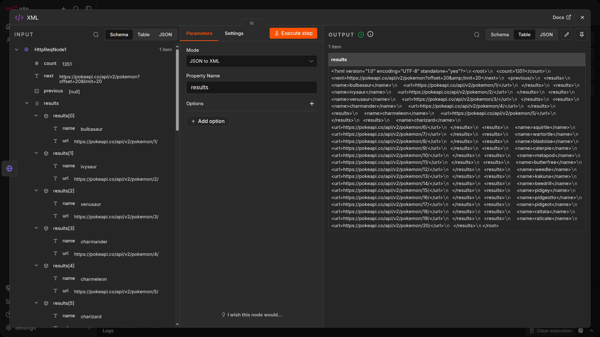
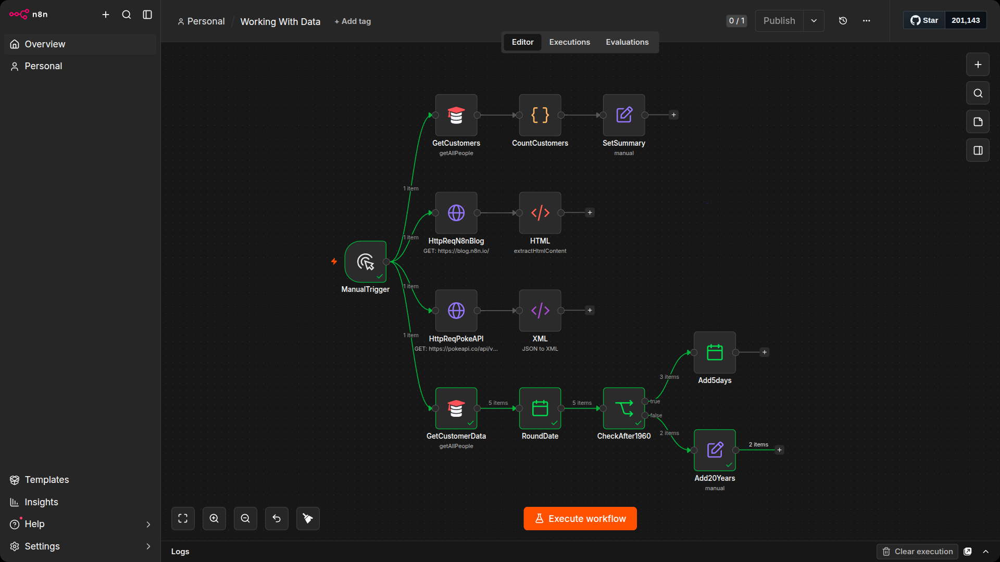
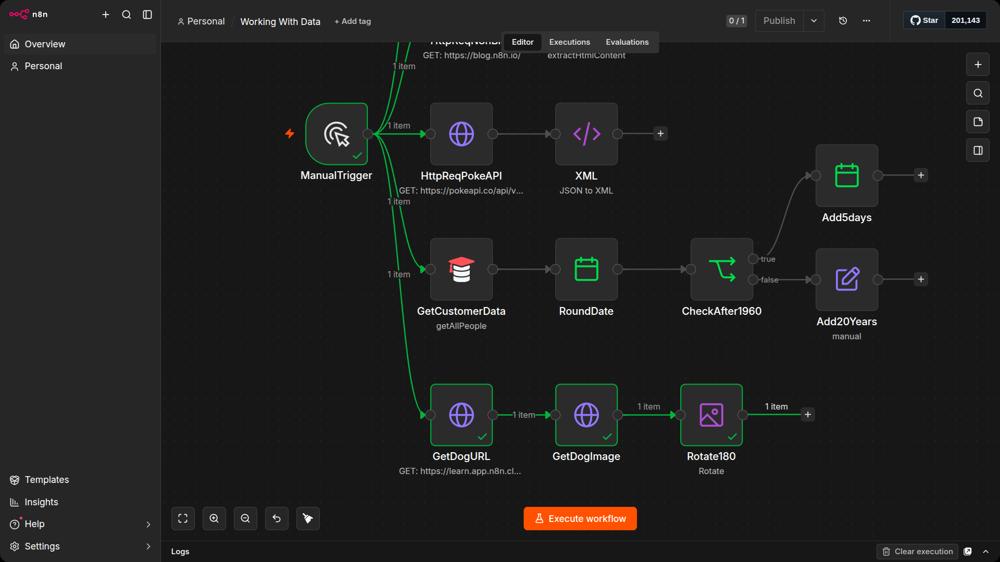
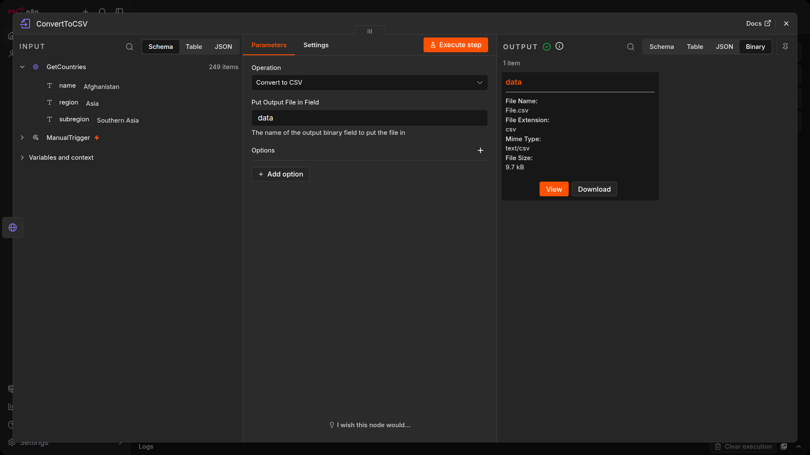
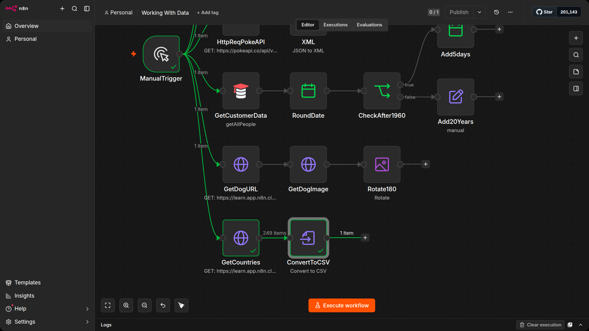

# HTML and XML data

In this unit, you will learn how to process different types of data using n8n core nodes.

You're most likely familiar with HTML and XML.

> [!NOTE] HTML is a markup language used to describe the structure and semantics of a web page. XML looks similar to HTML, but the tag names are different, as they describe the kind of data they hold.

If you need to process HTML or XML data in your n8n workflows, use the HTML node or the XML node.

- Use the HTML node to extract HTML content of a webpage by referencing CSS selectors. This is useful if you want to collect structured information from a website (web-scraping).

- Use the XML node to convert XML to JSON and JSON to XML. This operation is useful if you work with different web services that use either XML or JSON and need to get and submit data between them in the two formats.

## HTML Exercise

Let's get the title of the latest n8n blog post:

1. Use the HTTP Request node to make a GET request to the URL `https://blog.n8n.io/` (this endpoint requires no authentication)

2. Connect an HTML node and configure it to extract the title of the first blog post on the page.
    - `Note:` If you're not familiar with CSS selectors or reading HTML, the CSS selector `.post .item-title a` should help.

3. Configure the HTTP Request node with the following parameters:
    - `Authentication:` None
    - `Request Method:` GET
    - `URL:` https://blog.n8n.io/



4. Connect an HTML node to the HTTP Request node and configure the former's parameters:

    - `Operation:` Extract HTML Content
    - `Source Data:` JSON
    - `JSON Property:` data
    - `Extraction Values:`
        - `Key:` title
        - `CSS Selector:` .post .item-title a
        - `Return Value:` HTML
        - Toggle Return Array on

The Return Array option will return all instances on the page for the defined selector. If you only need the first one you would keep this off. 

You can add more values to extract more data. You need to know the css selector to extract that data. The result should look like this:



## XML exercise

In this exercise, we'll use the Pokemon API to request JSON and then we'll convert the output to XML:

1. Add an HTTP Request node that makes the same request to the PokeAPI at https://pokeapi.co/api/v2/pokemon.
Use the XML node to convert the JSON output to XML.

2. Use the XML node to convert the JSON output to XML.

To get the pokemon from the PokeAPI, execute the HTTP Request node with the following parameters:

- `Authentication:` None
- `Request Method:` GET
- `URL:` https://pokeapi.co/api/v2/pokemon

3. Connect an XML node to it with the following parameters:

    - `Mode:` JSON to XML
    - `Property name:` results

The result should look like this:



To transform data the other way around, select the mode XML to JSON.

# Date, time, and interval data

Date and time data types include DATE, TIME, DATETIME, TIMESTAMP, and YEAR. The dates and times can be passed in different formats, for example:

- `DATE:` March 29 2022, 29-03-2022, 2022/03/29
- `TIME:` 08:30:00, 8:30, 20:30
- `DATETIME:` 2022/03/29 08:30:00
- `TIMESTAMP:` 1616108400 (Unix timestamp), 1616108400000 (Unix ms timestamp)
- `YEAR:` 2022, 22

There are a few ways you can work with dates and times:

- Use the `Date & Time` node to convert date and time data to different formats and calculate dates.
- Use the `Schedule Trigger node` to schedule workflows to run at a specific time, interval, or duration.

Sometimes, you might need to pause the workflow execution. This might be necessary if you know that a service doesn't process the data instantly or it's slow to return all the results. In these cases, you don't want n8n to pass incomplete data to the next node.

If you run into situations like this, use the `Wait node` after the node that you want to delay. The Wait node pauses the workflow execution and will resume execution:

- At a specific time.
- After a specified time interval.
- On a webhook call.

## Date and time data types

Working with date and time data is common in automation workflows. n8n supports several date and time data types: DATE, TIME, DATETIME, TIMESTAMP, and YEAR, in various formats.

## Date and Time node

The Date & Time node is the primary node for working with dates in n8n. It can convert between date formats, add or subtract time from dates, round dates to specific units, and compare dates. You will use this node whenever your workflow needs to calculate deadlines, filter records by date ranges, or format dates for different systems.

## Luxon date expressions

n8n also supports date manipulation through Luxon expressions in any node that accepts expressions. Luxon is a JavaScript library for working with dates and times that is built into n8n. You can use Luxon methods like `.toDateTime().plus()` and `.toDateTime().minus()` directly in expression fields, giving you a flexible alternative to the Date & Time node.

## Exercise: Working with dates

Build a workflow that rounds customer creation dates, filters them by year, and then applies different date calculations depending on the result.

1. Add a Customer Datastore (n8n training) node connected to the Manual Trigger. Set the resource to All People and enable Return All. Name it GetCustomerData.
2. Execute the node and inspect the output. Notice the created field on each customer -- this is the date you will work with.
3. Add a Date & Time node connected to GetCustomerData. Name it RoundDate.
4. Set the operation to `Round a Date`. Set the date input to the expression `{{ $json.created }}`, the mode to `Round Up`, and the output field name to `newDate`. Under Options, enable `Include Input Fields` so the original customer data is preserved alongside the rounded date.
5. Execute the node. Each customer's created date should now be rounded up to the nearest month in the newDate field.
6. Add an If node connected to RoundDate. Name it CheckAfter1960.
7. Set the condition to check whether `{{ $json.newDate }}` is a date that is after `1960-01-01T00:00:00`. This splits the customers into two branches based on their rounded creation date.
8. Execute the node and check how many customers go to the true branch versus the false branch.
9. Add a Date & Time node connected to the true output of CheckAfter1960. Name it Add5days.
10. Set the operation to `Add to a Date`. Set the date input to the expression `{{ $json.newDate }}`, the duration to `5`, and the unit to `Days`. Set the output field name to `plus5Days`. Under Options, enable `Include Input Fields`.
11. Execute the node. Each customer in the true branch should now have a plus5Days field showing their rounded date shifted forward by 5 days.
12. Add an Edit Fields (Set) node connected to the false output of CheckAfter1960. Name it Add20Years.
13. In the Edit Fields node, add a new field called `newYear` with the type set to `String`. Set the value to the following Luxon expression:

    ```text
    {{ $json.newDate.toDateTime().plus(20, 'years') }}
    ```

14. Enable `Include Other Input Fields` so the original data is preserved.
15. Execute the node. Each customer in the false branch should have a newYear field showing their date shifted forward by 20 years using Luxon rather than the Date & Time node.

This exercise demonstrates two ways to manipulate dates in n8n. The Date & Time node (RoundDate, Add5days) provides a visual, no-code approach. Luxon expressions in the Edit Fields node (Add20Years) offer more flexibility when you need date operations that go beyond what the Date & Time node provides out of the box.



# Binary data

Binary data refers to files such as images, PDFs, audio, and video. These files are represented in the binary numeral system and require conversion to a readable format for processing.

## Key nodes for binary data

- `HTTP Request` -- transfers files from web resources and APIs.
- `Read/Write Files from Disk` -- reads and writes files directly (self-hosted n8n only).
- `Convert to File` -- outputs input data as files (for example, converts JSON to CSV, XLSX, or other file formats).
- `Extract From File` -- converts binary format to JSON (for example, extracts text from a PDF).
- `Edit Image` -- performs image operations like rotating, cropping, resizing, and compositing.

> [!NOTE] For Cloud or Docker installations, use /tmp/filename for file paths. For npm installations, use ~/filename.

## Exercise 1: Downloading and editing an image

Build a workflow that fetches a random dog image from an API, downloads it, and rotates it upside down. This demonstrates how to chain HTTP Request nodes to first get a URL and then download the binary file it points to.

1. Add the Manual trigger. Name it ManualTrigger
2. Add an HTTP Request node connected to the Manual Trigger. Name it GetDogURL.
3. Set the URL to https://learn.app.n8n.cloud/webhook/apis/dog-images and execute the node. The response contains a message field with a URL pointing to a random dog image.
4. Add a second HTTP Request node connected to GetDogURL. Name it GetDogImage.
5. Set the URL to the expression `{{ $json.message }}`. This passes the image URL from the previous node's output into the request.
6. Execute the node. The output should show binary data with a preview of the dog image in the Binary tab.
7. Add an Edit Image node connected to GetDogImage. Name it Rotate180.
8. Set the operation to Rotate and the rotation angle to 180 degrees.
9. Execute the workflow. The Edit Image node should display the same dog image, now rotated upside down.



## Exercise 2: Converting JSON to a CSV file

Build a workflow that fetches data from an API and converts it into a downloadable CSV file. This demonstrates how to turn JSON output into a binary file format.

1. Add an HTTP Request node connected to the Manual Trigger. Name it GetCountries.
2. Set the method to GET and the URL to https://learn.app.n8n.cloud/webhook/countries
3. Add a Convert to File node connected to GetCountries. Name it ConvertToCSV.
4. Set the operation to Convert to CSV.
5. Execute the node. The output should show a binary file in the Binary tab. Click the binary data to preview or download the CSV file containing the country data.






