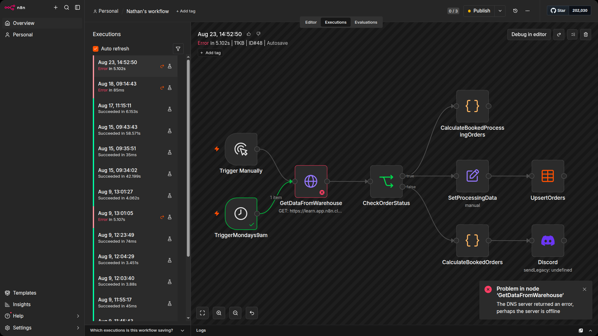
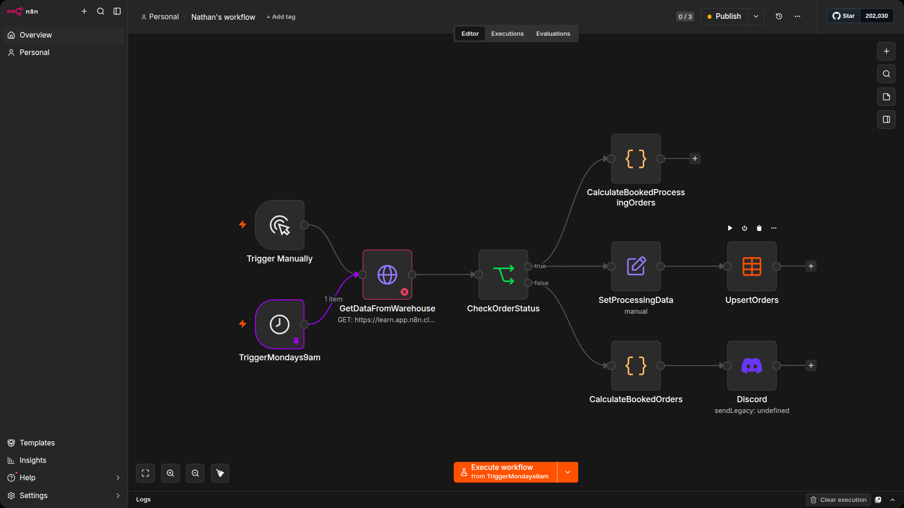
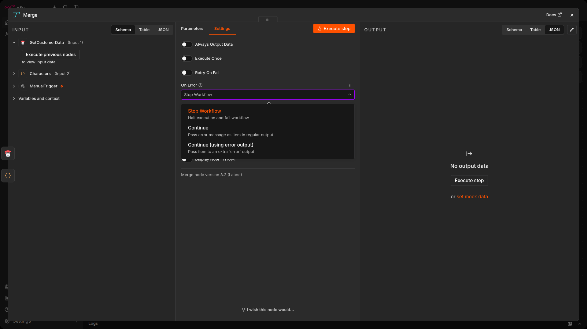
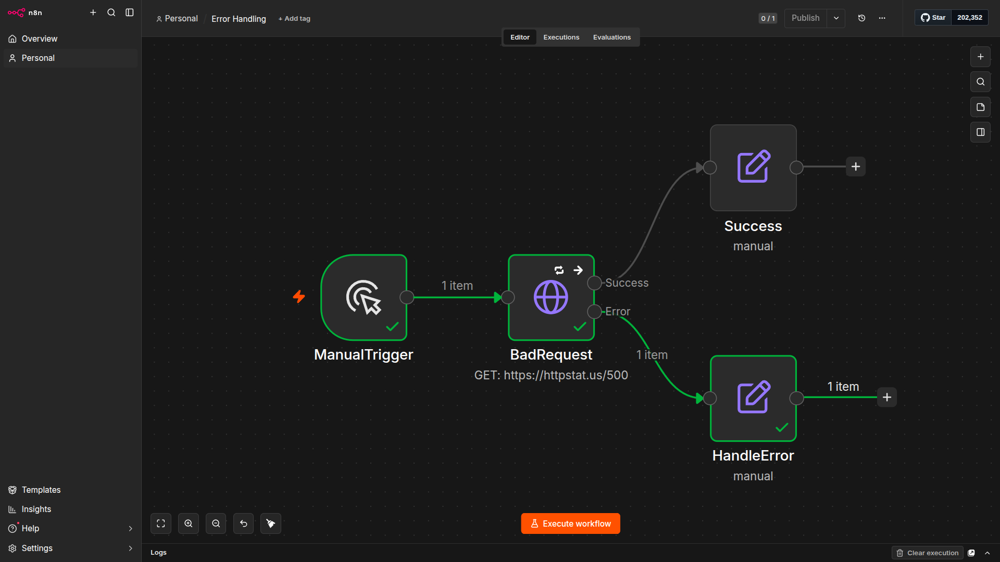

# Checking failed workflows

When a workflow fails, n8n provides tools to help you figure out what went wrong. Every workflow execution can be recorded in the Executions log, which you can access from the left panel in the Editor UI or by switching to the Executions tab when a workflow is open.

The Executions log shows:

- The workflow name
- When the execution started
- The status (Succeeded, Failed, Running, 
- Waiting, or Cancelled)
- How long the execution took
- The execution ID

## Saving successful executions

By default, n8n only saves failed executions to the log. Successful executions are not saved, which means you won't see them in the Executions list unless you change this setting. To enable it, open Workflow Settings and set Save Successful Production Executions to Yes. This is useful when you want to verify that a workflow ran correctly or need to inspect the output data from a past execution.

## Inspecting failed executions

When you select a failed execution from the log, n8n opens a read-only view of the workflow showing exactly where the error occurred. Failed nodes are highlighted in red, and you can click on them to see the error details including the error message and the data that was being processed at the time of failure.

Use the Editor | Executions toggle at the top of the screen to switch between editing your workflow and reviewing past executions. This lets you move quickly between investigating a failure and fixing the problem.

## Debugging failed executions

Once you have identified a failed execution, you can copy it into the editor for debugging. Click the Debug in editor button on a failed execution and n8n will load that execution's data into the workflow editor with all the node outputs pinned. This means you can re-run individual nodes or the entire workflow using the exact same data that caused the failure, without needing to trigger a new execution from scratch. Fix the problem, test it against the pinned data, and then unpublish the pinned data when you are satisfied the issue is resolved.

# Catching and handling errors

n8n gives you three levels of error handling, from the most granular to the broadest:

- **Node-level settings:** each node has its own error handling options in its Settings tab. You can tell a node to retry, continue, or route errors to a separate output. This is useful when you know a specific node might fail and you want to handle it right there.

- **Stop and Error node:** a node you add to your workflow to deliberately throw an error when certain conditions are met. Use this after validation checks to catch bad data early.

- **Error Workflows:** a separate workflow that runs automatically when any of your production workflows fail. This is how you set up notifications (Discord, Slack, email) so your team knows something went wrong.

This unit covers all three, starting with node-level settings and working up to Error Workflows.

## Node-level error handling

Every node has built-in error handling options in its Settings tab. These let you control what happens when an individual node fails, without needing any extra nodes in your workflow.

## On error

The On Error setting controls the behavior of the workflow when this specific node fails. There are three options:

Here's the table in Markdown format:

| Option | What happens | When to use it |
|---|---|---|
| **Stop Workflow** | The entire workflow stops and the execution is marked as failed. This is the default behavior. | When the node is critical and nothing downstream should run if it fails. |
| **Continue** | The workflow continues to the next node. The failed node outputs empty data. | When the node is optional and downstream nodes can work without its output. |
| **Continue Using Error Output** | The node gets a second output connector (a red one). If the node succeeds, data flows through the regular output. If it fails, data flows through the error output instead. | When you want to handle the error within the workflow itself, for example by sending a notification or taking a different path. |

## Retry on fail

The Retry on Fail toggle is also found in the node's Settings tab. When enabled, the node will automatically retry the operation if it fails. You can configure how many times it should retry (up to 5) and how long to wait between retries in milliseconds. This is useful for nodes that call external APIs where transient errors like timeouts or rate limits might resolve themselves after a short wait.

## Stop and Error node

Sometimes you want to deliberately stop a workflow and throw an error when certain conditions are met. The Stop and Error node does exactly this.

The Stop and Error node supports two error types:

- `Error Message:` a custom text message describing the error.
- `Error Object:` a structured error object for more detailed error information.

Throwing exceptions is especially useful when validating data from third-party APIs. External services might return data in unexpected formats, with incorrect data types, missing values, or server errors. By adding a Stop and Error node after validation checks (using an If node), you can catch these problems at the point of detection rather than allowing bad data to flow downstream and cause harder-to-diagnose issues later.

## Error Trigger and Error Workflows
Node-level settings and the Stop and Error node handle errors within a single workflow. To get notified when a production workflow fails, you can create a separate Error Workflow that executes automatically.

Setting up an Error Workflow:

1. Create a new workflow.
2. Add an Error Trigger node as the first node. This special trigger activates only when a connected workflow fails.
3. Connect additional nodes to send notifications. For example, a Discord node, Slack node, or Gmail node to alert your team about the failure.
4. Save the Error Workflow.
5. Go to the main workflow you want to monitor. Open Workflow Settings.
6. In the Error Workflow setting, select the Error Workflow you just created.

A few things to know about Error Workflows:

- A workflow with an Error Trigger node defaults to using itself as its own error handler.
- You cannot test Error Workflows by running them manually. They only activate during production (non-manual) workflow executions.
- Multiple workflows can share the same Error Workflow.

## Exercise: Handling errors

Build a workflow that demonstrates both node-level error handling and the Error Trigger.

1. Add a Manual Trigger node.
2. Add an HTTP Request node connected to the Manual Trigger. Name it BadRequest.
3. Set the URL to https://httpstat.us/500. This URL always returns a 500 server error, which is useful for testing error handling.
4. Open the Settings tab on the BadRequest node. Change On Error to Continue Using Error Output. Notice the red error output connector that appears on the node.
5. Add an Edit Fields (Set) node connected to the regular (grey) output of BadRequest. Name it Success.
6. Add another Edit Fields (Set) node connected to the red error output of BadRequest. Name it HandleError.
7. Execute the workflow. Since the HTTP request returns a 500 error, the data should flow through the red error output to the HandleError node. The Success node should receive nothing.
8. Now enable Retry on Fail in the BadRequest node's Settings tab. Set the retries to 2 and the wait between retries to 1000 ms. Execute again and notice that the node retries twice before sending data to the error output.

