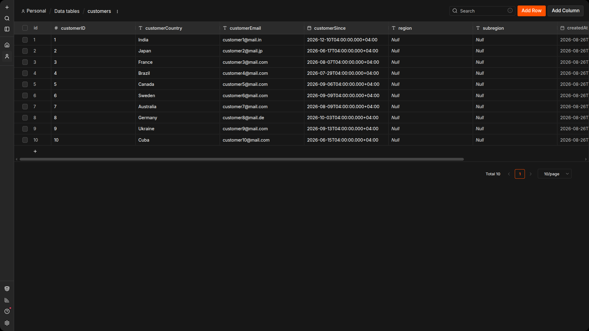
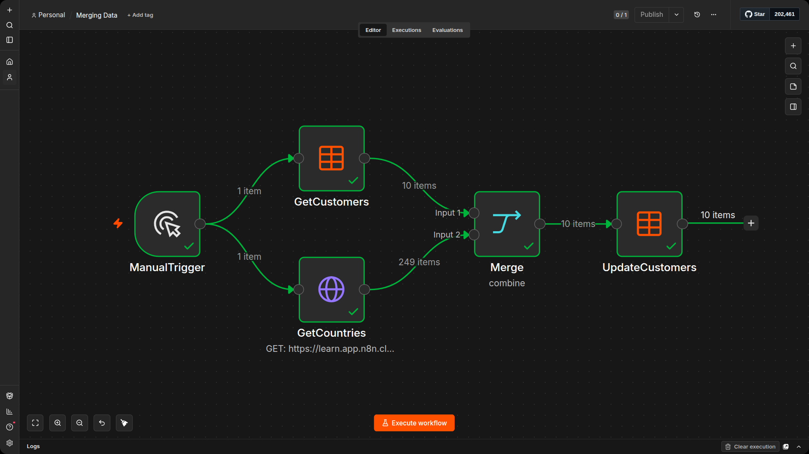
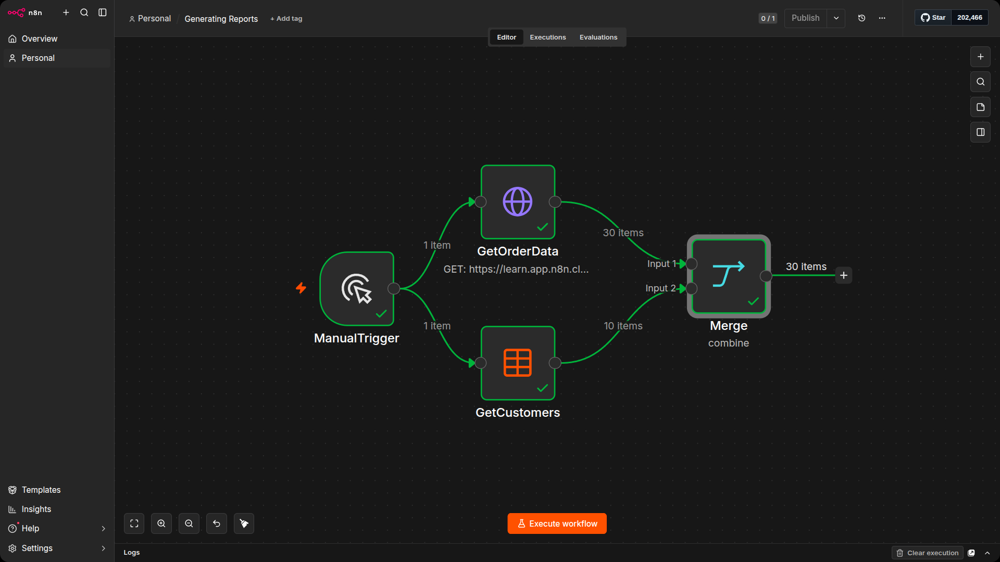
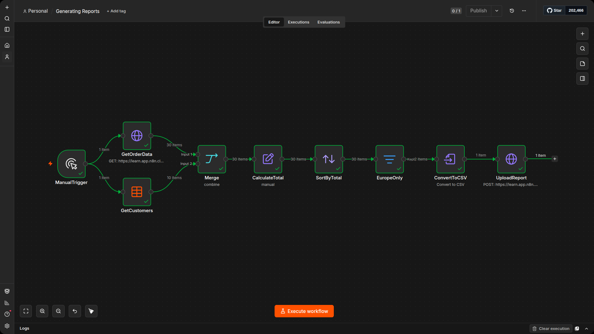
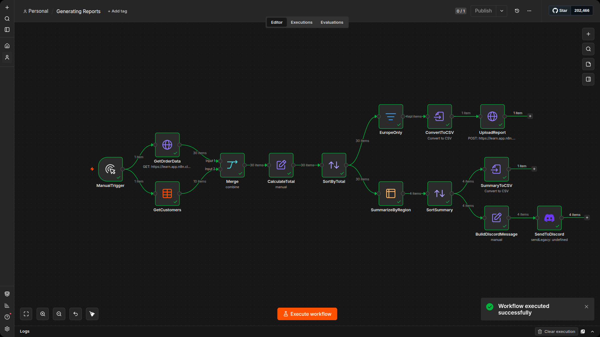
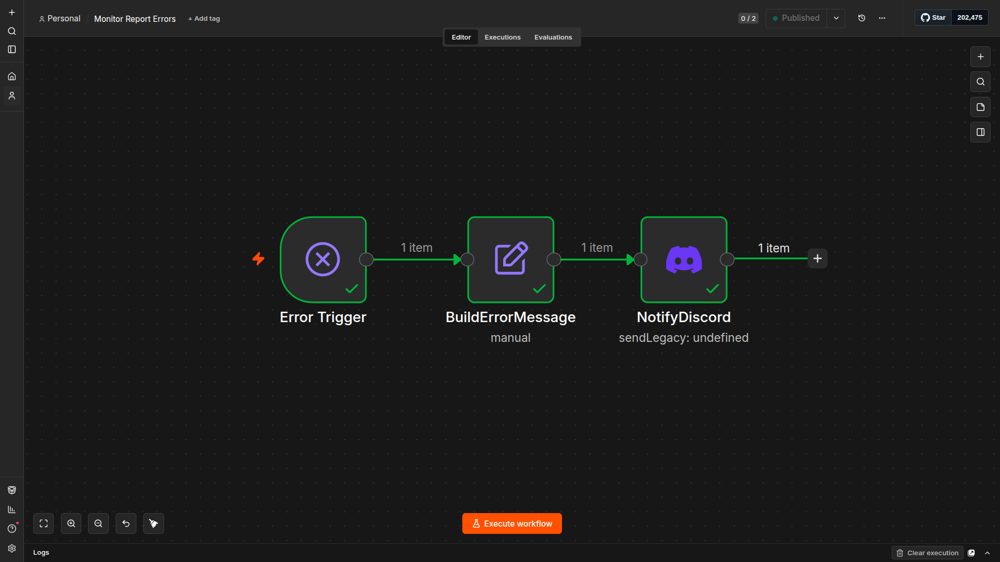
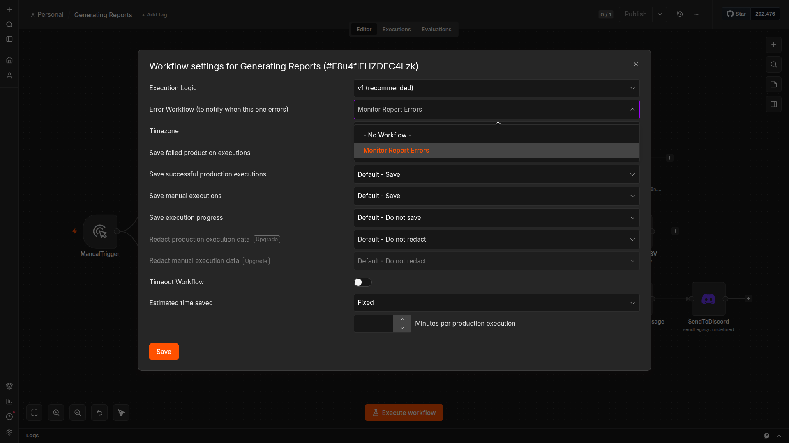

# Nathan's next challenge

Remember Nathan from Section 1? His manager was so impressed with his first workflow automation that she gave him more responsibility.

```text
Nathan 🙋: Hello, it's me again. My manager was so impressed with my first workflow automation solution that she entrusted me with more responsibility.
```

```text
You 👩‍🔧: More work and responsibility. Congratulations, I guess. What do you need to do now?
```

```text
Nathan 🙋: I got access to all our sales data and I'm now responsible for creating two reports: one for regional sales and one for order prices. They're based on data from different sources and come in different formats.
```

```text
You 👩‍🔧: Sounds like a lot of manual work, but the kind that can be automated. Let's do it.
```

## Workflow design

Now that we know what Nathan wants to automate, let's list the steps he needs to take:

1. Get order data from the company warehouse and combine it with customer data.
2. Calculate order totals and sort the data.
3. Filter and generate a European sales report as a CSV file.
4. Aggregate the data by region and send a summary to the team.
5. Monitor for errors and notify the team if something goes wrong.

We will build this as three separate workflows:

- `Merging customer data:` combines the customer Data Table with country data from the n8n Academy Countries API, filling in the missing region and subregion fields.

- `Generating reports:` retrieves order data, merges it with customer data, then branches into a European sales report (uploaded to a reporting endpoint) and a regional summary (sent to the team via webhook).

- `Monitoring workflow errors:` an Error Workflow that sends a notification when the reporting workflow fails during a production execution.


## Prerequisites

To build the workflows, you will need the following:

- A **customers Data Table** created from the CSV file provided on this page. If you have not created it yet, download the customers.csv file, go to Data Tables in the left panel, click Import from CSV, and name the table customers.

- **Header Auth credentials** with the name `x-assessment-id` and `your unique assessment ID` as the value. If you created these in Section 1, you can reuse them. If not, go to Credentials, add a new Header Auth credential, and enter the details.

Next, you will build these three workflows with step-by-step instructions.

# Merging Customer Data

Nathan's company stores its customer data in a data table. This data contains information about the customers' ID, country, email, and join date, but the region and subregion columns are empty. You need to fill in these two fields using external country data in order to create the reports for regional sales.

Before building the workflow, create a Data Table from the provided CSV file:

1. Download the [customers.csv](https://learn.n8n.io/asset-v1:n8n+QS101+2026H2+type@asset+block@customers.csv) file from this link.
2. In n8n, go to the Data Tables section under your workspace
3. Click create table
4. Click Import from CSV and upload the customers.csv file.
5. Name the table customers.
6. Verify the table has 10 rows with columns for customerID, customerCountry, customerEmail, customerSince, region, and subregion. The region and subregion columns should be empty.



## Build the workflow

This workflow reads the customer data, fetches country information from the n8n Academy Countries API, merges the two data sets, and updates the Data Table with the missing region and subregion values.

1. Create a new workflow
2. Name it Merging Data
3. Add a Manual Trigger node.
4. Add an Data Table Get row(s)  node connected to the Manual Trigger. Name it GetCustomers.
5. Select the customers table you just created and set the operation to Return All.
6. Execute the node to confirm all 10 customer rows appear in the output.
7. Add an HTTP Request node also connected to the Manual Trigger (creating a second branch in parallel). Name it GetCountries.
8. Set the method to GET and the URL to https://learn.app.n8n.cloud/webhook/countries
9. Execute the node. It should return a list of all countries with their name, region, and subregion.
10. Add a Merge node. Connect the GetCustomers node to Input 1 and the GetCountries node to Input 2.
11. Set the mode to Combine and the combination to Merge by Fields.
12. Set Input 1 Field to customerCountry and Input 2 Field to name. Remember to enter these as plain text, not expressions.
13. Execute the node. The output should show 10 items, each with the original customer data plus the matching region and subregion from the n8n Academy Countries API.
14. Add a Data Table node connected to the Merge node. Name it UpdateCustomers.
15. Set the resource to Row and the operation to Update.
16. Select the customers table from the Data Table dropdown.
17. Under Conditions, set the column to id (number), the condition to Equals, and the value to the expression `{{ $json.id }}`. This tells the node which row to update for each item.
18. Set the Mapping Column Mode to Map Each Column Manually.
19. Under Values to update, delete all but the following two columns:
    - region with the expression `{{ $json.region }}`
    - subregion with the expression `{{ $json.subregion }}`
10. Execute the workflow. Open the customers Data Table and verify that all 10 rows now have their region and subregion populated.



# Generating reports: Retrieving order data

## Part 1: Retrieving order data

The first step in generating Nathan's reports is to retrieve the order data from the company warehouse and combine it with the customer data from your Data Table. The company warehouse endpoint returns 30 orders, each with an order price, quantity, product category, and date. By merging this with your customer Data Table (which now has region and subregion from Workflow 1), you get a complete picture of every order with its customer's location.

### Configure Authentication

> [!NOTE]
> You should have already configured your Header Auth credential in Section 1 "Getting data from the warehouse". Make sure to set the header parameter with your x-assessment-id. 

If you have not, follow these steps:

1. Under Send Headers, toggle it on. In Specify Headers, make sure Using Fields Below is selected.
2. Set the header Name to x-assessment-id and the Value to your assessment ID (shown at the top of your course page).
3. Under Authentication, select Generic Credential Type.
4. Set Generic Auth Type to Header Auth.
5. Select the Header Auth credential you created in Section 1, or create a new one:
    - Click + Create new credential.
    - Set Name to `X-API-KEY`.
    - Set Value to `j[vKYdY68H(:WFb`.
    - Rename it `n8n Quickstart Header Auth account`
    - Save the credential.

### Build the workflow

1. Create a new workflow
2. Rename it Generating Reports
3. Add a Manual Trigger node.
4. Add an HTTP Request node connected to the Manual Trigger. Name it GetOrderData.
5. Set the method to GET and the URL to https://learn.app.n8n.cloud/webhook/courses/n8n-quickstart/company-data.
6. Under Authentication, select Generic Credential Type and choose Header Auth. Select the Header Auth credential you created.
7. Under Send Headers, toggle it on and add a header with name x-assessment-id and value set to your assessment ID.
8. Execute the node. You should see 30 order items, each with orderID, customerID, employeeName, orderPrice, quantity, productCategory, orderDate, and orderStatus.
9. Add a Data Table node also connected to the Manual Trigger (creating a second branch in parallel). Name it GetCustomers.
10. Set the resource to Row, the operation to Get Many, and select the customers table.
11. Execute the node to confirm all 10 customer rows appear, including the region and subregion columns from Workflow 1.
12. Add a Merge node. Connect GetOrderData to Input 1 and GetCustomers to Input 2.
13. Set the mode to Combine and the combination to Merge by Fields.
14. Set Input 1 Field to customerID and Input 2 Field to customerID.
15. Execute the node. You should see 30 merged items, each order now enriched with its customer's country, region, subregion, and email.



## Part 2: Uploading the European report
 
Nathan needs a report covering European orders. In this part, you will calculate the total value of each order, sort them, filter to keep only European orders, convert the result to a CSV file, and upload it to the reporting endpoint.

### Build the workflow

Continue from the Merge node in Part 1.

1. Add an Edit Fields (Set) node connected to the Merge node. Name it CalculateTotal.
2. Add a new field called orderTotal with the type set to Number and the value set to the expression `{{ $json.orderPrice * $json.quantity }}`.
3. Enable Include Other Input Fields so the rest of the data is preserved.
4. Execute the node. Each of the 30 items should now have an orderTotal field showing the price multiplied by the quantity.
5. Add a Sort node connected to CalculateTotal. Name it SortByTotal.
6. Sort by orderTotal in descending order.
7. Execute the node. The highest value orders should appear at the top.
8. Add a Filter node connected to SortByTotal. Name it EuropeOnly.
9. Set the condition to keep items where `{{ $json.region }}` is equal to Europe.
10. Execute the node. You should see 12 items, all belonging to customers in France, Sweden, Germany, or Ukraine.
11. Add a Convert to File node select Convert to CSV connected to EuropeOnly. Name it ConvertToCSV.
    - Set Put Output File in Field to data
12. Execute the node. The output should show a binary CSV file in the Binary tab.
13. Add an HTTP Request node connected to Convert to File. Name it UploadReport.
14. Set the method to POST and the URL to https://learn.app.n8n.cloud/webhook/courses/n8n-quickstart/upload-report.
15. Under Authentication, select Generic Credential Type and choose Header Auth. Select the same Header Auth credential from Part 1.
16. Under Send Headers, toggle it on and add a header with name x-assessment-id and value set to your assessment ID.
17. Under Send Body, toggle it on and set the body content type to n8n Binary file.
    - Set Input Data Field Name to data
18. Execute the node. If successful, the response should contain a confirmation code. 



In Part 3, you will connect a new branch from the SortByTotal node to generate the regional summary. Do not delete or disconnect anything from this workflow.

## Part 3: Generating the regional summary

The final part creates a summary report that shows the total order value and order count for each region. This branch connects to the SortByTotal node from Part 2, running in parallel with the European report branch.

Before you begin the steps below, use [this link](https://discord.gg/G98WXzsjky) to connect to the n8n server on Discord. Be sure you can access the #n8n-quickstart channel.

### Build the workflow

Connect these nodes from the SortByTotal node's output. The SortByTotal node will now have two branches: one going to EuropeOnly (Part 2) and one going to SummarizeByRegion (this part).

1. Add a Summarize node connected to the SortByTotal node. Name it SummarizeByRegion.
2. Under Fields to Summarize, add two aggregations:
    - Set the first aggregation to Sum on the field orderTotal.
    - Set the second aggregation to Count on the field orderTotal.
3. Under Fields to Split By, enter region.
4. Under Options, set Output Format to Each Split in a Separate Item.
5. Execute the node. You should see 4 items, one per region, each with a sum_orderTotal and count_orderTotal field.
6. Add a Sort node connected to SummarizeByRegion. Name it SortSummary.
7. Sort by sum_orderTotal in descending order.
8. Execute the node. Europe should appear at the top.
9. Add a Convert to File node connected to SortSummary. Name it SummaryToCSV.
10. Set the operation to Convert to CSV.
11. Execute the node to confirm the binary CSV file appears in the output.
12. Add an Edit Fields (Set) node also connected to SortSummary (creating a second branch). Name it BuildDiscordMessage.
13. Add a new field called discord_message with the type set to String and the value set to the expression:

```text
[YOUR_ASSESSMENT_ID] Regional Sales Summary: {{ $json.region }} - {{ $json.count_orderTotal }} orders, total: ${{ $json.sum_orderTotal.toFixed(2) }}
```
14. Replace YOUR_ASSESSMENT_ID with your actual assessment ID. You MUST include the brackets around your assessment ID. 
15. Execute the node. Each of the 4 region items should have a content field with a formatted summary line.
16. Add a Discord node connected to BuildDiscordMessage. Name it SendToDiscord.
    - When you search for the Discord node, look for Message Actions and select Send a message to add the node.
17. Configure the Discord node:
    - Connection Type: Select Webhook.
    - Credential for Discord Webhook: Select + Create New Credential.
        - In the Webhook URL field, enter: https://learn.app.n8n.cloud/webhook/courses/n8n-quickstart/notify-reports
        - Rename the credential to n8n Quickstart S2 Discord Webhook account by clicking on the name in the top left.
        - Click Save and close the credentials dialog.
    - Operation: Select Send a Message.
    - Message:
        - Select the Expression tab on the right side of the Message field.
        - Set the value to `{{ $('BuildDiscordMessage').item.json.discord_message }}`
18. Execute the node. Since there are 4 items, the node sends 4 messages to the #n8n-quickstart channel on the n8n Discord, one for each region.

Your messages must be formated exactly like this with your assessment id in square brackets with region, total orders and total value. 

```text
[39d88e5ef7741aaa9ae5504ff3d3bf6e] Regional Sales Summary: Europe - 123 orders, total: $1234
```

### Your final workflow. 



# Monitoring workflow errors

## Setting up error monitoring

> [!NOTE] 
> Error Workflows only activate during production executions, not manual test runs. In this unit, you will test the Error Workflow by executing the Error Trigger node directly with its sample data. This lets you confirm the workflow is wired up correctly. In production, the Error Trigger would fire automatically when a connected workflow fails, and the data would contain the actual workflow name, error message, and execution URL.

## Why monitor for errors

Production workflows run on schedules or in response to triggers, often without anyone watching. If something fails silently, bad data can pile up or downstream processes can stall before anyone notices. An Error Workflow sends a notification the moment something goes wrong, so your team can investigate and fix the issue quickly.

## Build the workflow

1. Create a new workflow and name it Monitor Report Errors.
2. Add an Error Trigger node. This node activates automatically when a connected workflow fails during a production 3. execution.
4. Execute the Error Trigger node to see the data structure it provides. The output contains sample data including a workflow name, error message, last node that executed, and an execution URL.

```json
[
  {
    "execution": {
      "id": 231,
      "url": "http://localhost:5678/execution/workflow/1/231",
      "retryOf": "34",
      "error": {
        "message": "Example Error Message",
        "stack": "Stacktrace"
      },
      "lastNodeExecuted": "Node With Error",
      "mode": "manual"
    },
    "workflow": {
      "id": "1",
      "name": "Example Workflow"
    }
  }
]
```

4. Add an Edit Fields (Set) node connected to the Error Trigger. Name it BuildErrorMessage.
5. Add a new field called content with the type set to String and the value set to the expression:

    ```text
    [YOUR_ASSESSMENT_ID] Workflow Error Alert - Workflow: {{ $json.workflow.name }} | Error: {{ $json.execution.error.message }} | Last node: {{ $json.execution.lastNodeExecuted }} | Execution URL: {{ $json.execution.url }}
    ```
    Replace YOUR_ASSESSMENT_ID with your actual assessment ID.

6. Add a Discord node connected to BuildErrorMessage. Name it NotifyDiscord.
    - When you search for the Discord node, look for Message Actions and select Send a message to add the node.

7. Configure the Discord node:
    - Connection Type: Select Webhook.
    - Credential for Discord Webhook: Select + Create New Credential.
        - In the Webhook URL field, enter: https://learn.app.n8n.cloud/webhook/courses/n8n-quickstart/notify-reports
        - Rename the credential to n8n Quickstart S2 Error Discord Webhook account by clicking on the name in the top left.
        - Click Save and close the credentials dialog.
    - Operation: Select Send a Message.
    - Message:
        - Select the Expression tab on the right side of the Message field.
        - Set the value to `{{ $json.content }}`

8. Test the workflow by clicking Test Workflow. This executes the entire workflow using the Error Trigger's sample data. You should see a message appear in the #n8n-quickstart Discord channel with the sample error details and your assessment ID.

> [!NOTE]
> The message will contain sample values like "Example Workflow" and "Example Error Message" because you are running test data. In production, these fields would contain the actual name of the failed workflow, the real error message, and a link to the failed execution.

9. Save and publish the workflow.



10. Now go back to your Generating Reports workflow. Open Workflow Settings.
11. In the Error Workflow setting, select Monitor Report Errors.
12. Save the Generating Reports workflow.



## What the Error Trigger provides

The Error Trigger node returns an object with two main sections:

| Field | Description |
|---|---|
| `execution.error.message` | The error message from the failed node |
| `execution.lastNodeExecuted` | The name of the node that failed |
| `execution.url` | A direct link to the failed execution for debugging |
| `workflow.name` | The name of the workflow that failed |
| `workflow.id` | The ID of the workflow that failed |

# Summary

Congratulations! You've completed the finishing the Working with data section. 

You now know how data actually moves through n8n: an array of objects, one item per row, processed node by node. You have merged datasets, filtered and sorted records, grouped data into regional summaries, and exported the results as a file. You also built an error monitoring workflow so you know when something breaks before your users do.

More importantly, you have seen how nodes like Split Out, Merge, Filter, Summarize, and Edit Fields let you reshape data without writing code. That is what makes n8n powerful for real business workflows. In the next section, you will connect an AI model to everything you have learned and build a chatbot that can look up real data.

