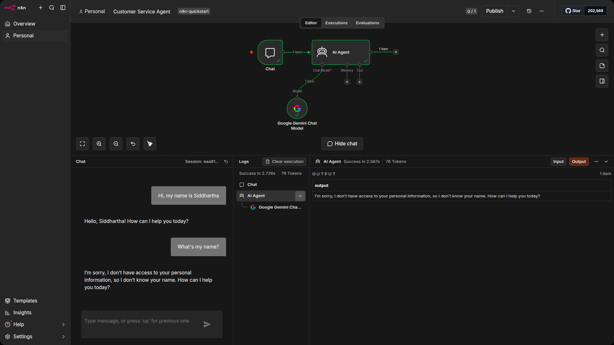
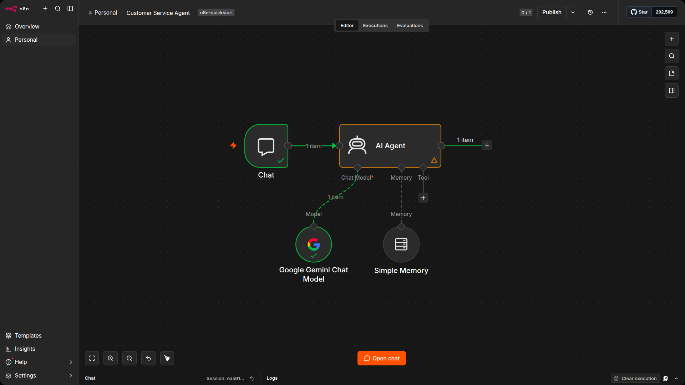
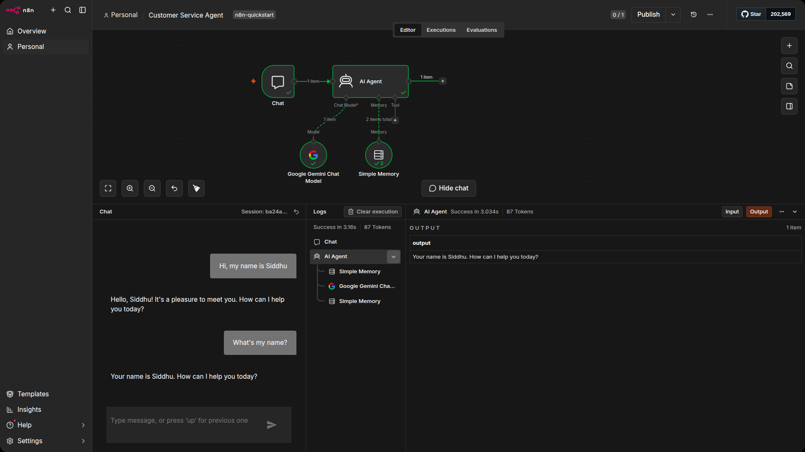

# Adding Memory

Your agent can hold a conversation, but try this: tell it your name, wait for a response, then ask "What's my name?" It will not be able to answer. It might apologize or guess, but it has no idea what you said 10 seconds ago.

This is because the AI Agent has no memory. Each message is treated as a completely new conversation. The model receives your latest message and the system prompt, but nothing else. It has no record of what came before.

For a customer service agent, this is a problem. A customer might say "I'm calling about order 5" and then follow up with "What's the status?" Without memory, the agent has already forgotten which order they were asking about.

## Test it yourself

Open the Customer service agent workflow you built in the previous unit.

1. Open the chat window by clicking the Chat button at the bottom of the canvas.
2. Type: Hi, my name is Nathan and press Enter. Wait for the response.
3. Now type: What's my name? and press Enter.

## Add Simple Memory

n8n solves this with memory nodes. The simplest option is Simple Memory, which stores a window of recent messages so the agent can see what has already been said in the current conversation.

1. On the canvas, click the + button underneath the Memory connector on the AI Agent node. A list of memory options will appear.
2. Select Simple Memory.
3. The default settings are fine. Simple Memory stores the last 5 interactions by default, which is enough for most conversations. You can increase this later if you need the agent to remember more context.
4. Close the node to return to the canvas.

## Test it again

Now repeat the same test with memory attached.

1. Open the chat window.
2. Type: Hi, my name is Nick and press Enter. Wait for the response.
3. Type: What's my name? and press Enter.

## How memory works

Simple Memory does not give the model a brain. What it actually does is append recent messages to the prompt each time the agent runs. When you send "What's my name?", the model receives something like this:

- System prompt: "You are a customer service agent..."
- User message 1: "Hi, my name is Nathan"
- Assistant response 1: "Hello Nathan, how can I help you today?"
- User message 2: "What's my name?"

The model can "remember" your name because it can see the earlier exchange right there in the prompt. The window size (default 5 interactions) controls how far back this context goes. Older messages get dropped to keep the prompt from growing too large.

This is worth understanding because it explains the limitations. Memory is not permanent storage. If a conversation goes on long enough, earlier messages will fall out of the window. For a quick customer service interaction, 5 interactions is plenty. For longer sessions, you may need to increase it or use a different memory type.

> [!NOTE]
> Simple Memory is also only stored in memory, which means it disappears when the workflow stops or the n8n instance restarts. That is fine for testing and development, but for a production agent you should use a database-backed memory option like Postgres Chat Memory or Redis Chat Memory. These persist conversations across restarts so your agent does not lose context if something goes wrong.

## Save the workflow

Save the workflow before moving on. In the next unit, you will give the agent tools so it can actually look up customer and order data instead of guessing.