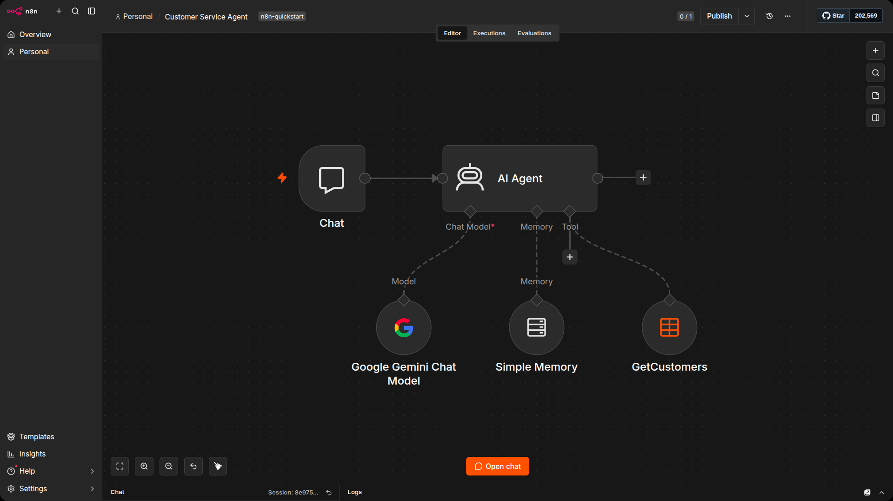
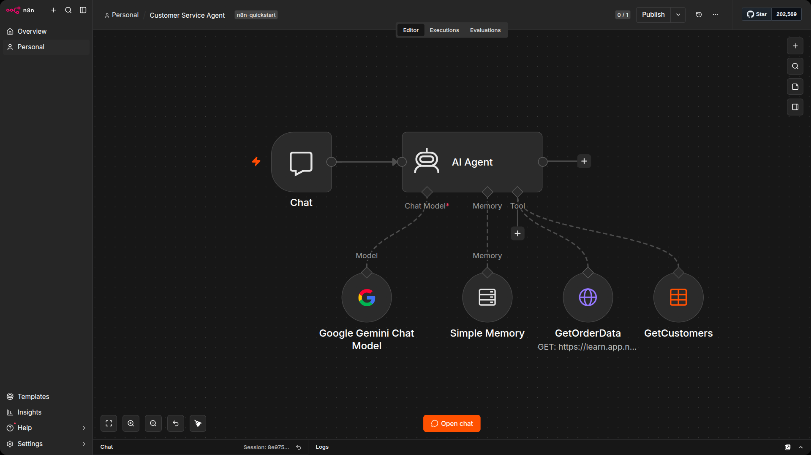
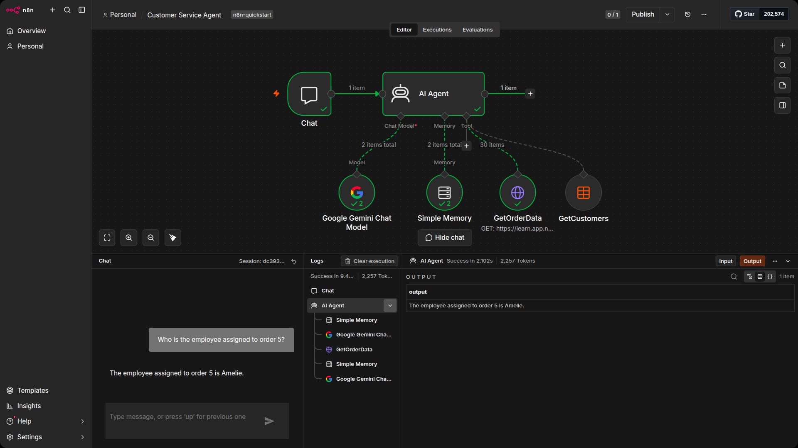
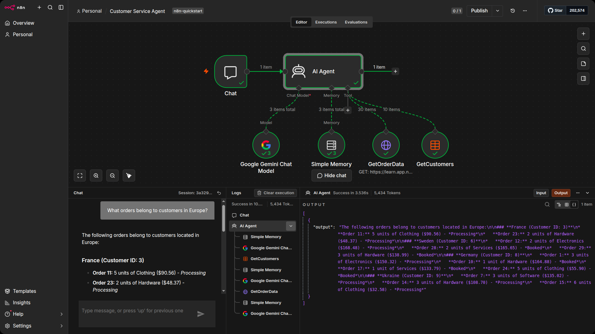

# Giving your agent tools

Right now your agent can chat and remember what you said, but if you ask "What region is customer 10 in?" it will either make something up or admit it has no idea. The model has no access to your data. It is just generating text based on patterns it learned during training.

Tools change that. A tool is a connection between the AI Agent and an external data source. When the agent receives a question it cannot answer from its own knowledge, it can decide to call a tool, read the result, and use that information in its response. You do not tell it when to use the tool: the agent decides on its own based on the question and the tool description you provide.

In this unit, you will give your customer service agent two tools: one that reads customer data from the Data Table you built in Section 2, and one that fetches order data from an API endpoint.

## Add the customers Data Table tool

The first tool gives the agent access to customer records: names, countries, emails, regions, and subregions.

1. Open your Customer service agent workflow.
2. Click the + button underneath the Tool connector on the AI Agent node. A list of available tool types will appear.
3. Search for "Data Table" and select Data Table Tool.
4. In the tool settings, set the Operation to Get.
5. For Data Table, select the customers table you created in Section 2.
6. Rename the node to GetCustomers.
7. Close the node to return to the canvas.



## Add the order data HTTP Request tool

The second tool lets the agent fetch order information: order prices, quantities, product categories, employee assignments, and order statuses.

1. Click the + button underneath the Tool connector on the AI Agent node again. You can attach multiple tools.
2. Search for "HTTP Request" and select HTTP Request Tool.
3. Set the URL to:
    ```text
    https://learn.app.n8n.cloud/webhook/courses/n8n-quickstart/order-tool
    ```
4. Under Authentication, select Generic Credential Type
    - Credential Type: Header Auth
    - Credential: Select your n8n Quickstart API Key credential you created in section 1 and section 2.
5. Ensure you are also sending your X-Assessment-ID header parameters are set as you did in section 1 and section 2.
6. In the Tool Description field, enter:
    ```text
    Retrieve order details including order prices, quantities, product categories, employee assignments, and order statuses for all customers
    ```
7. Rename the node to GetOrderData.
8. Close the node to return to the canvas.



## Update the system prompt

Now that the agent has tools, update the system prompt to reflect what it can actually do.

1. Open the AI Agent node and find the System message field you set up earlier.
2. Replace the prompt with something like:
    ```text
    You are a customer service agent. You have access to a customer database and an order database.

    When asked about customers, use the GetCustomers tool to look up their information.
    When asked about orders, prices, employees, or product categories, use the GetOrderData tool.

    Be concise and helpful. If the data does not contain what the user is asking for, say so. Do not make up information.
    ```
3. Close the node.

Telling the agent which tool to use for which type of question is not strictly required (it can figure it out from the tool descriptions), but it makes the agent more reliable. Think of it as giving a new employee clear instructions rather than hoping they work it out themselves.

## Test the agent with tools

Open the chat window and try asking questions that require the agent to use its tools.

Try these:

- What region is customer 10 in?
- How many orders does customer 3 have?
- Who is the employee assigned to order 5?
- What is the total order value for all electronics orders?



Watch the log panel on the right side of the chat window. You will see the agent deciding which tool to call, making the request, and then using the returned data to form its answer. This is the difference between an LLM (which can only generate text) and an agent (which can take actions and use real data).

Try asking something that requires both tools, like:

```text
What orders belong to customers in Europe?
```



The agent will need to check the customer table for European customers and then cross-reference with the order data. It may take a couple of steps, and you can watch the reasoning in the logs.

## When things go wrong

AI agents do not always get it right. You may notice the agent occasionally calling the wrong tool, misinterpreting a result, or giving a slightly different answer to the same question (remember: agents are not deterministic). This is normal.

A few things that help:

- Write clear tool descriptions. The agent relies on these to pick the right tool.
- Be specific in the system prompt about what the agent should and should not do.
- Use the log panel to debug. If the agent gave a wrong answer, the logs will show you exactly which tool it called and what data came back.

## Save the workflow

Save your workflow. You now have a working customer service agent that can remember conversations, look up customer records, and fetch order data. This is a basic example, but it covers the building blocks: a trigger, an agent, a model, memory, and tools. From here you can add more tools, refine the prompt, or connect the agent to a live chat interface.

To learn more about building AI workflows in n8n, explore the [Advanced AI documentation](https://docs.n8n.io/build/integrate-ai) and browse the [AI workflow templates](https://n8n.io/workflows/?categories=AI).