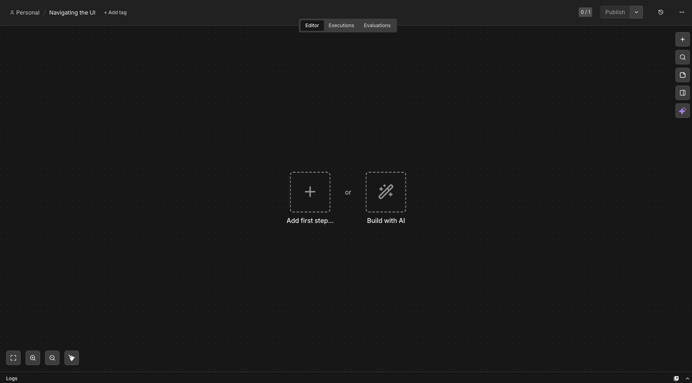

# Getting Started

Begin by setting up n8n.

We recommend starting with [n8n Cloud](https://app.n8n.cloud/register), a hosted solution that doesn't require installation and includes a free trial. 

If n8n Cloud isn't a good option for you, you can [self-host with Docker](https://docs.n8n.io/deploy/host-n8n/install-options/install-with-docker). This is an advanced option recommended only for technical users familiar with hosting services, Docker, and the command line.

For more details on the different ways to set up n8n, see our [platforms documentation](https://docs.n8n.io/choose-how-to-use-n8n#platforms).

Once you have n8n running, open the Editor UI in a browser window. Log in to your n8n instance. Select Overview and then Create Workflow to view the main canvas.

It should look like this: 

# Editor UI settings

The editor UI is the web interface where you build workflows. You can access all your workflows and credentials, as well as support pages, from the Editor UI.

## Left-side panel

On the left side of the Editor UI, there is a panel which contains the core functionalities and settings for managing your workflows.

At the top of the panel you'll find the n8n logo alongside icons to create a new workflow (**+**), search (magnifying glass), and toggle the panel view.

The panel contains the following sections:

- **Overview**: Contains all the workflows, credentials, and executions you have access to.
- **Personal**: Every user gets a default personal project. If you don't create a custom project, your workflows and credentials are stored here.
- **Chat (beta)**: A built-in chat interface for interacting with AI-powered workflows.
- **Projects**: Projects let you group workflows and credentials together. You can assign roles to users in a project to control what they can do.
- **Admin Panel**: n8n Cloud only. Access your n8n instance usage, billing, and version settings.
- **Templates**: A collection of pre-made workflows. Great place to get started with common use cases.
- **Insights**: Provides analytics and insights about your workflows.
- **Help**: Contains resources around n8n product and community.
- **Settings**: Access your n8n instance and account settings.

## Top bar

The top bar of the Editor UI contains the following information:

- **Personal / Workflow Name**: Shows which project the workflow belongs to and its name. By default, n8n names a new workflow as "Workflow Name", but you can click on it to edit the name at any time.
- **+ Add tag**: Tags help you organize your workflows by category, use case, or whatever is relevant for you. Tags are optional.
- **Editor | Executions | Evaluations**: Switch between the node editor, the execution history for this workflow, and evaluations.
- **Production checklist (0/1)**: Tracks items you need to complete before your workflow is ready for production.
- **Publish**: This button publishes the current workflow. The dropdown arrow next to it gives additional publishing options. By default, workflows are not published.
- **History (clock icon)**: View previous versions of your workflow.
- **Ellipsis menu (...)**: Opens a menu with additional options including Edit description, Duplicate, Download, Share, Move, Rename, Import from URL, Import from file, Push to git, Settings, and Archive.

## Workflow settings menu

Click the three-dot menu (**...**) in the top right corner of the Editor UI to access additional workflow options:

- **Edit description**: Add or edit a description for your workflow.
- **Duplicate**: Create a copy of the current workflow.
- **Download**: Download the workflow as a JSON file to your computer.
- **Share**: Share and collaborate with others on your workflow.
- **Move**: Move the workflow to a different project.
- **Rename**: Change the name of the workflow.
- **Import from URL**: Import a published workflow from a URL.
- **Import from file**: Import a workflow from a JSON file.
- **Push to git**: Push the workflow to a connected git repository.
- **Settings**: Access workflow-specific settings such as error workflows, timezone, execution saving, and timeout configuration.
- **Archive**: Archive the workflow when it's no longer needed.

## Workflow settings

Select **Settings** from the three-dot menu to open the workflow settings panel. Here you can configure how this specific workflow behaves:

- **Execution Logic**: Choose the execution logic for multi-branch workflows. You should leave this set to v1 (recommended) unless you have workflows that rely on the legacy execution ordering.
- **Error Workflow**: Select a workflow to notify you when this one errors. This is useful for setting up automated alerts when something goes wrong.
- **This workflow can be called by**: Control which workflows are allowed to call this workflow using the Execute Sub-workflow node.
- **Timezone**: Set the timezone for this workflow. This is especially important for the Schedule Trigger node, as you want to make sure the workflow executes at the right time.
- **Save failed production executions**: Whether n8n should save execution data when the workflow fails. Default is Save.
- **Save successful production executions**: Whether n8n should save execution data when the workflow succeeds. Default is Save.
- **Save manual executions**: Whether n8n should save executions started from the Editor UI. Default is Save.
- **Save execution progress**: Whether n8n should save the execution data of each node. If set to Save, you can resume the workflow from where it stopped in case of an error, though this might make execution slower. Default is Do not save.
- **Timeout Workflow**: Toggle this on to cancel a workflow execution after a specific period of time.
- **Estimated time saved**: Set the estimated time this workflow saves per production execution, used for reporting in Insights.

## Canvas

The canvas is the gray dotted grid background in the Editor UI. When you open a new workflow, you'll see two options in the center:

- **Add first step...**: Click here to open the nodes panel and add your first node.
- **Build with AI**: Use n8n's AI to help you build a workflow from a description.

On the right side of the canvas, there are five buttons:

- **Open nodes panel (`N` key)**: Opens the panel where you can browse and add nodes.
- **Command panel (`Cmd`/`Ctrl`+`K`)**: Opens a quick search panel to find actions, nodes, and settings.
- **Add sticky note (`Shift`+`S`)**: Adds a sticky note to the canvas for documentation.
- **Open focus panel**: Focuses the view on a specific part of your workflow.
- **n8n AI**: Opens the AI assistant to help you build and debug workflows.

In the bottom left corner, you'll find buttons to zoom the canvas to fit the screen, zoom in, zoom out, and tidy up the nodes on screen. The Logs panel at the bottom shows execution details.

> [!NOTE]
> You can move the workflow canvas around in three ways: select `Cmd`/`Ctrl` + left-button on the canvas and move it around, select middle-button of your mouse and move it around, or place two fingers on your touchpad and slide.

Don't worry about workflow execution and publishing for now; we'll explain these concepts later in the section.

## Nodes

You can think of nodes as building blocks that serve different functions that, when put together, make up a functioning machine: an automated workflow.

> [!NOTE]
> A node is an individual step in your workflow: one that either (a) loads, (b) processes, or (c) sends data.

Based on their function, n8n classifies nodes into four types:

- **App or Action Nodes**: add, remove, and edit data; request and send external data; and trigger events in other systems.
- **Trigger Nodes**: start a workflow and supply the initial data.
- **Core Nodes**: can be trigger or app nodes. Whereas most nodes connect to a specific external service, core nodes provide functionality such as logic, scheduling, or generic API calls.
- **Cluster Nodes**: are node groups that work together to provide functionality in a workflow, primarily for AI workflows.

### Finding nodes

You can find all available nodes in the nodes panel on the right side of the Editor UI. There are three ways in which you can open the nodes panel:

1. Click the **+** icon in the top right corner of the canvas.
2. Click the **+** icon on the right side of an existing node on the canvas (the node to which you want to add another one).
3. Press the **N** key on your keyboard.

In the nodes panel, notice that when adding your first node, you will see the different trigger node categories. After you have added your trigger node, you'll see that the nodes panel changes to show Advanced AI, Actions in an App, Data transformation, Flow, Core, and Human in the loop nodes.

If you want to find a specific node, use the search input at the top of the nodes panel.

### Adding nodes

There are two ways to add nodes to your canvas:

1. Select the node you want in the nodes panel. The new node will automatically connect to the selected node on the canvas.
2. Drag and drop the node from the nodes panel to the canvas.

### Node buttons

If you hover on a node, you'll notice that three icons appear on top:

- **Execute the node** (Play icon)
- **Deactivate/Activate the node** (Power icon)
- **Delete the node** (Trash icon)
- **Add to n8n AI** (Sparkle icon)
- **More options** (Ellipsis icon): Opens a context menu containing node settings and other options.

> [!NOTE]
> To move a workflow around the canvas, select all nodes with your mouse or `Ctrl`+`A`, select and hold on a node, then drag it to any point you want on the canvas.

# Summary

In this sub-section you learned how to navigate the Editor UI, what the icons mean, how to access the left-side and node panels, and how to add nodes to the canvas.

In the next sub-section, you will build a mini-workflow to put into practice what you've learned so far.