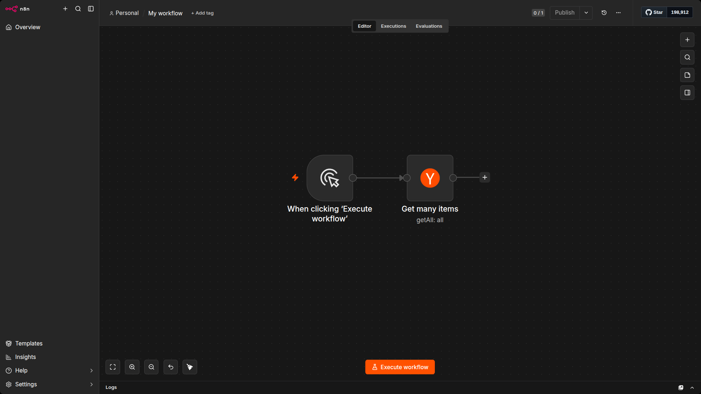
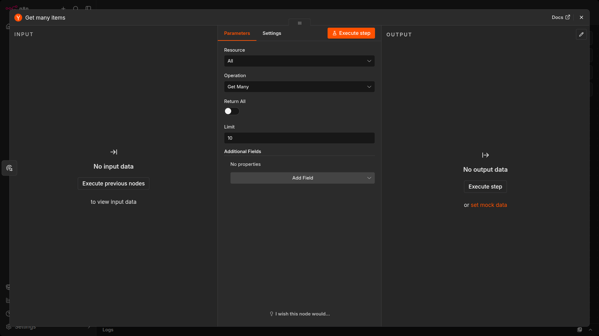
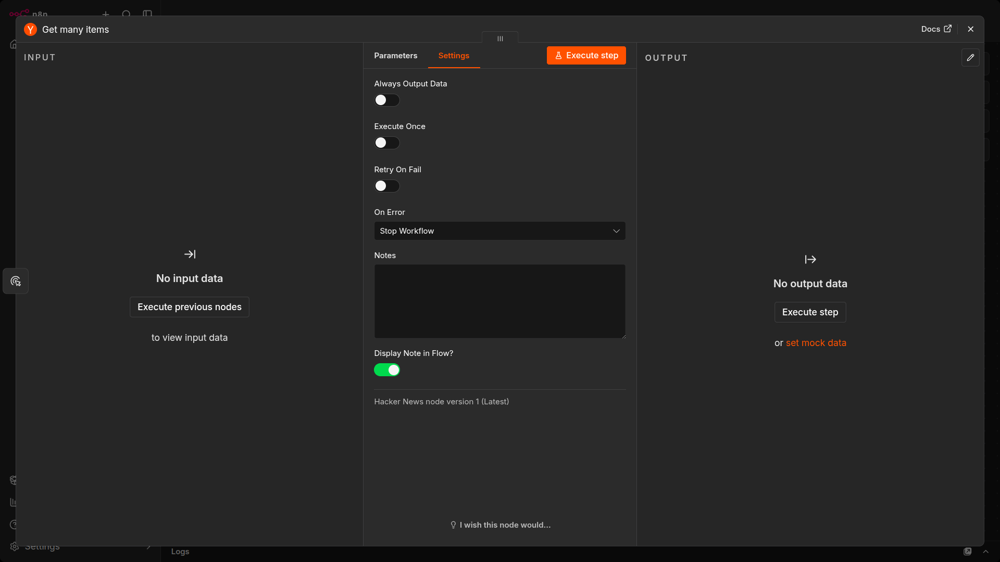
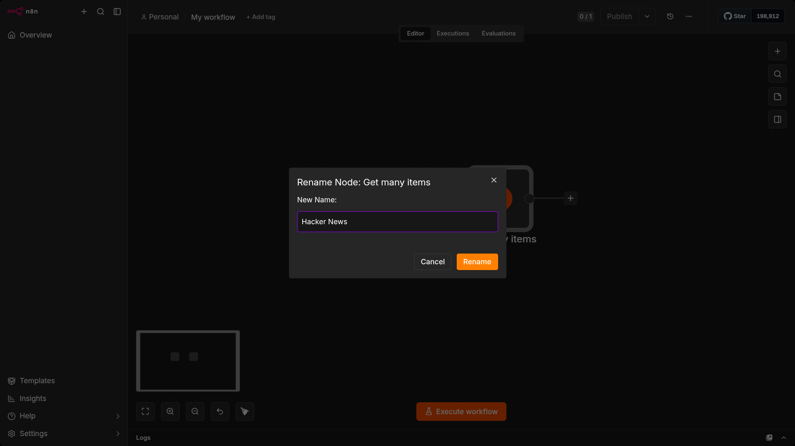
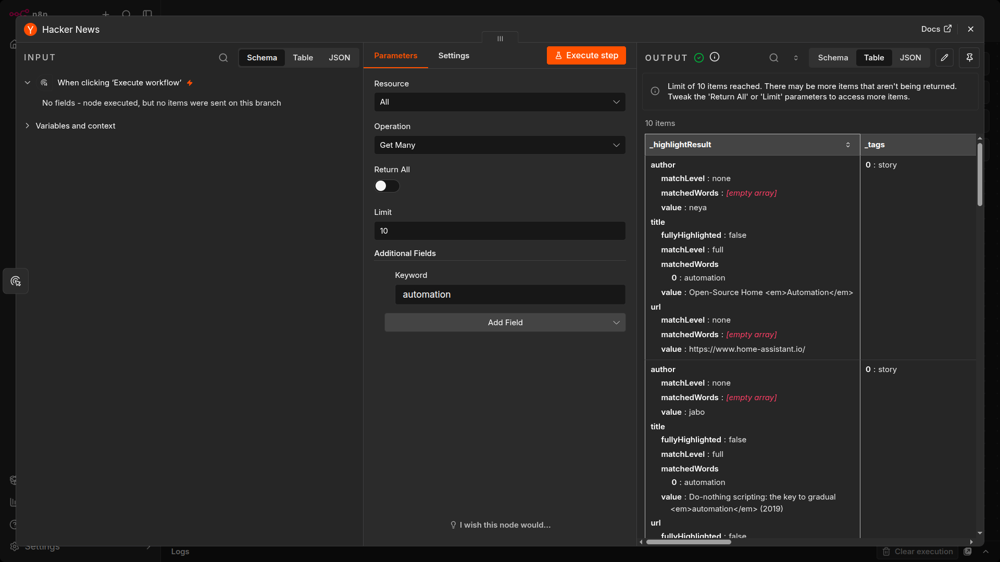
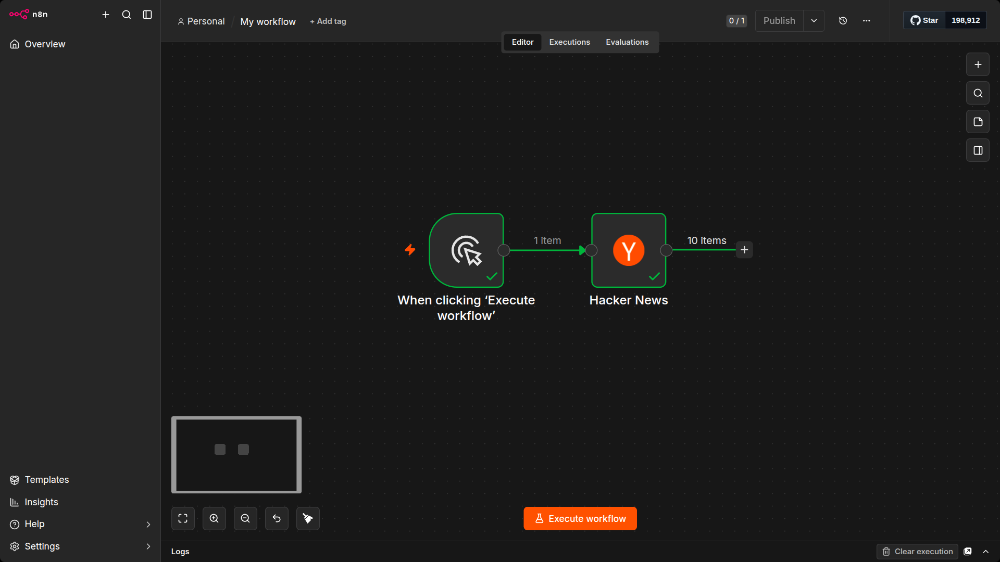
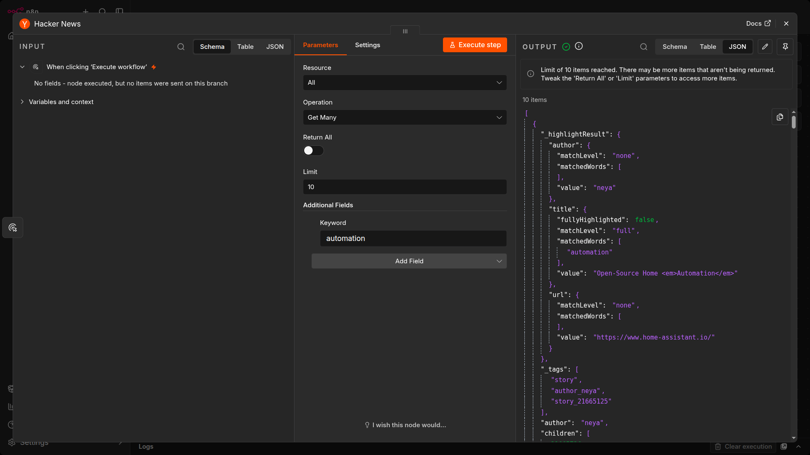
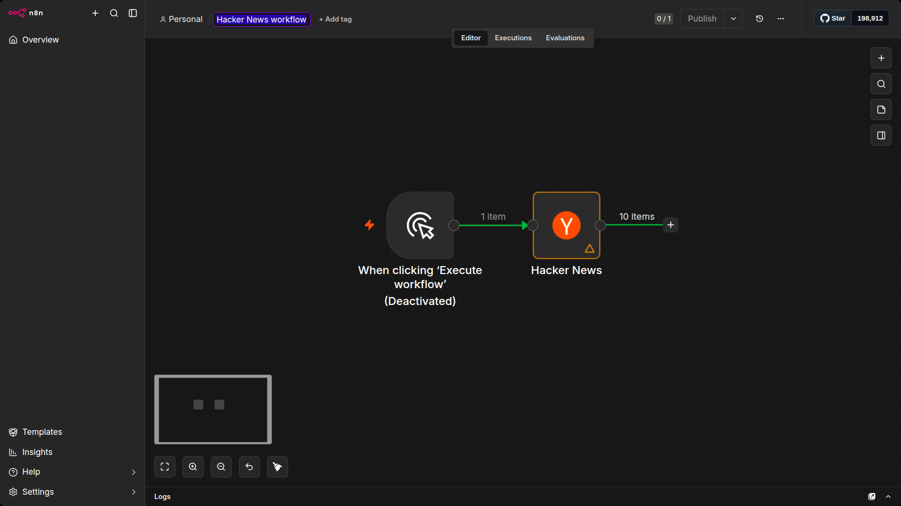

# Intro

In this sub-section, you will build a small workflow that gets 10 articles about automation from Hacker News. The process consists of five steps:

1. Add a Manual Trigger node
2. Add the Hacker News node
3. Configure the Hacker News node
4. Execute the node
5. Save the workflow

# Add a Manual Trigger node

Open the nodes panel (reminder: you can open this by pressing the N key or clicking the + icon on the right side of the canvas).

Then:

1. Search for the Manual Trigger node.
2. Select it when it appears in the search.

This will add the Manual Trigger node to your canvas, which allows you to run the workflow at any time by selecting the Execute workflow button.

> [!NOTE]
> For faster workflow creation, you can skip this step in the future. Adding any other node without a trigger will add the Manual Trigger node to the workflow. In a real-world scenario, you would probably want to set up a schedule or some other trigger to run the workflow.

# Add the Hacker News node

Select the + icon to the right of the Manual Trigger node to open the nodes panel.

Then:

1. Search for the Hacker News node.
2. Select it when it appears in the search.
3. In the Actions section, select Get many items.

n8n adds the node to your canvas and the node window opens to display its configuration details. 

# Configure the Hacker News node

When you add a new node to the Editor UI, the node is automatically activated. The node details will open in a window with several options:

- `Parameters`: Adjust parameters to refine and control the node's functionality.
- `Settings`: Adjust settings to control the node's design and executions.
- `Docs`: Open the n8n documentation for this node in a new window.

> [!NOTE]
> Parameters are different for each node, depending on its functionality. Settings are the same for all nodes.

## Parameters

We need to configure several parameters for the Hacker News node to make it work:

- `Resource: All` -- This resource selects all data records (articles).
- `Operation: Get Many` -- This operation fetches all the selected articles.
- `Limit: 10` -- This parameter sets a limit to the number of results the Get Many operation returns.
- `Additional Fields > Add Field > Keyword: automation` -- Additional fields are options that you can add to certain nodes to make your request more specific or filter the results. For this example, we want to get only articles that include the keyword "automation."

## Settings

The Settings section includes several options for node design and executions. In this case, we'll configure only the final two settings, which set the node's appearance in the Editor UI canvas.

In the Hacker News node Settings, edit:

- `Notes`: Get the 10 latest articles.

> [!NOTE]
> It's often helpful to add a short description in the node about what it does. This is helpful for complex or shared workflows in particular.

- `Display note in flow?`: toggle to true - This option will display the Note under the node in the canvas.

> [!NOTE]
> It's good practice to name your nodes. You can rename the node with a name that's more descriptive for your use case. There are four ways to do this:

1. Select the node and press F2.
2. Hit spacebar
3. Double-click the node, click the name in the top left, rename it, then click Rename.
4. Right-click on the node and select Rename.

# Execute the node

Select the Execute step button in the node details window. You should see 10 results in the Output Table view.

## Node executions

> [!NOTE]
> A node execution represents a run of that node to retrieve or process the specified data.

If a node executes successfully, a small green checkmark appears on top of the node in the canvas.

If there are no problems with the parameters and everything works fine, the requested data displays in the node window in Schema, Table, and JSON format. You can switch between these views by selecting the one you want from the Table | JSON | Schema button at the top of the node window.

> [!NOTE]
> The Table view is the default. It displays the requested data in a table, where the rows are the records and the columns are the available attributes of those records.

The node window displays more information about the node execution:

- Next to the Output title, notice a small icon (this will be a green checkmark if the node execution succeeded). Beside it, there is an info icon. If you hover on it, you'll get two more pieces of information:
    - Start Time: When the node execution started.
    - Execution Time: How long it took for the node to return the results from the moment it started executing.
- Just below the Output title, you'll notice another piece of information: 10 items. This field displays the number of items (records) that the node request returned.

> [!NOTE]
> A red warning icon on a node means that the node has errors. This might happen if the node credentials are missing or incorrect or the node parameters aren't configured correctly.

# Save the workflow

Once you're finished editing the node, select Back to canvas to return to the main canvas.

By default, your workflow is automatically saved as "My workflow" It's best practice to name your workflow before you do anything else. For this exercise, rename the workflow to be "Hacker News workflow."

> [!NOTE]
> You can rename a workflow by clicking on the workflow's name at the top of the Editor UI.

Once you've renamed the workflow, be sure to save it.

There are two ways in which you can save a workflow:

- From the Canvas in Editor UI, click Ctrl + S or Cmd + S on your keyboard.
- n8n also has auto save which will save your workflow at various times automatically. 

# Summary

Congratulations, you just built your first workflow. In this unit, you learned how to use actions in app nodes, configure their parameters and settings, and save and execute your workflow.

Next up, you'll meet your new client, Nathan, who needs to automate his sales reporting work. You will build a more complex workflow for his use case, helping him become more productive at work.