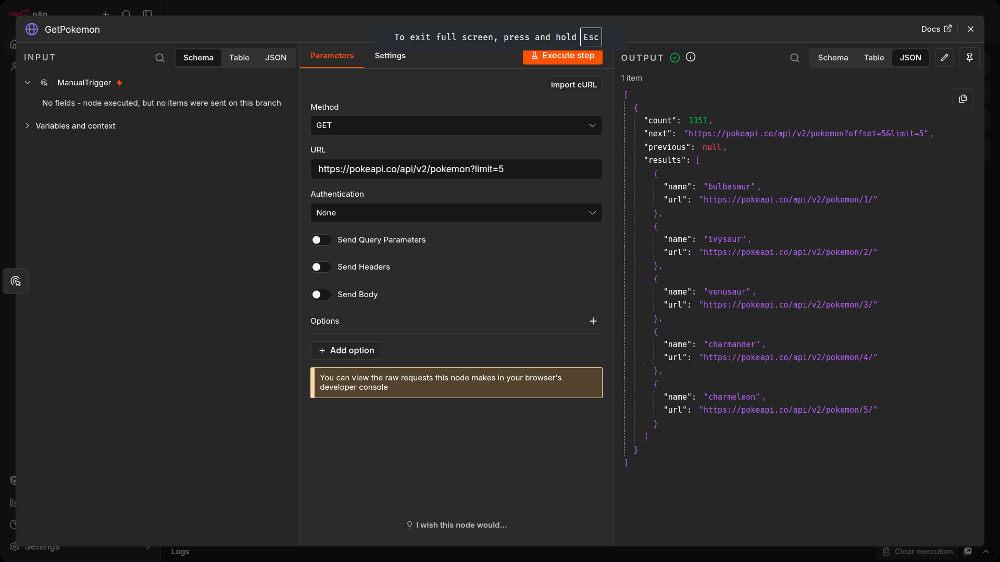
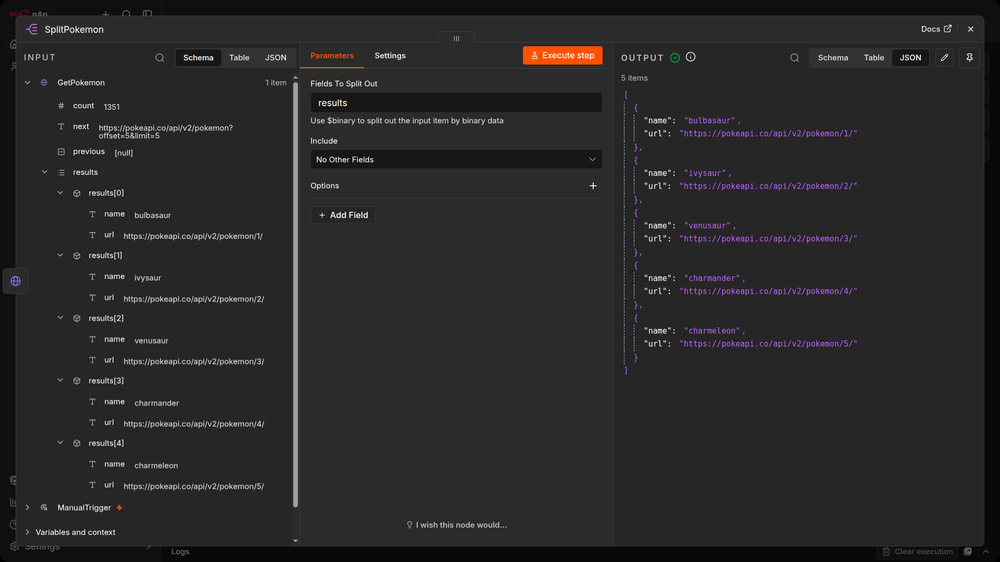
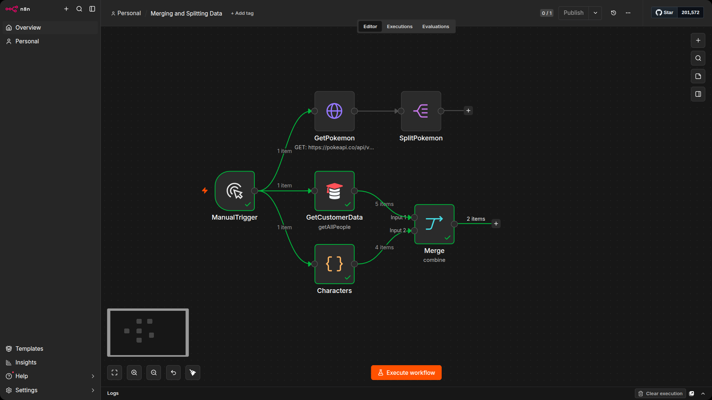
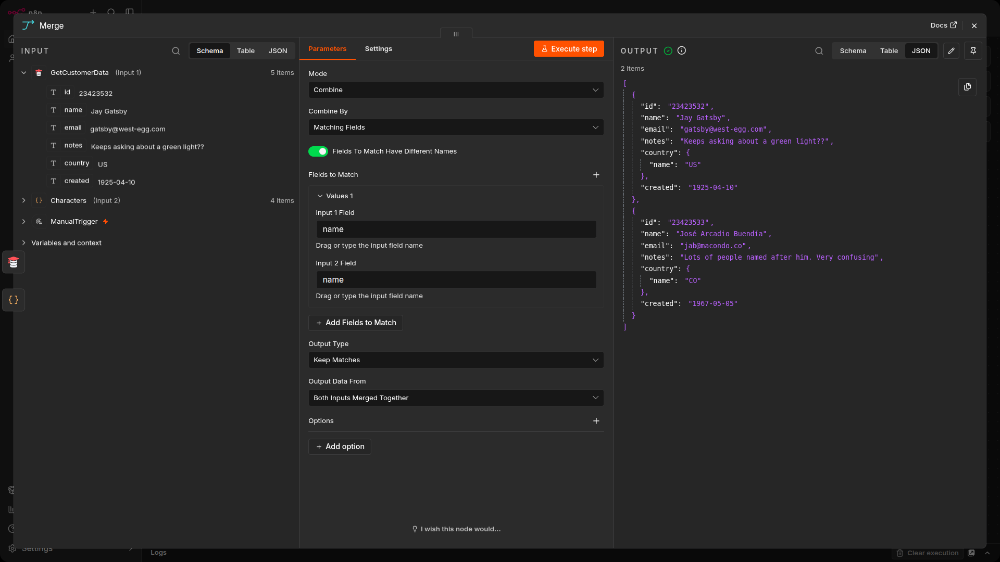
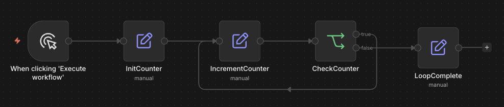
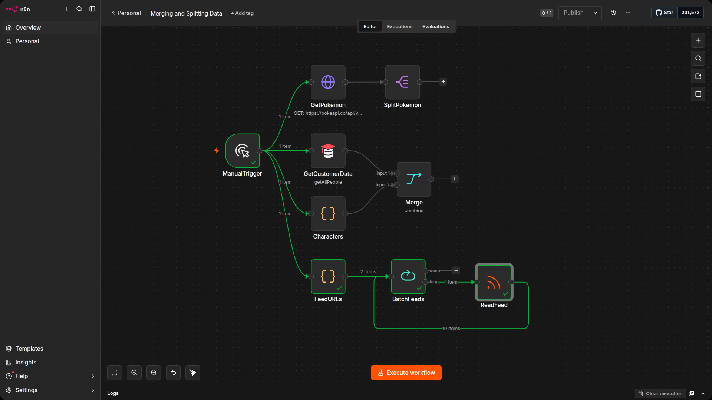

# Splitting Data

A common pattern when working with APIs is receiving a single item that contains a nested array. For example, an API might return one object with a `results` field containing 20 records inside it. In n8n, this arrives as one item, but you usually need each record as its own separate item so that downstream nodes can process them individually.

The **Split Out** node takes a field containing an array and outputs each element as its own item. This is one of the most frequently used data transformation nodes in n8n.

## How Split Out works

The Split Out node needs one key setting: the Field To Split Out, which is the name of the field containing the array you want to unpack. The node reads that field, creates one output item per array element, and optionally keeps the other fields from the original item alongside each new item.

| Setting | What it does | Example |
|---|---|---|
| Field To Split Out | The field containing the array | results |
| Include | Whether to keep other fields from the original item | Set to All Other Fields to preserve context |

## Exercise: Splitting API results

Build a workflow that fetches data from an API that returns a nested array, then splits it into individual items.

1. Add a Manual Trigger node.
2. Add an HTTP Request node connected to the Manual Trigger. Name it GetPokemon.
3. Set the URL to https://pokeapi.co/api/v2/pokemon?limit=5 and execute the node.
4. Inspect the output. The API returns a single item with a results field containing an array of 5 Pokemon. Notice that even though there are 5 Pokemon in the data, n8n shows this as 1 item because the array is nested inside a single object.



5. Add a Split Out node connected to GetPokemon. Name it SplitPokemon.
6. Set the Field To Split Out to results.
7. Execute the node. You should now see 5 separate items, one for each Pokemon, each with a name and url field.



> [!NOTE]
> Without the Split Out node, downstream nodes would only run once because there was one input item. Splitting the nested array into individual items is what allows downstream nodes to process each record separately. This is a pattern you will use frequently when working with APIs.

# Merging data

In many workflows, you will need to combine data from different sources into a single data set. Common use cases include creating one data set from multiple sources (for example, combining customer data from a CRM with order data from a database) and synchronizing data between multiple systems (for example, removing duplicates or updating records when changes occur).

## Sync types

- `One-way sync:` Data flows from a single source of truth to one or more destinations. Changes in the source are pushed to the destination, but not vice versa.
- `Two-way sync:` Data flows bidirectionally between systems. Changes in either system are synced to the other.

## The Merge node

The Merge node (also available under the alias "Join") provides several methods for combining data:

- **Append:** combines arrays sequentially. All items from Input 1 followed by all items from Input 2.
- **Combine:** joins data with several sub-options:
    - **Merge by Fields:** matches items from both inputs by the values of specified fields (like a database JOIN).
    - **Merge by Position:** pairs items from both inputs based on their position/index.
    - **Combine All:** creates all possible combinations of items from both inputs (a Cartesian product).
- **Choose Branch:** selects output from one specific input, ignoring the other.

If you want to reference nested values in the Merge node parameters Input 1 Field and Input 2 Field, you need to enter the property key in dot-notation format (as text, not as an expression). For example, use `name.common` not `{{ $json.name.common }}`.

## Exercise: Merging data

Build a workflow that combines data from two sources and tests different merge options.

1. Add a Manual Trigger node.
2. Add a Customer Datastore (n8n training) node connected to the Manual Trigger. Set the resource to All People and enable Return All. Name it GetCustomerData.
3. Add a Code node (select Code in JavaScript) also connected to the Manual Trigger. This creates a second branch running in parallel. Name it Characters.
4. Paste the following code into the Characters node:

```python
return [
  {
    json: {
      name: 'Jay Gatsby',
      country: {
        name: 'US'
      }
    }
  },
  {
    json: {
      name: 'José Arcadio Buendía',
      country: {
        name: 'CO'
      }
    }
  },
  {
    json: {
      name: 'Max Mustermann',
      country: {
        name: 'DE'
      }
    }
  },
  {
    json: {
      name: 'John Smith',
      country: {
        name: 'UK'
      }
    }
  }
];
```

5. Add a Merge node. Connect the GetCustomerData node to Input 1 and the Characters node to Input 2.



6. Set the mode to `Append` and execute the node. All items from both inputs should appear in a single combined list, with the GetCustomerData items first followed by the Characters items.
7. Now change the mode to `Combine` and the sub-option to `Merge by Fields`. Set Input 1 Field to name and Input 2 Field to name.
8. Execute the node. Only items where the name matches in both inputs should appear in the output. Check which names are returned. These are the customers that also exist in the Characters data set.



# Looping and batch processing

n8n nodes take any number of items as input, process these items, and output the results. You can think of each item as a single data point, or a single row in the output table of a node.

Nodes usually run once for each item. For example, if you connect a Slack node to a Customer Datastore node that returns five customers, and configure it to send a message with each customer's name, you would receive five messages: one for each item. This is how n8n processes multiple items without you having to build a loop yourself.

## Executing nodes once

Sometimes you don't want a node to process all received items. For example, you might want to send a Slack message only to the first customer in the list, not all five. You can do this by toggling the Execute Once parameter in the Settings tab of that node. When enabled, the node only processes the first item and ignores the rest.

## Creating loops

n8n handles iteration automatically for most nodes. However, there are certain scenarios where you need to create a loop yourself. To create a loop, connect the output of one node to the input of a previous node, and add an If node to check when to stop the loop.



## Node exceptions

Some nodes and operations do not automatically iterate over all incoming items. You need to design a loop into your workflow when working with these:

- **Code node in Run Once for All Items mode:** processes all items based on the code snippet rather than iterating.
- **HTTP Request:** you must handle pagination yourself. If your API call returns paginated results, you need to create a loop to fetch one page at a time.
- **RSS Read:** executes once for the requested URL.
- **Execute Workflow node in Run Once for All Items mode.**
- **Several database nodes** (CrateDB, Microsoft SQL, MongoDB, QuestDB, TimescaleDB) execute once for insert and update operations.

## Splitting data into batches

If you need to process large volumes of incoming data or avoid API rate limits, split the data into batches and process them in groups.

The Loop Over Items node handles this. It splits incoming data into batches of a configurable size and processes each batch through the connected nodes. To process each item individually, set the Batch Size to 1. Once all items have been divided into batches and passed on, the loop stops on its own. No If node is required for the stopping condition.

## Exercise: Batch processing RSS feeds

Build a workflow that reads RSS feeds from multiple sources using batch processing.

1. Add a Manual Trigger node.
2. Add a Code node (select Code in JavaScript) connected to the Manual Trigger. Name it FeedURLs.
3. Paste the following code into the FeedURLs node:

```javascript
return [
  {
    json: {
      url: 'https://medium.com/feed/n8n-io'
    }
  },
  {
    json: {
      url: 'https://dev.to/feed/n8n'
    }
  }
];
```

4. Execute the node to confirm two items appear in the output, each containing a feed URL.
5. Add a Loop Over Items node connected to FeedURLs. Name it BatchFeeds.
6. Set the Batch Size to 1. This tells the node to process one feed URL at a time.
7. Add an RSS Read node connected to the BatchFeeds node. Name it ReadFeed.
8. Set the URL to the expression `{{ $json.url }}`.
9. Execute the workflow. The Loop Over Items node processes each URL one at a time, fetching the RSS feed for each before moving to the next. When the loop completes, the output contains the combined feed items from both sources.

This exercise uses the RSS Read node, which is one of the nodes that executes once per URL rather than iterating automatically. That is why the Loop Over Items node is needed here: without it, only the first feed URL would be read.

