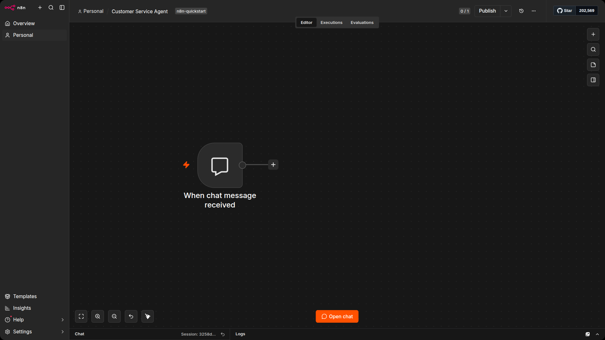
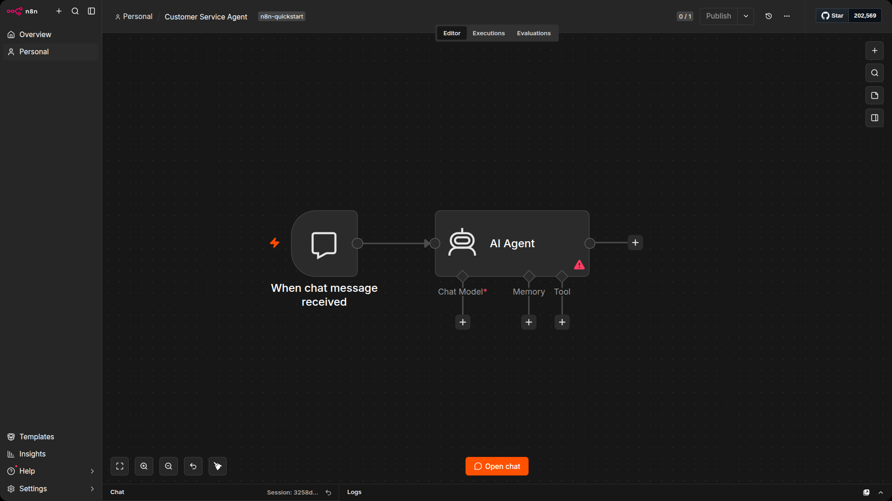
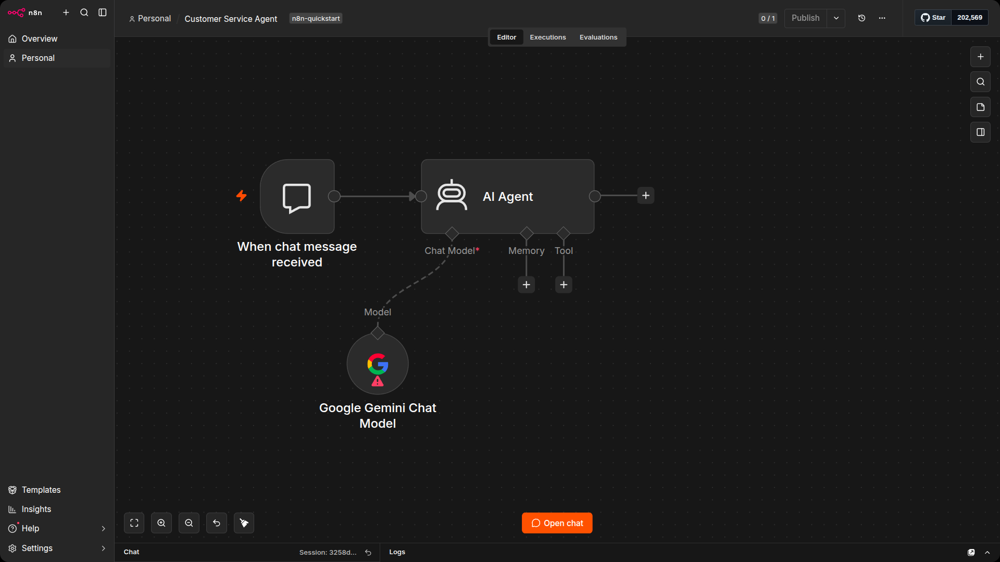
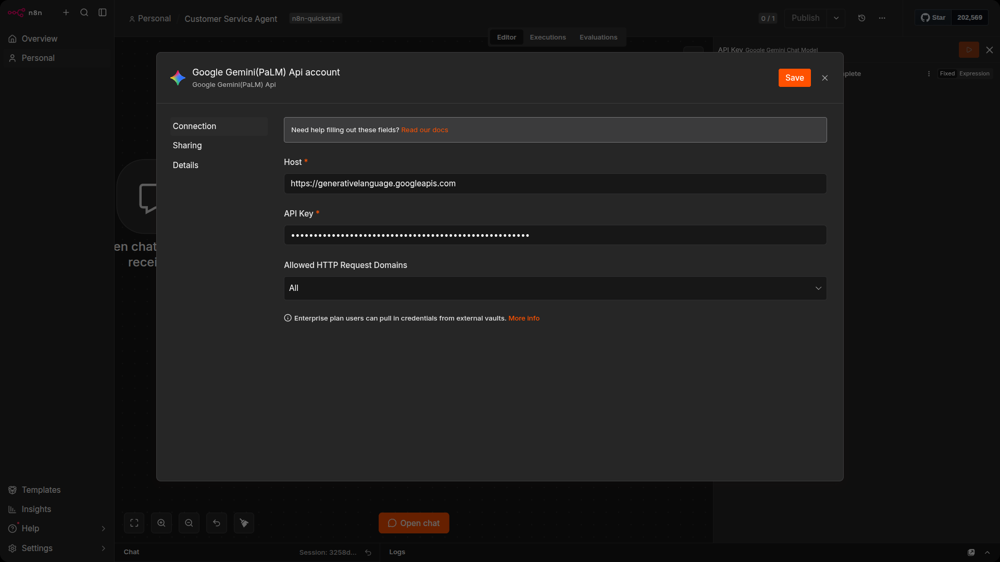
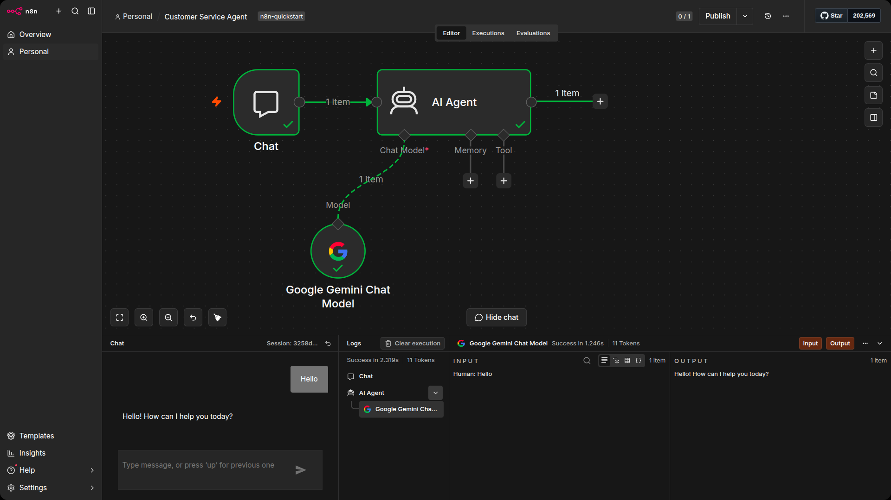
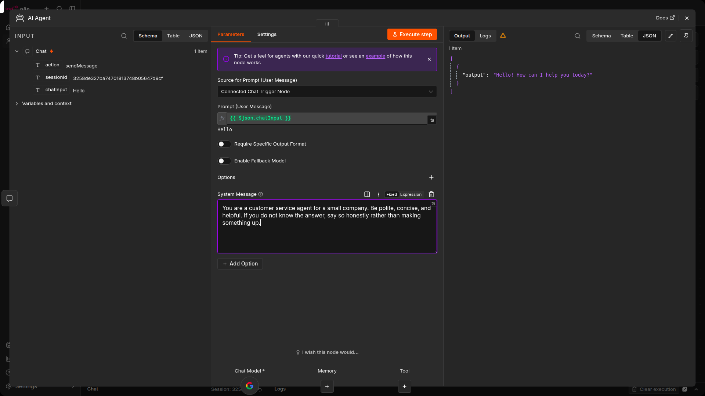
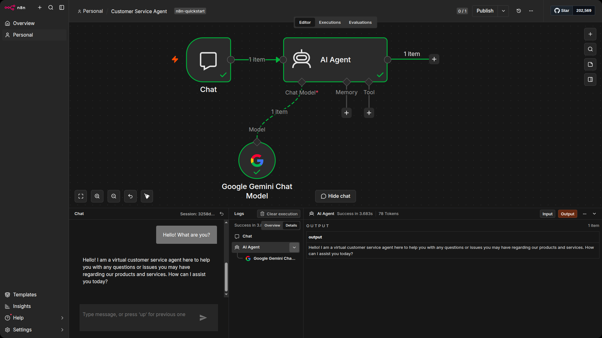

# Basic Chat Agent

You have spent the last two sections building workflows that follow a fixed path: data comes in, nodes process it step by step, and something comes out the other end. Every decision is one you made when you built the workflow. These workflows are deterministic: the same input always produces the same output.

An AI agent works differently. Instead of following a predefined path, it uses a Large Language Model (LLM) to decide what to do next. You give it a goal, and it figures out the steps. It can read data, call APIs, and make decisions on its own based on the input it receives. The tradeoff is that agents are not deterministic: the same question might get a slightly different answer each time. You gain flexibility, but you give up the predictability of a fixed workflow.

In n8n, the AI Agent is a node like any other. The difference is what you connect to it: a chat model for thinking, memory for context, and tools for doing things in the real world. In this section, you will build a simple customer service agent and add each of these pieces one at a time so you can see what each one does.

| Feature | LLM | AI Agent |
|---|---|---|
| Core capability | Text generation | Goal-oriented task completion |
| Decision making | Predicts the next word in a sequence | Selects and uses tools to solve problems |
| Uses tools/APIs | No | Yes |
| Workflow complexity | Single-step | Multi-step |
| Example | Generating a paragraph of text | Looking up a customer record and drafting a reply |

By the end of this unit, you will have a working chatbot. It will not be able to remember your conversation or look anything up yet: memory comes in the next unit, and tools in the one after that.

## Prerequisites

To complete this section, you will need:

- An API key from a chat model provider. This tutorial uses Google Gemini, but you can use any supported provider: Anthropic, OpenAI, DeepSeek, Groq, and others.

- The customers Data Table from Section 2 (you will need this in Unit 3 when you add tools to the agent).

> [!NOTE]
> Most chat model providers offer free trial credits or a free tier. If you do not already have an API key, create an account with your chosen provider before continuing.

## Create a new workflow

Open n8n and create a new workflow. If this is your first time logging in, you will already see an empty workflow ready to go. Otherwise, go to the Workflows list on the Overview page and select the + button.

Name the workflow Customer service agent and add the tag n8n quickstart. You should be naming and tagging all your workflows by now. It takes two seconds and saves you from scrolling through a list of "My workflow 14" six months from now.

## Add a Chat Trigger

The Chat Trigger node is what lets you talk to your agent. It opens a chat window inside the n8n editor where you can type messages and see responses.

1. Select Add first step or press N to open the node menu.
2. Search for Chat Trigger.
3. Select Chat Trigger to add it to the canvas.
4. Close the node details view (select Back to canvas) to return to the canvas.




## Add an AI Agent node

The AI Agent node is where the thinking happens. It receives the chat message, sends it to a language model, and returns the response.

1. Select the Add node + connector on the Chat Trigger node.
2. Start typing "AI" and choose the AI Agent node.
3. The AI Agent editing view will open. Since you are using the Chat Trigger, the default settings for source and prompt are already correct. You do not need to change anything here yet.



Notice the connectors along the bottom of the AI Agent node: Chat Model, Memory, and Tool. These are where you attach the pieces that give the agent its capabilities. Right now they are all empty, so the agent cannot do anything yet.

## Attach a chat model

The AI Agent needs a language model to generate responses. For this tutorial, we will use Google Gemini, but any supported chat model works (Anthropic, OpenAI, DeepSeek, Groq, and others). See the [sub-nodes documentation](https://docs.n8n.io/integrations/builtin/cluster-nodes/sub-nodes/n8n-nodes-langchain.lmchatanthropic/) for the full list.

1. Click the + button underneath the Chat Model connector on the AI Agent node. A list of available language models will appear.
2. Use the search bar to filter for "Google" and select Google Gemini Chat Model.
3. This attaches the model to the AI Agent and opens the node editor. The default model is fine for this exercise.



## Add credentials

n8n needs an API key to communicate with the chat model.

1. In the Google Gemini Chat Model node, click the text that says "Select credential". An option to add a new credential will appear.
2. Select + Create new credential.
3. Paste your Google Gemini API key into the API key field. If you do not have one, you can get it from [Google AI Studio](https://aistudio.google.com/app/apikey).
4. Close the credential dialog.



> [!NOTE]
> If you are using a different chat model provider, the credential setup will look slightly different, but the process is the same: create a new credential and paste in your API key.

## Test the agent

The agent is now connected to the Chat Trigger and has a language model attached. That is enough to have a basic conversation.

1. Click the Chat button near the bottom of the canvas. This opens a chat window on the left and the AI Agent logs on the right.
2. Type 'Hello' and press Enter. You will see the response from the chat model appear below your message.
3. The log window on the right shows the inputs and outputs from the AI Agent. Take a look at the logs: you will see the system message that the agent is using to prime the conversation.



## Change the system prompt

The logs from the previous step show the default system message: "You are a helpful assistant." This is the prompt that tells the model how to behave. You can change it to anything you want.

1. Open the AI Agent node. At the bottom of the panel there is a section labeled "Options" and a selector labeled "Add Option". Use this to select System message.

2. The system message field will appear. This is the same default prompt you saw in the logs. Change it to something different. For example:

```text
You are a customer service agent for a small company. Be polite, concise, and helpful. If you do not know the answer, say so honestly rather than making something up.
```



3. Close the node and return to the chat window. Send the same 'Hello' message and see how the tone of the response has changed.



The system prompt is how you shape the agent's personality and behavior. A good system prompt is specific about what the agent should do and how it should respond. You will refine this further when you add tools in a later unit.

## Save the workflow

Before you move on, save your work. CMD/CTRL + S to save. Although your workflows are automatically saved, its good practice to manually save the workflow before you close it. You will come back to this workflow in the next unit.

