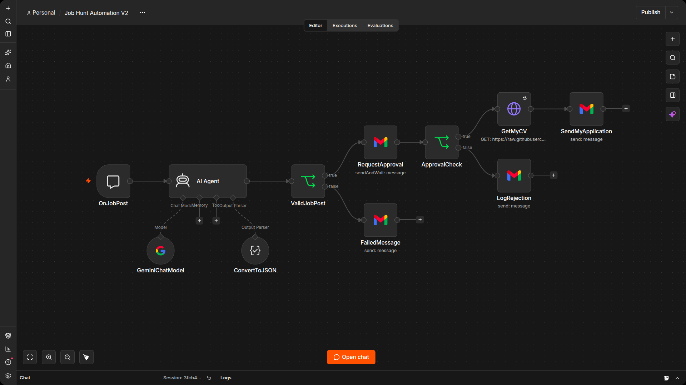

# Job Hunt Automation

An n8n-powered AI agent that watches for job/internship postings, parses them with Gemini, drafts a tailored application email, waits for my approval, and sends it off with my CV attached — all triggered from a chat input.

## What it does

1. **Receives a job posting** (pasted as raw text via a chat trigger)
2. **Parses it with an AI Agent** (Gemini) into structured fields: contact email, role, location, whether it's an internship, whether it's paid, duration, and a tailored opening paragraph for the application email
3. **Validates the posting** — rejects anything that doesn't look like a real job/internship post, or is missing a contact email or role
4. **Requests my approval by email** before anything is sent, showing exactly what would go out and to whom
5. **On approval**, fetches my latest CV and sends the application email with it attached
6. **On rejection**, logs that the application was skipped
7. **On a parsing failure**, emails me the raw agent output so I can see what went wrong

## Why the approval step exists

An earlier version of this workflow sent applications fully autonomously based on whatever the AI Agent extracted from the input text. Since that input is untrusted (it's whatever gets pasted into the chat), there was no safeguard against a malformed or adversarial "job posting" causing the agent to misdirect where my CV and personal information went. Adding a human-in-the-loop approval step before any email is actually sent closes that gap — nothing goes out without me reviewing the extracted fields and drafted message first.

## Workflow structure

| Node | Purpose |
|---|---|
| `OnJobPost` | Chat trigger — entry point for pasting in a job posting |
| `AI Agent` (+ `GeminiChatModel`, `ConvertToJSON`) | Parses the posting into structured JSON via Gemini, following a strict schema and validity rules defined in the system prompt |
| `ValidJobPost` | Branches based on whether the posting was successfully parsed and looks like a real job post |
| `RequestApproval` | Sends a "Send and Wait" approval email showing the extracted fields and drafted email body, with Approve/Decline buttons |
| `ApprovalCheck` | Branches based on the approval response |
| `GetMyCV` | Downloads my current CV from GitHub |
| `SendMyApplication` | Sends the final application email with the CV attached, using the AI-drafted opening paragraph |
| `LogRejection` | Notifies me that an approved-pending application was declined and skipped |
| `FailedMessage` | Notifies me when a posting fails validation, along with the raw agent output for debugging |

## Requirements

- Self-hosted n8n instance (this project was built and tested on self-hosted n8n via Docker)
- A public HTTPS URL for your n8n instance — required for the approval email's Approve/Decline links to be reachable from your phone. If self-hosting locally, a tunnel (e.g. ngrok) is needed; see the setup notes below.
- **Credentials configured in n8n:**
  - Gmail OAuth2 (used for sending the application, requesting approval, and logging outcomes)
  - Google Gemini (PaLM) API — used by the AI Agent for parsing
- Node/credential IDs in the exported workflow JSON are specific to my n8n instance — you'll need to reconnect your own Gmail and Gemini credentials after importing.

## Setup

1. Import `Job Hunt Automation V2.json` into your n8n instance (Workflows → Import from File)
2. Reconnect the Gmail OAuth2 and Google Gemini credentials to your own accounts
3. Update the hardcoded values to your own:
   - `GetMyCV`'s URL (currently points to my CV on GitHub)
   - Email addresses in `RequestApproval`, `LogRejection`, and `FailedMessage` (currently my own inbox)
   - The signature block in `SendMyApplication`'s message (name, contact info, links)
4. Make sure your n8n instance is reachable via a public HTTPS URL, and that `N8N_WEBHOOK_URL` (or the older `WEBHOOK_URL`) is set correctly — otherwise the approval email's links won't resolve from your phone. If self-hosting locally without a domain, see the companion `n8n-ngrok-setup-guide.md` for a full walkthrough using a free ngrok static domain.
5. Activate the workflow (toggle in the top-right of the n8n editor — it's saved as inactive by default)

## Usage

Open the chat trigger in n8n and paste in the raw text of a job or internship posting. The AI Agent parses it, and if it looks valid, you'll get an approval email within a few seconds. Approve to send the application, or decline to skip it.

## Known limitations / next steps

- No duplicate-application guard yet — the same posting fed in twice will trigger two separate approval requests
- No error handling after the final send step — if the Gmail send itself fails (bad attachment, API error), there's currently no notification
- CV is hosted as a public raw file on GitHub, which includes personal contact details — worth reviewing if privacy is a concern
- Model name (`gemini-3.1-flash-lite`) should be periodically checked against Google's current model list

## License

Personal project — not licensed for redistribution.