# Editor UI walkthrough

Get familiar with the key parts of the n8n Editor UI. We’ll explore the panels, controls, and core actions so you can confidently navigate the interface and begin building your workflows.

## Getting Started

Open the Editor UI, access your workflows, and create a new workflow to explore the canvas.

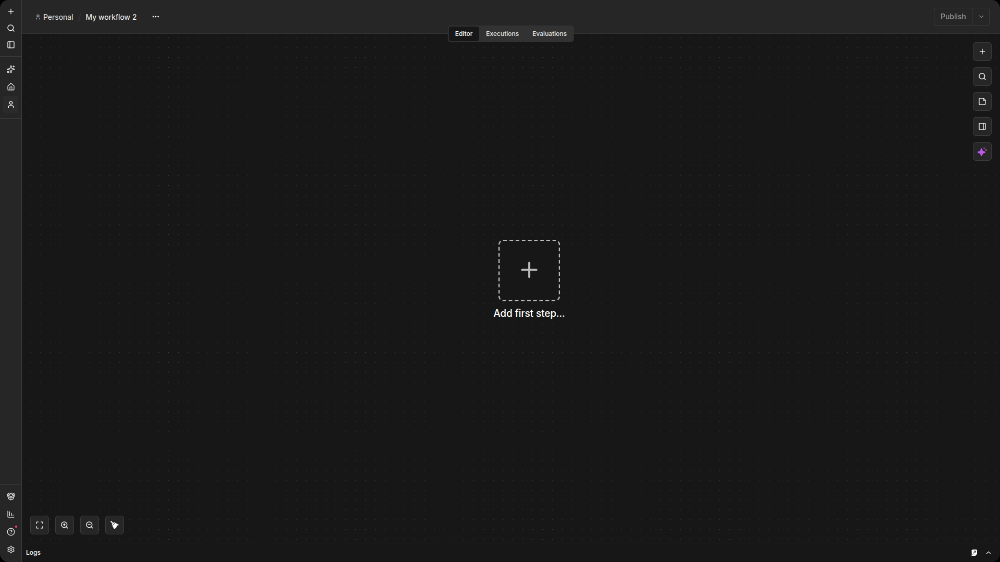


## Left Panel Overview

Core workflow management functions:

- **Overview:** Access workflows, executions.
- **Personal:** Default personal project.
- **Projects:** Group workflows, assign roles (paid plans; not available in Community Edition).
- **Admin Panel:** Usage, billing, version (n8n Cloud).
- Templates, Variables, Insights, Help, What’s New.

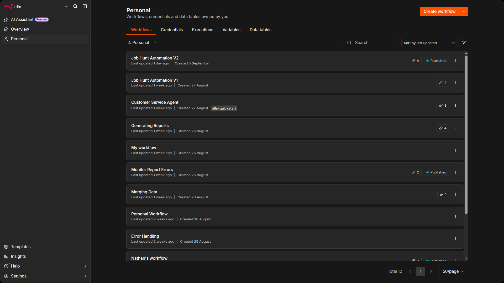

## Top Bar Controls

Key actions at the top of the Editor UI:

- Edit workflow name
- Add tags
- Save changes (creates a new version)
- Publish or unpublish workflow
- Share and view version history

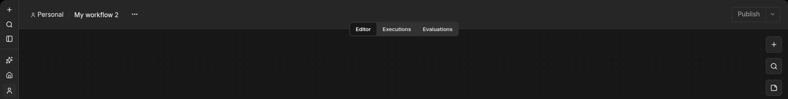

## Workflow Canvas

Main area to build workflows:

- Dotted grid background
- Zoom controls
- Execute workflow button
- Button to open nodes panel
- Sticky Note and Ask Assistant
- Add first node placeholder

Move canvas:

| Action | Windows / Linux | macOS |
|---|---|---|
| Modifier + Left Mouse Button + drag | Ctrl + Left Mouse Button + drag | Cmd + Left Mouse Button + drag |
| Modifier + Middle Mouse Button + drag | Ctrl + Middle Mouse Button + drag | Cmd + Middle Mouse Button + drag |
| Space + drag | Space + drag | Space + drag |
| Middle Mouse Button + drag | Middle Mouse Button + drag | Middle Mouse Button + drag |
| Two-finger touchpad/touchscreen drag | Two-finger touchpad/touchscreen drag | Two-finger touchpad/touchscreen drag |

### 💡 Tip:

    - If you're on Windows or Linux, use Ctrl + key
    - If you're on macOS, use Cmd + key

## Finding and Adding Nodes

Open via + icon or N key.

Categories:

- Trigger,
- Action,
- Data Transformation,
- Flow, Core,
- Human in Loop
- Add nodes by drag & drop or auto-connect.

Use search input to locate nodes quickly.

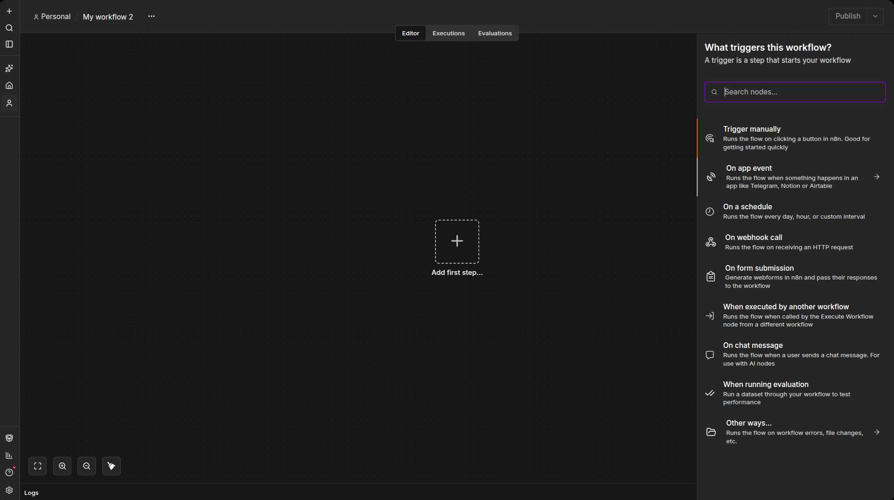

## Node Buttons & Options

Hover over a node to see:

- Execute (Play icon)
- Activate/Deactivate (Power icon)
- Delete (Trash icon)
- Ellipsis for more options
- Move workflow by selecting all nodes and dragging

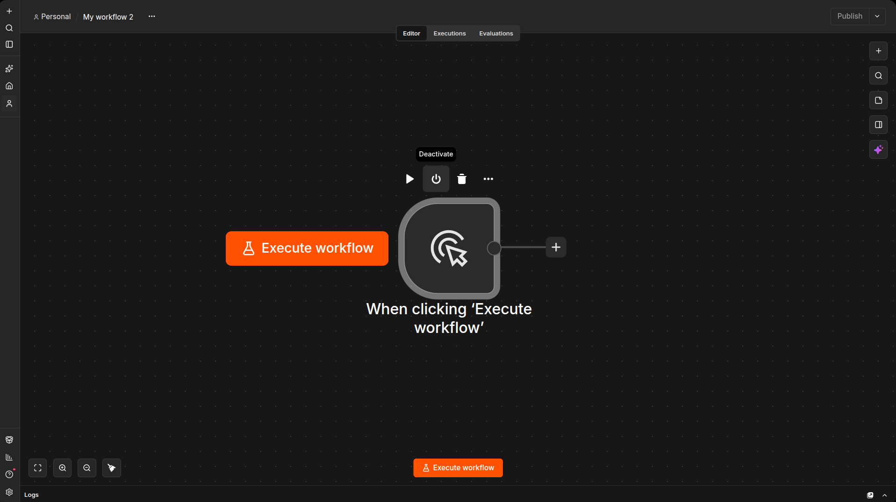

---

### `Save vs Publish`

`Save` — stores your changes and creates a new workflow version.
You can save as many times as you want while editing and testing. Auto save is also enabled so if you forget to save, we have you covered.

`Publish` — makes a specific version live in production.
Only the published version runs automatically.

**Important:** Editing a workflow after publishing does NOT affect production until you publish again.

---

## Key interface areas

This infographic gives you a fast visual map of the n8n Editor.
See where the key panels and tools are — so you can navigate the interface with confidence from the start. 🚀

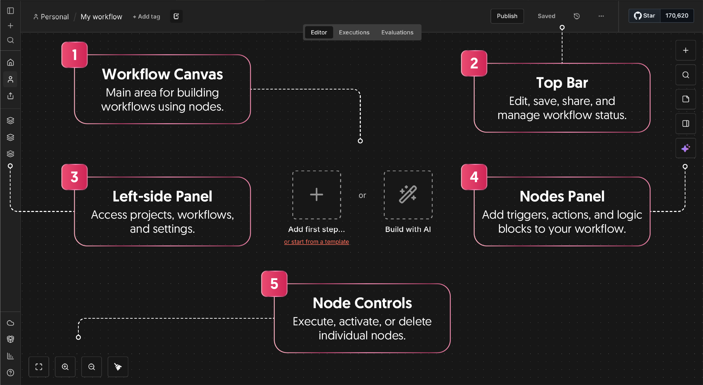

## Canvas navigation and zoom controls

Discover how to move around the canvas and control zoom, so navigating any workflow feels effortless. Flip the cards to explore the essential gestures, shortcuts, and tools that keep you oriented while building automations.

> `Move the canvas` (Hold Ctrl + Drag to move around the workflow area)
> Use this to explore large workflows — it’s faster than scrolling! 💡 Works best when zoomed in.

> `Pan Freely` (Hold Middle Mouse Button or Space + Drag to move across the canvas)
> Great shortcut for navigating complex automations. Try both options and choose what feels natural.

> `Touchpad Navigation` (Use two fingers to slide in any direction)
> Ideal for laptop users — no mouse needed. Use smooth gestures for precision.

> `Zoom In / Out` (Press + / - or Ctrl + Mouse Wheel)
> Zoom in to focus on details, or out to see the whole flow. 💡 Tip: Use Ctrl + Scroll for gradual control.

> `Reset or Fit Zoom` (Press 0 or 1)
> Instantly reset view to default (100%) or fit all nodes on screen. Quick way to regain an overview.

> `Canvas Toolbar` (Use icons at the bottom-left corner)
> Zoom to fit, Zoom in/out, Tidy up nodes. Perfect for quick layout adjustments.

# Keyboard shortcuts (Mac/Win)

Here are the main shortcuts to help you work faster and stay in your flow.

## Workflow Controls

| Action | 🪟 Windows | 🍎 Mac |
|---|---|---|
| Create new workflow | Ctrl + Alt + N | Cmd + Alt + N |
| Open workflow | Ctrl + O | Cmd + O |
| Save workflow | Ctrl + S | Cmd + S |
| Undo | Ctrl + Z | Cmd + Z |
| Redo | Ctrl + Shift + Z | Cmd + Shift + Z |
| Execute workflow | Ctrl + Enter | Cmd + Enter |

💡 Tip: Use these to speed up common actions like creating, saving, and testing workflows.

## Canvas Navigation

| Action | 🪟 Windows | 🍎 Mac |
|---|---|---|
| Move canvas | Ctrl + drag or Space + drag | Cmd + drag or Space + drag |
| Zoom in | + or = | + or = |
| Zoom out | - or _ | - or _ |
| Reset zoom | 0 | 0 |
| Zoom to fit | 1 | 1 |

💡 Tip: Combine zoom and move shortcuts for efficient workflow navigation.

## Node Operations

| Action | 🪟 Windows | 🍎 Mac |
|---|---|---|
| Select all nodes | Ctrl + A | Cmd + A |
| Copy nodes | Ctrl + C | Cmd + C |
| Paste nodes | Ctrl + V | Cmd + V |
| Cut nodes | Ctrl + X | Cmd + X |
| Delete selected | Delete | Delete |
| Rename node | F2 | F2 |
| Pin data | P | P |
| Add a sticky note | Shift + S | Shift + S |
| Open sub-workflow | Ctrl + Shift + O or Ctrl + Double Click | Cmd + Shift + O or Cmd + Double Click |

💡 Tip: Use shortcuts to manage nodes quickly without breaking your flow.

## Node Panel & Navigation

| Action | 🪟 Windows | 🍎 Mac |
|---|---|---|
| Open Node Panel | N (formerly Tab) | N (formerly Tab) |
| Insert node | Enter | Enter |
| Close panel | Esc | Esc |
| Expand category | Arrow Right | Arrow Right |
| Collapse category | Arrow Left | Arrow Left |

💡 Tip: Perfect for power users who prefer keyboard navigation over mouse clicks.

## Expression Mode

| Action | 🪟 Windows | 🍎 Mac |
|---|---|---|
| Switch to expression mode | = | = |

## Quick Tips for Quick Keys

> `Tip 1: Group by Context`
> Shortcuts are easier to remember when grouped by where you use them. Example: workflow controls (Ctrl+S to save, Ctrl+Z to undo, Ctrl+Shift+Z to redo) follow familiar patterns from other apps.

> `Tip 2: Use Common Patterns`
> Many shortcuts follow standard conventions: Ctrl+C to copy Ctrl+V to paste Ctrl+A to select all Leverage existing muscle memory from other software.

> `Tip 3: Practice Frequently Used Actions`
> Focus on shortcuts you use the most: Ctrl+Enter — execute workflow Tab — open node panel Space + drag — move the canvas.

> `Tip 4: Visual Cues`
> The UI shows tooltips or highlights when hovering over buttons, reminding you of available shortcuts.

> `Tip 5: Leverage Modifier Keys`
> Node actions often use Ctrl/Cmd combined with Shift or Alt. Example: Ctrl+Alt+N to create a new workflow.

> `Tip 6: Check the Docs`
> Keep the n8n keyboard shortcuts reference open for quick review.

## Summary

By grouping shortcuts by context and practicing the most common ones, you'll build familiarity quickly.

# Workspace customization and settings

Customize how your workflow runs by adjusting execution, saving, and timeout options in the Workflow settings modal. To access it:

- Open your workflow.
- Click the three dots in the top-right corner.
- Select Settings.


## Workflow settings modal

💡 Access workflow settings from the workflow menu.

> `Execution order` (Defines how multi-branch workflows execute)
> **v1 (recommended)** – completes one branch at a time (top to bottom).
> **v0 (legacy)** – executes node by node across branches.

💡 Choose how your workflow executes branches. You should only ever use v0 if you have inheritted a workflow that hasn't been updated to support v1. 

> `Error Workflow`
> Select another workflow to trigger if this one fails. If none is chosen, errors won’t trigger an automatic action.

💡 Always set up an error workflow to notify yourself whenever there is a problem.

> `This workflow can be called by`
> Decide which workflows are allowed to call (execute) this one.

💡 Control which workflows can trigger this workflow.

> `Timezone`
> Sets the timezone for workflow execution and triggers. If not set, the default timezone is EDT (Eastern Daylight Time, New York).

💡 Set the correct timezone for your workflow.

> `Execution data saving`
> Control what data n8n saves for your workflow: Failed production executions, Successful production executions, Manual executions, Execution progress, Each option can be set to Save or Do not save.

💡 Choose what execution data to store.

> `Timeout Workflow`
> Enable this toggle to automatically cancel long-running workflows after a set time. You can define the timeout duration.

💡 Set a timeout limit for workflow runs.

> `Estimated time saved`
> Enter an estimate of how many minutes each workflow run saves you. This helps generate productivity insights in n8n.

💡 Track time saved per execution.

# Customize Your Flow

You can customize workflows in n8n in several ways, from workflow settings to data handling and visual adjustments. The following features are commonly used when building and testing workflows.

## 1. Custom HTML & CSS in Forms

Make your forms look unique by adding images, videos, and changing colors or fonts. Open the Form Trigger settings and add your own HTML or CSS. This helps your forms match your brand and engage users.

## 2. Workflow Settings

Control how your workflow runs, including execution order, error handling, timeouts, and data saving. Click the three dots in the top-right corner of your workflow and select “Settings.” This ensures your automations run smoothly and avoid mistakes.

## 3. Expressions & Data Mapping

Fill data from one element to another automatically. Type = in any input field to enter expression mode, then drag and drop the data you need. This connects data between nodes quickly without coding.

## 4. Custom Code

Add your own JavaScript or Python in the Code node for advanced logic. If you are unsure how to write code, use the “Ask AI” feature to generate it from your description. This handles complex calculations or data processing automatically

## 5. Data Pinning

Press P on any node to pin its output. This lets you check or reuse data and speeds up workflow setup and testing. You can see results of each step without running the entire workflow again.

## 6. Sticky Notes

Add sticky notes on the canvas to remember important points or leave explanations for yourself and your team. Press Shift + S to add a note. This keeps your workflow organized and easy to follow.

### Quickstart

Start with the Very Quick Quickstart template to try workflows without complex data setup. Add a node, map data using expressions, and run your first workflow. 

# Core Concepts

## 1. What are workflows? 

A workflow is a collection of nodes connected together to automate a process.

It begins executing when a trigger condition occurs and then runs each node step by step.

You build workflows visually on the workflow canvas. Drag, drop, and connect the nodes.

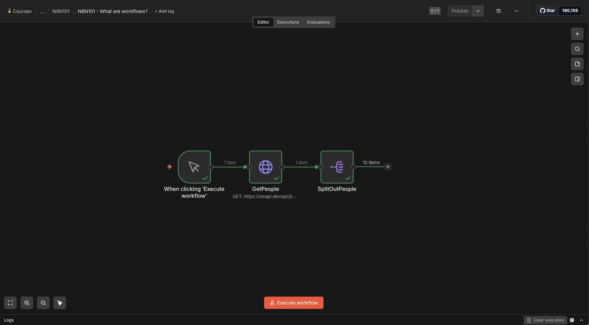

## 2. When to use workflows (Manual vs Automatic execution) 

Manual execution

- You run the workflow using Execute Workflow.
- Perfect for testing workflow logic, checking node outputs, and making adjustments.

Automatic execution 

- The workflow runs automatically when a triggering event or schedule occurs.
- To enable automatic execution, add a trigger node and publish the workflow.

Example:
```
New email arrives → workflow runs automatically → data is processed or sent elsewhere.
```
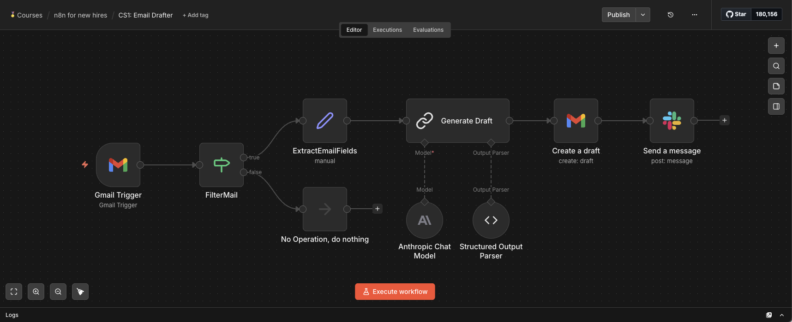

## 3. Common use cases

Workflows help automate everyday tasks, such as:

- moving or syncing data between apps
- updating CRM or database records
- scheduling recurring tasks or reports
- using AI nodes to process data
- sending alerts and notifications
- connecting services and APIs

These automations save time and reduce repetitive manual work

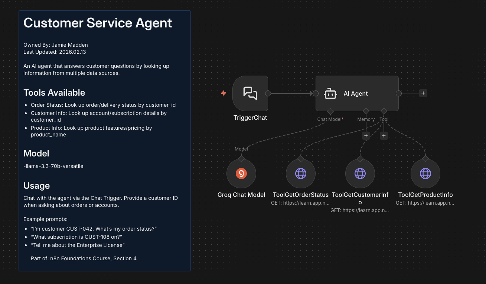

## 4. Getting started quickly 

- use workflow templates
- learn core components (nodes, triggers, connections)
- check results in the Executions list
- share workflows with teammates

Quickstart guides help you learn by doing and get hands-on fast.

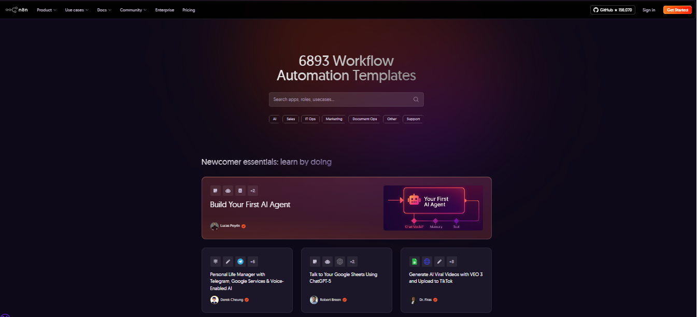

# Workflow types in n8n

Learn the different ways workflows can run in n8n! Whether you want to trigger them manually, automatically, or on a schedule, understanding each type helps you build and manage workflows more effectively.

| 👆 Manual Execution | ⚡ Automatic Execution | 📅 Scheduled Execution |
|---|---|---|
| Runs when you click Execute Workflow. Used for testing or workflows without a trigger. | Runs automatically when a Trigger, Webhook or polling detects an event. | Runs on a set schedule. Ideal for daily/weekly recurring tasks. |

# Understanding nodes and connections

## What is a node?

A node is a single step in your workflow.

Each node can:

- Fetch data
- Process data
- Send data

Nodes are connected in a sequence:

```text
[Node] → [Node] → [Node]
```

All nodes together make the workflow run smoothly, like building blocks of automation.

Learn what nodes are, how they connect, and how data flows through a workflow.

> `Trigger Node` (Start your workflow)
> Trigger nodes start the workflow and provide the first data.
> Examples: New Telegram message, new email, new row in Google Sheets.

```text
[Trigger Node] → [Next Node]
```

> `Action/App nodes` (Perform actions)
> Action/App nodes act on data: add, update, delete, send.
> Examples: Slack, DB, Twitter

```text
[Trigger] → [Action] → [Next]
```

> `Core nodes` (Logic and rules)
> Core nodes handle workflow logic. They can check conditions, schedule actions, or transform data.
> Examples: IF node, Set node, HTTP Request node.

```text
[Trigger] → [IF Node] → [Action]
```

> `Cluster nodes` (Groups working together)
> Cluster nodes are groups of nodes working together, mainly in AI workflows.

```text
[Root Node] → [Language Model] → [Parser] → [Output]
```

> `Connections & data flow` (Connections pass data between nodes (JSON items))

```text
[Node A] → [Node B] → [Node C]
```

- `Create:` drag from dot.
- `Delete:` click connection.

# Trigger types

Every workflow starts with a trigger node. Trigger nodes start a workflow and supply the initial data. A workflow can contain multiple trigger nodes, but for each execution, only one will run, depending on the triggering event.

Trigger nodes include:

- **Manual Trigger** — starts the workflow when you click Execute Workflow and doesn’t run automatically.
Trigger nodes include:
    ```text
    Manual Trigger starts the workflow manually for testing purposes.

    - Starts workflow manually by clicking Execute Workflow.
    - Good for testing.
    - Does not run automatically.
    
    ⚠️ Only one Manual Trigger node allowed per workflow.
    🖱️ Hand clicking a button
    ```

- **Schedule Trigger** — runs the workflow at fixed times or intervals, like cron.

    ```text
    Scheduled Trigger runs workflows at specified times or intervals.

    - Runs workflow at set times or intervals (seconds, minutes, hours, days, weeks, months, custom Cron).
    - Must save changes and publish the workflow.
    - Cron defines exact times to run the workflow.
    - Check timezone for correct timing.

    🕒 Clock / calendar
    ```

- **Other trigger nodes** — Webhook, Polling, and other event-based triggers.

    ```text
    Other Trigger Nodes start workflows automatically based on events.

    - Webhook — triggers workflow when an event occurs.
    - Polling — checks periodically for updates if webhooks are not available.
    - Queues / time-based triggers — execute automatically based on schedule or messages.

    Examples: Zendesk, Telegram, etc.
    ☁️ Cloud with arrow pointing up
    ```

💡 When you search for a node, trigger operations have a ⚡ (bolt) icon next to them

## 🔍 Summary

Manual, Other (Webhook, Polling, Queues, time-based), and Scheduled triggers work differently, but together they cover all workflow start scenarios.

- **Manual** — starts workflow manually for testing.
- **Other Trigger Nodes** — start workflows automatically based on events (webhooks, polling, queues, time-based triggers).
- **Scheduled**— runs your workflow on a set schedule (seconds, minutes, hours, days, weeks, months, custom Cron).

**Tips**

- Manual runs appear in the Editor.
- Other and Scheduled trigger runs happen automatically — find them in the Executions tab.
- Don’t forget to save your changes and publish the workflow to enable automatic triggers.
- Manual = testing; Other/Scheduled = reliable automation.
- ⚡ Trigger nodes are marked with a bolt icon in the node search.

❗ **Note:** This grouping is provided to help understand workflow start options in a clear way.

# Best practices and organization

## What are Projects in n8n?

Projects group workflows, variables, and credentials, and access is controlled via project roles. They let you organize automation by team or domain and make collaboration easier by keeping resources structured.

Available on all plans except the Community edition.

## Creating a Project

Instructions:
- Click the + Add project icon.
- Fill in the project settings (name, description, etc.).
- Click Save.

Only instance owners or instance admins can create projects.

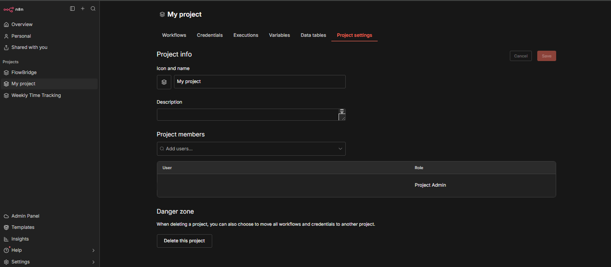

## Managing Project Members

Instructions:

- `Add a member:` Project settings → Project members → select a user → assign a role → Save.
- `Remove a member:` Click the three-dot menu next to a user → Remove user.

**Tip:** Roles control what a member can access in the project.

## Deleting a Project

Instructions:

- Go to Project settings → Delete project.
- You can transfer workflows and credentials to another project or delete them permanently.

Make sure you move any important workflows before deleting.

## Moving Workflows & Credentials

Instructions:

- Workflow and credential owners can move workflows or credentials to other users or projects they have access to.
- Moving removes existing sharing. You can re-share credentials with workflows after moving.

## What are Folders in n8n?

Folders help you organize your workflows. You can create unlimited folders and nested folders, search for workflows within folders, and drag & drop workflows and folders to reorganize. Folders are available to all registered users of n8n.

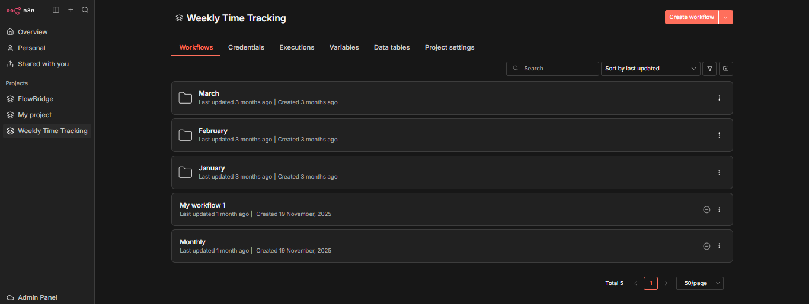

---

> `Folders`: You can create and manage folders in your personal space or within projects. You can also create workflows directly inside a folder. Some features may require a restart of your instance.

> `Organizing Credentials`: Credentials can be grouped into:

- **Company-wide** — for company workflows
- **Department-specific** — for team workflows
- **Individual** — for personal workflows

Use central service accounts for shared workflows.

> `n8n Database Structure`: n8n stores projects and workflows in several database tables:

- **project** → lists projects
- **workflow_entity** → saved workflows
- **tag_entity** → workflow tags
- **workflows_tags** → maps tags to workflows

# Workflow naming conventions and organization

Good naming and organization habits save you a lot of time as your workspace grows. When you have dozens of workflows, clear names and a logical structure make it easy to find what you need without digging around. Let's walk through the key practices.

## Rename your workflow

The first thing you should do after creating a workflow is rename it. Don't keep the default "My workflow" name. Click the workflow title at the top of the Editor UI and give it something descriptive that tells you what the workflow actually does.

A good name includes the purpose or main action, and optionally the system or app involved. For example, "N8N101 - Hacker News Vocabulary Update" or "N8N101 - Weekly Time Tracking Report" are both clear and easy to scan.

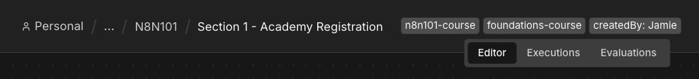

## Use consistent naming conventions

Pick a naming pattern and stick with it across your workspace. Include the app or system, the main purpose, and optionally hint at what the workflow does. When every workflow follows the same structure, you can scan a list and instantly know what each one is for.

For this course, all workflows use the "N8N101 -" prefix. In your own workspace, you might use prefixes based on team, department, or project.

## Add tags to stay organized

Tags let you categorize workflows by topic, use case, team, or whatever grouping makes sense for you. Click the three dots next to the workflow name, then select edit description and tags to tag a workflow. Once tagged, you can filter your workflow list to quickly surface everything related to a specific area.

For example, you might tag workflows with "reporting," "onboarding," or "CRM sync" so your team can find related workflows without memorizing names.

## Organize with folders

Folders give you another layer of structure on top of naming and tags. You can create folders and nested folders inside your Personal space or within a Project, then drag and drop workflows to keep related ones grouped together.

This is especially useful when your workspace has workflows that serve different purposes, like separating daily reports from experimental drafts or keeping each team's workflows in their own folder.

## Find workflows with the Command Bar

All of your good naming and tagging work pays off when you need to find something quickly. Press Ctrl+K (or Cmd+K on Mac) to open the Command Bar. From here you can search for any workflow by name, open recent workflows, or create new ones.

If your workflows are named well, the Command Bar becomes the fastest way to jump to what you need without scrolling through your workspace.

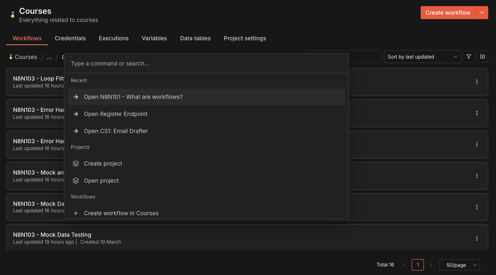

### Pro Tips for Clear Workflows

1. **Rename “My workflow”**
Don’t keep the default name. Click the workflow title at the top of the Editor UI and give it a clear, descriptive name (e.g., “Hacker News workflow”, “Weekly Time Tracking”).

2. **Use consistent naming conventions**
Keep names predictable and meaningful. Include the app, system, or main purpose, and if helpful, hint at the main action the workflow performs, so it’s instantly clear what it does (for example, “Hacker News Vocabulary Update” - Vocabulary workflow, “Weekly Time Tracking Report” - Time tracking workflow).

3. **Add Tags to stay organized**
Use the + Add Tag button to categorize workflows by topic, use case, or department. Tags make filtering and finding workflows easier.

4. **Use Projects**
Projects help group related workflows and credentials and manage access with roles. (Not available on the Community edition).

5. **Save regularly**
Use Ctrl+S / Cmd+S or the Save button in the top bar. After the first Save As, future saves simply update the workflow.

6. **Check Workflow History**
After saving, use the History button in the top bar to view previous versions. Version history lets you publish another version, restore an older one, or unpublish the workflow from production.

7. **Choose the right storage space**
Store your workflow either in your Personal Space or in a Project (if available) to keep things organized and accessible.