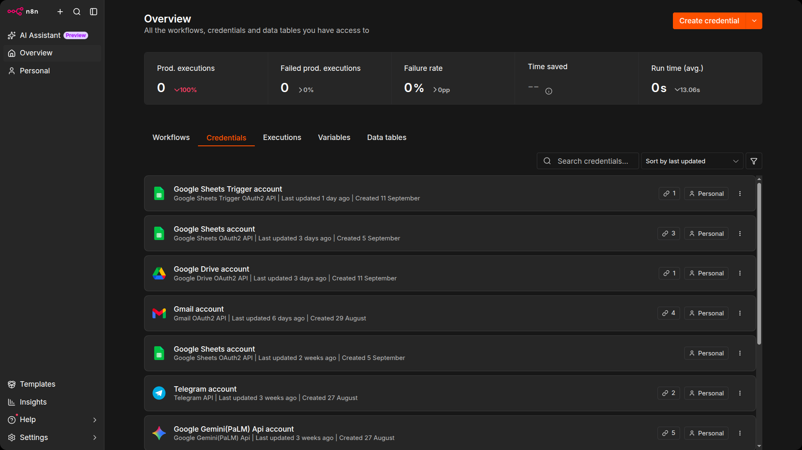
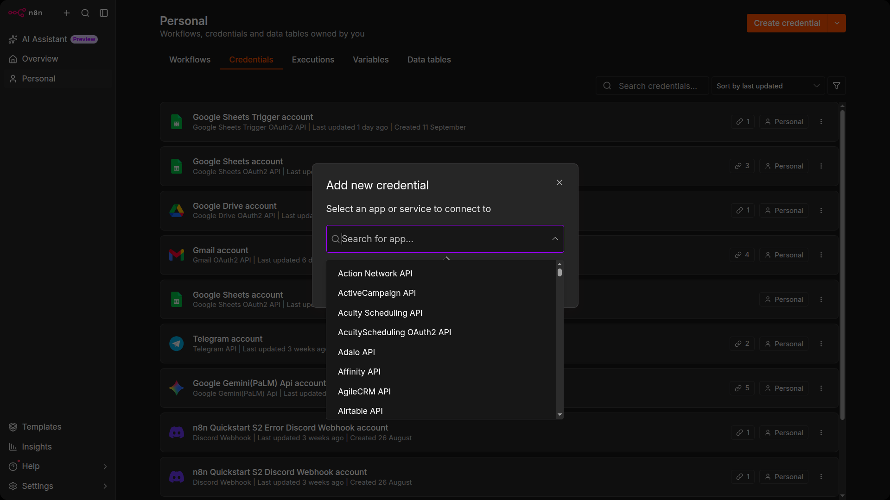
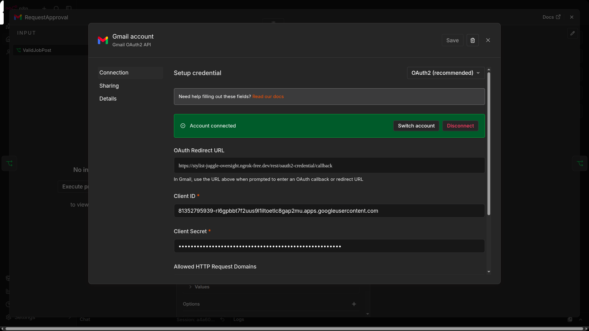
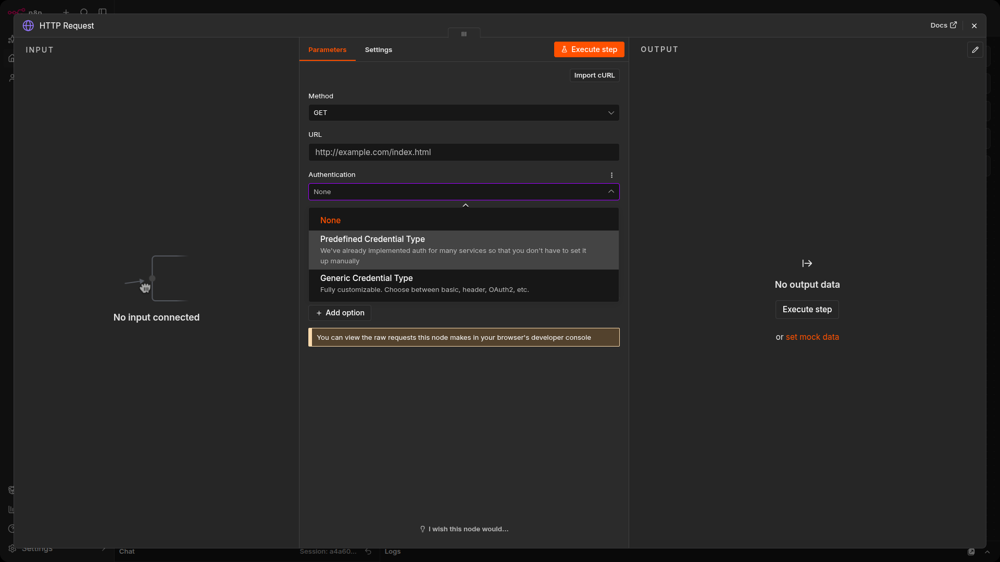
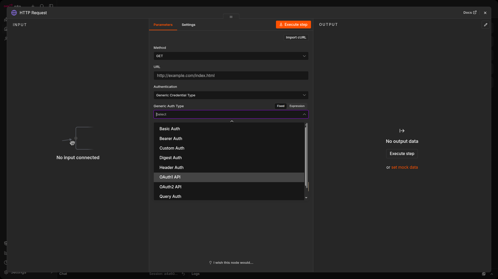

# Credentials

Credentials in n8n are authentication details (such as API keys, passwords, or OAuth tokens) provided by an external service that allow your workflows to securely connect to it. They are stored encrypted and can be reused across multiple workflows and nodes, so you don't have to re-enter sensitive information each time you build an automation.

### What credentials are

- Credentials = private info apps give you to confirm who you are.
- They let n8n "talk" to other apps (Google Sheets, Slack, Notion, etc.).
- Forms: API key, username/password, token, etc.
- Why it matters: n8n can't connect without them.

### How credentials work in n8n

- Stored safely inside n8n.
- Each workflow node uses credentials to connect to a service.
- You just select/add the right credential — no technical skills needed.

### Where to find credentials (UI)

Step-by-step:

- Open project.
- Select Credentials from the top menu.

**Credentials section**

### Creating and editing credentials

- Click Add credential to connect a new service.
- Edit existing ones by opening them.
- n8n guides you through required fields.

**Add New Credential — setup screen**

### Sharing credentials

- Some credentials can be shared with team members.
- Shared credentials appear in All credentials.
- Safe way to let multiple users use the same connection.

### Credentials Library

- Check if unsure how to set up a service.
- Step-by-step instructions for each service.

## When and why to use credentials

*Credentials are private info (API keys, passwords, OAuth tokens) used to authenticate you and connect n8n to services. You can find Credentials in the Credentials tab in either your private or project workspace to manage them.*

### When to use credentials

When a node needs to access an external service securely (e.g., API, database, SaaS). Store sensitive info safely.

Node configuration with credential selection

Example Screenshot:

*Don't use credentials for actions that don't require authentication. Avoid hardcoding secrets in workflows.*

### Why use credentials?

Credentials are required to connect your workflows to external systems and services. They keep your workflows more secure, reusable, and easier to manage by separating sensitive data (like API keys and tokens) from workflow logic and allowing the same credential to be reused across multiple nodes and workflows.

- `Security:` 🛡️ Credentials are encrypted, reducing risk of exposure compared to hardcoding.
- `Reusability:` 🔁 Use once, reuse in multiple workflows. Easy management.
- `Seperation:` 🛠️ Managed separately from workflow logic → easier maintenance.
- `Compliance:` ✅ Helps with access control, auditing, credential rotation in teams or client environments.

# Exploring credentials UI

### Step 1: Select Credential Type

> Predefined: Ready-made for popular services.

> Generic: Fully customizable credentials for advanced configuration.

n8n allows you to select between predefined credential types (for popular services) and generic types (for custom setups) when creating a new credential. The UI presents these options during the credential creation process.

### Step 2: Configure Credential

Configure Generic credentials:

- **Basic** — Username & password
- **Header** — Custom headers
- **OAuth2** — Token-based authentication

When a generic credential is selected, n8n provides configuration forms for the relevant authentication method. The user fills out the required fields based on the chosen method.

### Step 3: Save & Auto-encryption

Click Save to store credentials securely. They are automatically encrypted after saving. No additional action is needed.

## Tip: Security Reminder

Important: Credentials are automatically encrypted. Never share them with anyone.

- Use strong passwords
- Store credentials safely

# Security First: Keep Your Credentials Safe

n8n automatically encrypts all credentials before saving them. For advanced setups, you can also define a custom encryption key to keep full control over how your data is protected.

Only authorized nodes can access credentials during workflow execution. When you share a credential, others can use it, but cannot view or edit any sensitive details.

To keep your workflows secure:

- Use OAuth whenever possible.
- Avoid entering passwords directly into nodes, use the credential system instead.
- Review and rotate your credentials regularly.

If you self-host n8n, make sure to:

- Enable TLS (SSL) to encrypt data in transit.
- Encrypt data at rest (for example, using encrypted partitions).
- Run periodic security audits with n8n’s built-in tools.